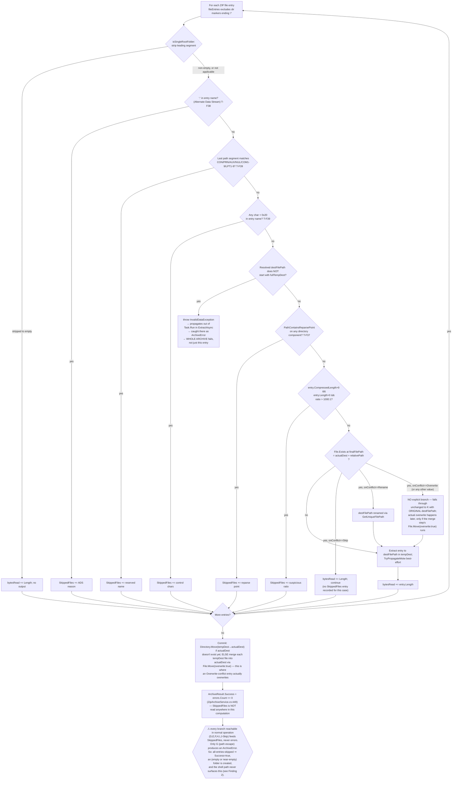
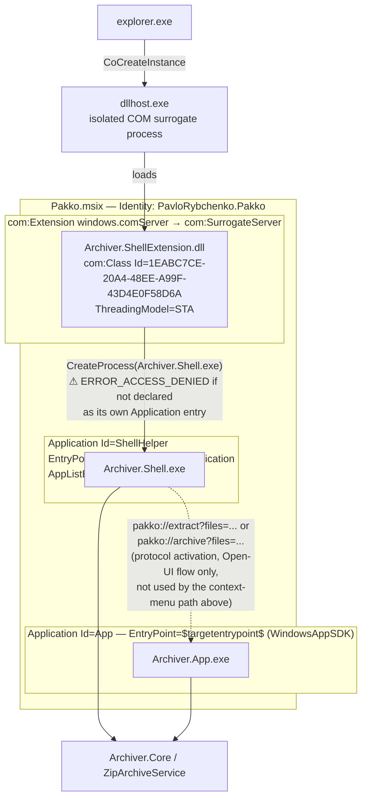

# DIAGRAMS.md — Required Diagrams for Dead-End & Problem-Area Detection

Diagrams here are a reasoning aid, not an executable test — they don't replace `dotnet test`,
they catch what unit tests structurally can't: illegal/missing state transitions, COM contract
mismatches across process boundaries, and unhandled branches in multi-step validation chains.

## Ground Truth Rule — read before drawing or updating any diagram

**A diagram must reproduce what the code actually does, verified by reading it — never what
seems plausible, symmetric, or "probably how it works."** Specifically:

- Every arrow, branch, and label must trace to a specific file:line you have actually read in
  the current session. If you have not opened the file, you do not know the branch — go read it.
- Do not smooth an asymmetric or ugly code structure into a tidy diagram. If the code has two
  `if`s with an implicit fallthrough (no `else`), draw exactly that — not three clean parallel
  branches. The ugliness is often the point (see the `OnConflict` gate in diagram 3: `Overwrite`
  has no explicit branch and that's a real, load-bearing fact about the code, not an omission
  to tidy up).
- Do not infer execution order from what would be "natural" — verify it. Two operations that
  look independent (e.g. "set `IsBusy=false`" vs. "await a modal dialog") may execute in either
  order depending on where in the method they actually appear; get this from the source, not from
  intuition (see diagram 2, where this was gotten backwards in an earlier draft — the dialog
  await happens *before* `finally`, not after).
- Where the code doesn't name something the diagram needs a label for (e.g. bucketing several
  `catch` blocks into "outcomes"), the label must be immediately followed by the literal
  condition from the code it stands for. Never let an invented label stand alone as if it were
  a real enum or state in the codebase.
- If, while drawing, you find the diagram doesn't match the code you just read, that's a signal
  either the diagram was wrong or the code has a real gap — report both, don't quietly pick
  whichever is more convenient to draw.
- When updating a diagram after a code change, re-derive the affected part from the new source —
  don't edit the old diagram by pattern-matching against its previous shape.

Violating this makes the diagram actively worse than having none: a wrong diagram is trusted
documentation that lies.

---

## When to update which diagram (Definition of Done)

| Change touches... | Update this diagram | Because |
|---|---|---|
| COM interop, `IExplorerCommand`, process launch (`CreateProcess`, `Process.Start`), `IProgressDialog` | **1. Sequence** | Every real bug so far here (`S_FALSE`, missing `[PreserveSig]`, undeclared `Application`) was a contract mismatch across a process/COM boundary — invisible in unit tests, visible in a sequence diagram. |
| `IsBusy`/cancellation/operation lifecycle in `MainViewModel`, or `NativeProgressDialog` cancel polling | **2. State** | Catches stuck states (a state with no outgoing transition) and commands gated on the wrong `CanExecute`. |
| New branch in `ZipArchiveService` validation/conflict/smart-folder logic | **3. Activity** | Catches silently-dropped entries: a new `continue`/skip path that isn't reflected in `ArchiveResult` (see Finding 2 below for why this matters). |
| MSIX manifest `<Application>` entries, `com:ComServer` registration, packaging of a new satellite EXE | **4. Component** | Catches "works in VS, `ERROR_ACCESS_DENIED` when packaged" — an EXE that isn't its own declared `Application` entry. |

Update the diagram in the same commit as the code change, alongside `dotnet test` — not as a
follow-up. Re-derive the affected part from the current source per the Ground Truth Rule above;
do not edit by pattern-matching the diagram's previous shape.

---

## 1. Sequence — Shell context-menu invocation

Sources read for this diagram: `src/Archiver.ShellExtension/dllmain.cpp`,
`src/Archiver.ShellExtension/ExplorerCommands.cpp`, `src/Archiver.ShellExtension/ShellExtUtils.cpp`,
`src/Archiver.Shell/Program.cs`, `src/Archiver.Shell/NativeProgressDialog.cs`.

```mermaid
sequenceDiagram
    actor User
    participant Explorer as explorer.exe
    participant Dllhost as dllhost.exe (COM surrogate)
    participant Factory as PakkoClassFactory<PakkoRootCommand>
    participant Root as PakkoRootCommand
    participant Enum as SubCommandEnum
    participant EH as ExtractHereCommand
    participant EF as ExtractFolderCommand
    participant AC as ArchiveCommand
    participant ShellExe as Archiver.Shell.exe
    participant Core as ZipArchiveService
    participant Dlg as IProgressDialog (shell32)

    User->>Explorer: right-click selection
    Explorer->>Dllhost: CoCreateInstance(CLSID_PakkoRootCommand)<br/>(com:SurrogateServer registration)
    Dllhost->>Factory: DllGetClassObject(CLSID_PakkoRootCommand)<br/>only this CLSID is registered
    Explorer->>Factory: IClassFactory::CreateInstance
    Factory->>Root: Make<PakkoRootCommand>()
    Explorer->>Root: GetFlags() → ECF_HASSUBCOMMANDS
    Explorer->>Root: EnumSubCommands()
    Root->>EH: Make<ExtractHereCommand>()
    Root->>EF: Make<ExtractFolderCommand>()
    Root->>AC: Make<ArchiveCommand>()
    Root->>Enum: SetCommands([EH, EF, AC])<br/>ALWAYS all three, unconditionally —<br/>selection does not filter EnumSubCommands
    Root-->>Explorer: Enum (IEnumExplorerCommand)
    loop Explorer drains the enumerator
        Explorer->>Enum: Next(celt, ...)
        Enum-->>Explorer: fetched item(s);<br/>S_OK if fetched==celt, else S_FALSE<br/>(S_FALSE is a SUCCESS code here, not failure)
    end
    Note over Explorer,AC: Visibility is decided per-command by GetState(),<br/>separately from enumeration
    Explorer->>EH: GetState(psia) → ECS_ENABLED iff AllPathsAreZip(paths), else ECS_HIDDEN
    Explorer->>EF: GetState(psia) → ECS_ENABLED iff AllPathsAreZip(paths), else ECS_HIDDEN
    Explorer->>AC: GetState(psia) → ECS_HIDDEN iff AllPathsAreZip(paths), else ECS_ENABLED<br/>(condition is INVERTED vs. EH/EF)
    Explorer->>AC: GetTitle(psia) → BuildAddToArchiveTitle(paths)<br/>dynamic "Add to <name>.zip", truncated middle if >40 chars
    User->>Explorer: click one visible leaf command
    Explorer->>EH: Invoke(psia, pbc)  — or EF / AC, same shape
    alt GetPathsFromShellItemArray(psia) empty
        EH-->>Explorer: E_INVALIDARG
    else paths present
        EH->>ShellExe: LaunchShellExe(BuildExtractHereArgs(paths))<br/>CreateProcessW; PROCESS_INFORMATION handles<br/>closed immediately; does NOT wait for the child
        ShellExe-->>Explorer: (no return channel — ShellExe runs independently)
        EH-->>Explorer: S_OK, or HRESULT_FROM_WIN32(GetLastError())<br/>on CreateProcess failure — returned the instant<br/>CreateProcess returns, NOT when the operation finishes
        ShellExe->>Dlg: new NativeProgressDialog(title)<br/>= new ProgressDialogCoClass() + StartProgressDialog
        alt COMException thrown during construction
            ShellExe->>Core: ExtractAsync(options, progress: null, CancellationToken.None)
        else dialog constructed
            loop every 250ms (System.Threading.Timer, lock-guarded on dialogLock)
                ShellExe->>Dlg: HasUserCancelled()<br/>[PreserveSig] required — plain BOOL return, not HRESULT
                alt returns true
                    ShellExe->>ShellExe: cts.Cancel()
                end
            end
            ShellExe->>Core: ExtractAsync(options, progress, cts.Token)
            Core-->>ShellExe: IProgress<ProgressReport> callback per file/entry
            ShellExe->>Dlg: SetLine(1, CurrentFile) / SetLine(2, status) / SetProgress64(bytes, total)
            alt OperationCanceledException from Core
                ShellExe-->>ShellExe: return new ArchiveResult { Success = false }
            else Core completes
                Core-->>ShellExe: ArchiveResult
            end
            ShellExe->>Dlg: Dispose() → StopProgressDialog
        end
        opt !result.Success or result.Errors.Count > 0
            ShellExe->>User: MessageBoxW(error summary, max 10 lines shown)
            Note over ShellExe: result.SkippedFiles is NEVER inspected here — see Finding 2
        end
    end
```

**What this catches (verified against the two real bugs already fixed here):**
- `EH`/`EF`/`AC` `Invoke()` never awaits the operation — Explorer's HRESULT comes back the instant
  `CreateProcess` returns. Anything that assumes Explorer "waits" for Pakko's result is wrong.
- `HasUserCancelled()` is the one `IProgressDialog` method returning a plain `BOOL`; the
  `[PreserveSig]` boundary is exactly where "Cancel does nothing" lived (`NativeProgressDialog.cs:26`).
- `SubCommandEnum::Next()` returns `S_FALSE` on partial fetch — a *success* code, per
  `(fetched == celt) ? S_OK : S_FALSE` (`ExplorerCommands.cpp:29`). Any new
  `IEnumExplorerCommand`/`IExplorerCommand` method must not conflate `S_FALSE` with failure.
- Visibility filtering happens via `GetState()`, not `EnumSubCommands()` — a future change that
  tries to filter which commands appear by editing `EnumSubCommands` (e.g. "don't enumerate
  Archive for all-ZIP selections") would be editing the wrong method; `ArchiveCommand`'s
  `GetState` condition is the *inverse* of `ExtractHereCommand`/`ExtractFolderCommand`'s, which is
  easy to get backwards when copy-pasting.

---

## 2. State — Operation lifecycle (`MainViewModel`)

Source read for this diagram: `src/Archiver.App/ViewModels/MainViewModel.cs`
(`ArchiveAsync`/`ExtractAsync`/`Cancel`, lines 228–437). Both methods have the identical
try/catch/finally shape; the diagram applies to either.

```mermaid
stateDiagram-v2
    [*] --> Idle
    Idle --> Busy: ArchiveCommand/ExtractCommand invoked<br/>(CanExecute: FileItems.Count>0 && !IsBusy)<br/>IsBusy=true
    Busy --> Busy: CancelCommand invoked<br/>(CanExecute: IsOperationRunning == IsBusy)<br/>→ cts.Cancel() only — IsBusy is NOT changed here;<br/>there is no dedicated "Cancelling" state in code
    Busy --> AwaitingSummaryDialog: _archiveService call returns without throwing<br/>StatusMessage set to StatusDone/StatusArchivedIn<br/>(Errors==0 && Skipped==0) or StatusIssues (otherwise)
    AwaitingSummaryDialog --> AwaitingSummaryDialog: await ShowOperationSummaryAsync(...)<br/>IsBusy is STILL TRUE while this modal is open —<br/>finally has not run yet
    AwaitingSummaryDialog --> Idle: finally{IsBusy=false}; then StatusMessage=StatusReady<br/>(unconditional, executes immediately, no delay)
    Busy --> AwaitingErrorDialog: unexpected Exception caught (not OperationCanceledException)<br/>StatusMessage="Error"
    AwaitingErrorDialog --> AwaitingErrorDialog: await ShowErrorAsync(...)<br/>IsBusy is STILL TRUE while this modal is open
    AwaitingErrorDialog --> Idle: finally{IsBusy=false}; then StatusMessage=StatusReady<br/>(unconditional, immediately, no delay)
    Busy --> CancelledNoDialog: OperationCanceledException caught<br/>StatusMessage=StatusCancelled — NO dialog is shown
    CancelledNoDialog --> Idle: finally{IsBusy=false} runs FIRST (immediately);<br/>THEN await Task.Delay(2000) while already back to !IsBusy;<br/>THEN StatusMessage=StatusReady
```

**What this catches:**
- Every exit path sets `IsBusy=false` inside `finally` — no path leaves `Busy` without
  re-enabling controls. A future edit that adds an early `return` before the `finally`, or a new
  `catch` that doesn't fall through to it, would break this.
- **Order matters and was gotten backwards in an earlier draft of this diagram:** for the
  success/issues/error outcomes, the modal dialog (`ShowOperationSummaryAsync` /
  `ShowErrorAsync`) is awaited *before* the `finally` block, so `IsBusy` stays `true` — buttons
  stay disabled — for as long as that dialog is open. For the cancelled outcome there is no
  dialog at all: `IsBusy` flips to `false` immediately, and only *after* that does the fixed
  2-second delay run. So during that 2 seconds the UI is already not-busy (new operations are
  invokable) while the status text still reads "Cancelled" — a real, verified asymmetry, not
  balanced across the two exit families. Worth confirming this is the intended UX; not a
  correctness bug (nothing is stuck), but flagged here since a future diagram-writer must not
  "tidy" this into a symmetric two-branch picture.
- `Cancel`'s `CanExecute` is gated on `IsOperationRunning` (=`IsBusy`) — a future state inserted
  between "user clicked" and `IsBusy=true` would make Cancel uninvokable during it.
- Cancellation itself has no intermediate state: `cts.Cancel()` only sets the token; the running
  `Task.Run` loop notices it at whatever granularity it happens to check
  (`cancellationToken.IsCancellationRequested`, or inside `CopyToAsync`, which also observes the
  token). Confirm this still holds for any new async step added inside `ArchiveAsync`/`ExtractAsync`.

---

## 3. Activity — Extract validation/foldering chain

Source read for this diagram: `ExtractWithSmartFolderingAsync` in
`src/Archiver.Core/Services/ZipArchiveService.cs:463-668`.



**What this catches — a live finding, not a hypothetical:**
Every validation gate in this chain (ADS, reserved name, control chars, reparse, ZIP bomb,
`OnConflict=Skip`) routes to `SkippedFiles`, never `ArchiveError`. `ArchiveResult.Success` is
computed as `errors.Count == 0` (`ZipArchiveService.cs:449`) and does not look at `SkippedFiles`
at all. So an archive where *every* entry gets skipped reports `Success=true` with no real content
extracted besides an empty folder.

The GUI path surfaces this correctly — `ShowOperationSummaryAsync` receives the full
`ArchiveResult` including `SkippedFiles`. The **shell path does not**: `Program.cs:235` only calls
`ShowErrorSummary` when `!result.Success || result.Errors.Count > 0` — `SkippedFiles` is never
inspected, so a shell-triggered "Extract here" that skips every entry closes silently with no
dialog at all. Found while drafting this diagram, not fixed — flagging for a `TASKS.md` decision.

**Corrected in this redraw:** the `OnConflict` gate is not three parallel branches for three enum
values. The code is two sequential `if`s with no `else` (`ZipArchiveService.cs:597-609`) — `Skip`
and `Rename` are handled explicitly; `Overwrite` (and any future enum value) has no branch at all
and simply falls through to extraction with the original path, with the actual overwrite deferred
to the final merge step's `File.Move(overwrite: true)`. Drawing this as three clean branches in
the previous version hid that a new `ConflictBehavior` value added later would silently get
"extract unchanged" behavior unless a branch is added for it explicitly.

---

## 4. Component/Deployment — MSIX package & process boundaries

Source read for this diagram: `src/Archiver.App/Package.appxmanifest`.



**What this catches:** any satellite EXE added later that is *not* given its own `<Application>`
entry with `EntryPoint="Windows.FullTrustApplication"` will build and run fine from Visual Studio
but fail with `ERROR_ACCESS_DENIED` the moment it's launched via `CreateProcess` from inside the
installed MSIX package — invisible until on-device testing. This is exactly the bug the
`ShellHelper` entry above was added to fix.

**Finding 1 (doc drift, not fixed here):** `ARCHITECTURE.md:259` currently states *"Registered via
`com:InProcessServer` in `Package.appxmanifest`"*. The actual manifest
(`Package.appxmanifest:70-78`) uses `com:SurrogateServer`, matching `CLAUDE.md`'s own
"Correction — SurrogateServer" note in `DECISIONS.md`. Not fixed here — out of scope for this task.

---

## Findings summary (surfaced while drafting/redrawing, not acted on)

1. **`ARCHITECTURE.md:259` stale** — says `com:InProcessServer`, actual manifest and
   `DECISIONS.md` say `com:SurrogateServer`. Tracked as **T-F69**.
2. **Possible silent-empty-extract bug** — `ArchiveResult.Success` ignores `SkippedFiles`; the
   shell path (`Program.cs:235`) only checks `Errors`, so an all-skipped shell extraction shows
   no dialog at all. Tracked as **T-F68**.
3. **`IsBusy` vs. status-text asymmetry (watch, not confirmed as a bug)** — after a cancelled
   operation, `IsBusy` is already `false` throughout the fixed 2-second `StatusCancelled` display,
   while after a completed/errored operation `IsBusy` stays `true` for as long as the summary/error
   dialog is open. Different exit families leave the UI in observably different "is this really
   done" states. Tracked as **T-F70**.
