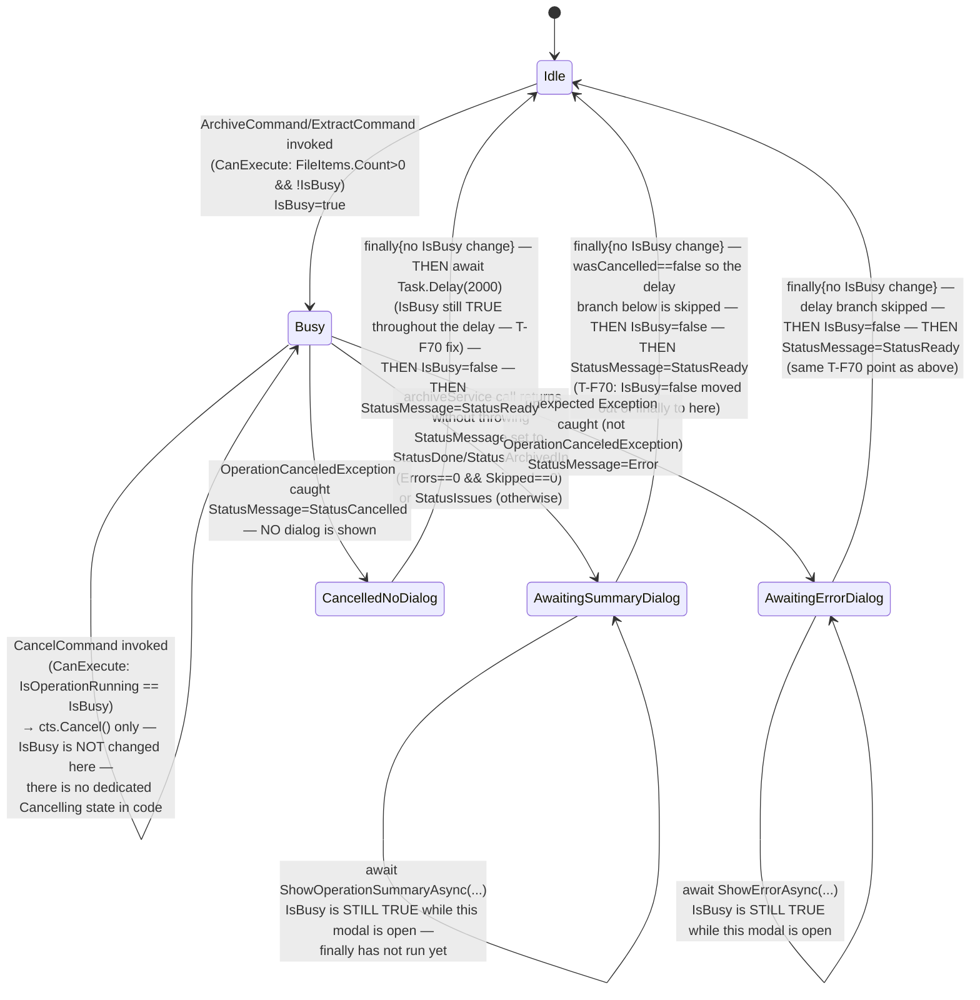
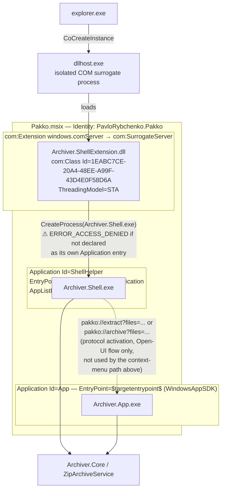
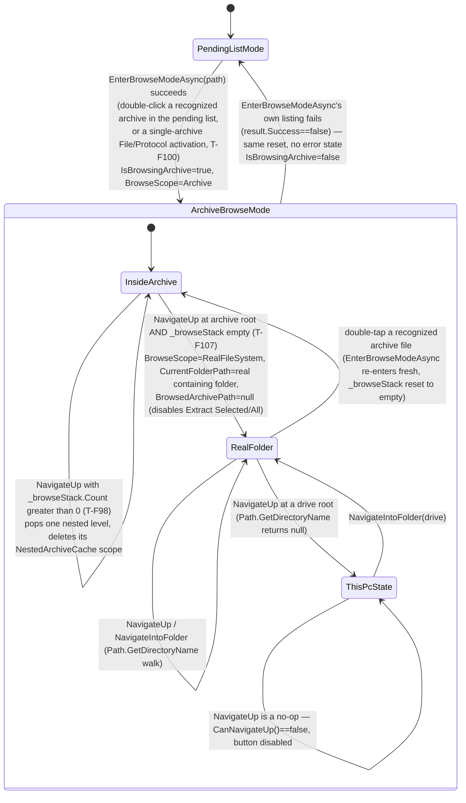

# DIAGRAMS.md — Required Diagrams for Dead-End & Problem-Area Detection

Diagrams here are a reasoning aid, not an executable test — they don't replace `dotnet test`,
they catch what unit tests structurally can't: illegal/missing state transitions, COM contract
mismatches across process boundaries, and unhandled branches in multi-step validation chains.

## Ground Truth Rule — read before drawing or updating any diagram

**A diagram must reproduce what the code actually does, verified by reading it — never what
seems plausible, symmetric, or "probably how it works."** Specifically:

- Every arrow, branch, and label must trace to a specific file:line you have actually read in
  the current session. If you have not opened the file, you do not know the branch — go read it.
- Do not smooth an asymmetric or ugly code structure into a tidy diagram. If the code has two
  `if`s with an implicit fallthrough (no `else`), draw exactly that — not three clean parallel
  branches. The ugliness is often the point (see the `OnConflict` gate in diagram 3: `Overwrite`
  has no explicit branch and that's a real, load-bearing fact about the code, not an omission
  to tidy up).
- Do not infer execution order from what would be "natural" — verify it. Two operations that
  look independent (e.g. "set `IsBusy=false`" vs. "await a modal dialog") may execute in either
  order depending on where in the method they actually appear; get this from the source, not from
  intuition (see diagram 2, where this was gotten backwards in an earlier draft — the dialog
  await happens *before* `finally`, not after).
- Where the code doesn't name something the diagram needs a label for (e.g. bucketing several
  `catch` blocks into "outcomes"), the label must be immediately followed by the literal
  condition from the code it stands for. Never let an invented label stand alone as if it were
  a real enum or state in the codebase.
- If, while drawing, you find the diagram doesn't match the code you just read, that's a signal
  either the diagram was wrong or the code has a real gap — report both, don't quietly pick
  whichever is more convenient to draw.
- When updating a diagram after a code change, re-derive the affected part from the new source —
  don't edit the old diagram by pattern-matching against its previous shape.

Violating this makes the diagram actively worse than having none: a wrong diagram is trusted
documentation that lies.

---

## When to update which diagram (Definition of Done)

| Change touches... | Update this diagram | Because |
|---|---|---|
| COM interop, `IExplorerCommand`, process launch (`CreateProcess`, `Process.Start`), `IProgressDialog` | **1. Sequence** | Every real bug so far here (`S_FALSE`, missing `[PreserveSig]`, undeclared `Application`) was a contract mismatch across a process/COM boundary — invisible in unit tests, visible in a sequence diagram. |
| `IsBusy`/cancellation/operation lifecycle in `MainViewModel`, or `NativeProgressDialog` cancel polling | **2. State** | Catches stuck states (a state with no outgoing transition) and commands gated on the wrong `CanExecute`. |
| New branch in `ZipArchiveService` validation/conflict/smart-folder logic | **3. Activity** | Catches silently-dropped entries: a new `continue`/skip path that isn't reflected in `ArchiveResult` (see Finding 2 below for why this matters). |
| MSIX manifest `<Application>` entries, `com:ComServer` registration, packaging of a new satellite EXE | **4. Component** | Catches "works in VS, `ERROR_ACCESS_DENIED` when packaged" — an EXE that isn't its own declared `Application` entry. |
| New branch in `TarSandboxedService`'s pre-scan/extraction/conflict pipeline | **5. Activity (tar.exe)** | Whole-archive-reject means a single scan gap silently lets an entire class of unsafe entries through — there's no per-entry fallback the way ZIP has, so a missed branch here is higher-severity, not lower. |
| `MainWindow.xaml` row added/removed, or any row's `Visibility` binding changed; new `IsBrowsingArchive`-gated (or should-be-gated) UI element | **6. State (UI mode)** | Exactly the category that missed Row 0 never hiding in browse mode (found 2026-07-13 by manual comparison, not by this table) — a per-row visibility table is the only thing that would have caught it before shipping. |

Update the diagram in the same commit as the code change, alongside `dotnet test` — not as a
follow-up. Re-derive the affected part from the current source per the Ground Truth Rule above;
do not edit by pattern-matching the diagram's previous shape.

---

## 1. Sequence — Shell context-menu invocation

Sources read for this diagram: `src/Archiver.ShellExtension/dllmain.cpp`,
`src/Archiver.ShellExtension/ExplorerCommands.cpp`, `src/Archiver.ShellExtension/ShellExtUtils.cpp`,
`src/Archiver.Shell/Program.cs`, `src/Archiver.Shell/ShellResultPresenter.cs`,
`src/Archiver.Shell/NativeProgressDialog.cs`, `src/Archiver.App/App.xaml.cs`.

**T-F99 (2026-07-13):** `Package.appxmanifest` now also registers `PakkoRootCommand`'s verb for
`desktop10:ItemType Type="Drive"`, alongside the existing `*`/`Directory` entries this diagram
already covers — `Explorer->>Root: CoCreateInstance(...)` is now also reachable for a drive-root
`IShellItemArray` selection. No new sequence step needed (`GetState`/`Invoke` already treat `paths`
generically, regardless of what kind of selection produced them), but see the new "What this
catches" bullet below for a real bug this reachability change exposed in `LaunchShellExe`'s
argument-building step (node `EH->>ShellExe`/`AC->>ShellExe` etc.).

```mermaid
sequenceDiagram
    actor User
    participant Explorer as explorer.exe
    participant Dllhost as dllhost.exe (COM surrogate)
    participant Factory as PakkoClassFactory<PakkoRootCommand>
    participant Root as PakkoRootCommand
    participant Enum as SubCommandEnum
    participant EDC as ExtractDialogCommand
    participant EHF as ExtractHereFlatCommand
    participant EH as ExtractHereCommand
    participant EF as ExtractFolderCommand
    participant CDC as CompressDialogCommand
    participant AC as ArchiveCommand
    participant TC as TestCommand
    participant ShellExe as Archiver.Shell.exe
    participant Core as ZipArchiveService
    participant Dlg as IProgressDialog (shell32)
    participant App as Archiver.App.exe (pakko:// activation)

    User->>Explorer: right-click selection
    Explorer->>Dllhost: CoCreateInstance(CLSID_PakkoRootCommand)<br/>(com:SurrogateServer registration)
    Dllhost->>Factory: DllGetClassObject(CLSID_PakkoRootCommand)<br/>only this CLSID is registered
    Explorer->>Factory: IClassFactory::CreateInstance
    Factory->>Root: Make<PakkoRootCommand>()
    Explorer->>Root: GetFlags() → ECF_HASSUBCOMMANDS
    Explorer->>Root: EnumSubCommands()
    Root->>EDC: Make<ExtractDialogCommand>()
    Root->>EHF: Make<ExtractHereFlatCommand>()<br/>(T-F115: new, genuinely flat extract)
    Root->>EH: Make<ExtractHereCommand>()<br/>(T-F115: title now "...Intelligently" — behavior unchanged)
    Root->>EF: Make<ExtractFolderCommand>()
    Root->>CDC: Make<CompressDialogCommand>()
    Root->>AC: Make<ArchiveCommand>()
    Root->>TC: Make<TestCommand>()
    Root->>Enum: SetCommands([EDC, EHF, EH, EF, CDC, AC, TC, ...])<br/>ALWAYS all, unconditionally — selection does not filter EnumSubCommands.<br/>Order mirrors NanaZip's real ContextMenu.cpp (T-F63) and its own three-way<br/>extract-verb layout (T-F115): dialog, then flat, then intelligent, then named-folder.<br/>TC last: diagnostic/verification action, not primary —<br/>deliberate deviation from NanaZip's own Test-before-Compress grouping.<br/>TarArchiveCommand (added T-F105) is omitted from this list — pre-existing<br/>diagram gap, not introduced here, see this file's own staleness note above
    Root-->>Explorer: Enum (IEnumExplorerCommand)
    loop Explorer drains the enumerator
        Explorer->>Enum: Next(celt, ...)
        Enum-->>Explorer: fetched items,<br/>S_OK if fetched==celt, else S_FALSE<br/>S_FALSE is a SUCCESS code here, not failure
    end
    Note over Explorer,TC: Visibility is decided per-command by GetState(),<br/>separately from enumeration
    Explorer->>EDC: GetState(psia) → ECS_ENABLED iff AnyPathIsSupportedArchive(paths), else ECS_HIDDEN<br/>(T-F86: also true for RAR/7z/tar-family when tar.exe exists — EDC routes<br/>to Archiver.App/IExtractionRouter, which supports those formats since T-F85)
    Explorer->>EHF: GetState(psia) → ECS_ENABLED iff AllPathsAreSupportedArchive(paths), else ECS_HIDDEN<br/>(same condition as EH/EF — T-F115)
    Explorer->>EH: GetState(psia) → ECS_ENABLED iff AllPathsAreSupportedArchive(paths), else ECS_HIDDEN<br/>(T-F86: also true for RAR/7z/tar-family when tar.exe exists)
    Explorer->>EF: GetState(psia) → ECS_ENABLED iff AllPathsAreSupportedArchive(paths), else ECS_HIDDEN<br/>(T-F86: also true for RAR/7z/tar-family when tar.exe exists)
    Explorer->>CDC: GetState(psia) → always ECS_ENABLED (T-F63: shown for any selection,<br/>unlike AC below — archiving a .zip into a new .zip via the dialog is valid)
    Explorer->>AC: GetState(psia) → ECS_HIDDEN iff AllPathsAreZip(paths), else ECS_ENABLED<br/>(condition is INVERTED vs. EH/EF — T-F86: deliberately UNCHANGED —<br/>still AllPathsAreZip, not AllPathsAreSupportedArchive — archiving an<br/>all-RAR selection into a new ZIP stays valid, same reasoning as CDC)
    Explorer->>AC: GetTitle(psia) → BuildAddToArchiveTitle(paths)<br/>dynamic "Add to <name>.zip", truncated middle if >40 chars
    Explorer->>TC: GetState(psia) → ECS_ENABLED iff AnyPathIsZip(paths), else ECS_HIDDEN<br/>(T-F62: AnyPathIsZip, NOT AllPathsAreZip — shows on a mixed selection too —<br/>T-F86: deliberately UNCHANGED — ITarService has no Test/verify method,<br/>so enabling this for RAR/7z would run ZipArchiveService.TestAsync,<br/>which skips non-zip paths internally and would report a false<br/>"No errors detected" — see DECISIONS.md's T-F86 entry)
    User->>Explorer: click one visible leaf command
    alt command is EDC or CDC (dialog form, T-F63)
        Explorer->>EDC: Invoke(psia, pbc) — or CDC, same shape
        EDC->>ShellExe: LaunchShellExe(BuildOpenUiExtractArgs(paths))<br/>— or BuildOpenUiArchiveArgs for CDC —<br/>i.e. "--open-ui --extract/--archive <paths>"
        EDC-->>Explorer: S_OK, or HRESULT_FROM_WIN32(GetLastError())
        ShellExe->>App: Process.Start("pakko://extract?files=<base64>", UseShellExecute:true)<br/>— or pakko://archive — then ShellExe's Main returns/exits immediately —<br/>NO NativeProgressDialog, NO ZipArchiveService call in this branch at all
        Note over App: T-F83 (fixed 2026-07-06): cold start reads the activation via<br/>OnLaunched→AppInstance.GetCurrent().GetActivatedEventArgs(), not just<br/>the OnActivated event (which only fires for redirected/warm activation).<br/>Before the fix, a cold pakko:// launch silently opened an EMPTY window.
        App->>App: window.ActivationGate.RunOrDefer(...) → MainViewModel.AddPathsFromProtocolUri(uri)<br/>— files pre-loaded, user drives Archive/Extract from the full UI.<br/>T-F106: wrapped in ActivationGate/DeferredActionGate so this runs AFTER<br/>the first layout pass, not synchronously inline as drawn in earlier versions<br/>of this diagram — a UI-thread timing detail, not a new process/COM contract
    else command is EHF, EH, EF, AC, or TC (silent form)
        Explorer->>EH: Invoke(psia, pbc) — or EHF / EF / AC / TC, same shape
        alt GetPathsFromShellItemArray(psia) empty
            EH-->>Explorer: E_INVALIDARG
        else paths present
            EH->>ShellExe: LaunchShellExe(BuildExtractHereArgs(paths))<br/>— or BuildExtractHereFlatArgs (T-F115, "--extract-flat") /<br/>BuildExtractFolderArgs / BuildArchiveArgs / BuildTestArgs<br/>CreateProcessW — PROCESS_INFORMATION handles<br/>closed immediately — does NOT wait for the child<br/>note: TC passes the FULL selection unfiltered — Core does the<br/>per-path IsZipFile gating, same as Extract already does
            ShellExe-->>Explorer: (no return channel — ShellExe runs independently)
            EH-->>Explorer: S_OK, or HRESULT_FROM_WIN32(GetLastError())<br/>on CreateProcess failure — returned the instant<br/>CreateProcess returns, NOT when the operation finishes
            ShellExe->>Dlg: new NativeProgressDialog(title)<br/>= new ProgressDialogCoClass() + StartProgressDialog
            alt COMException thrown during construction
                ShellExe->>Core: ArchiveAsync/ExtractAsync/TestAsync(options or paths, progress: null, CancellationToken.None)
            else dialog constructed
                loop every 250ms (System.Threading.Timer, lock-guarded on dialogLock)
                    ShellExe->>Dlg: HasUserCancelled()<br/>[PreserveSig] required — plain BOOL return, not HRESULT
                    alt returns true
                        ShellExe->>ShellExe: cts.Cancel()
                    end
                end
                ShellExe->>Core: ArchiveAsync/ExtractAsync/TestAsync(options or paths, progress, cts.Token)
                Core-->>ShellExe: IProgress<ProgressReport> callback per file/entry<br/>(TestAsync: TotalBytes=0, one report per archive — no byte-level tracking)
                ShellExe->>Dlg: SetLine(1, CurrentFile) / SetLine(2, status) / SetProgress64(bytes, total)
                alt OperationCanceledException from Core
                    ShellExe-->>ShellExe: return new ArchiveResult { Success = false }
                else Core completes
                    Core-->>ShellExe: ArchiveResult<br/>(TestAsync: CreatedFiles always empty — nothing is written to disk)
                end
                ShellExe->>Dlg: Dispose() → StopProgressDialog
            end
            Note over ShellExe: ShellResultPresenter.Classify(result) (T-F68, fixed 2026-07-06):<br/>Failed (!Success or Errors.Count>0) wins over SkippedOnly wins over Success
            opt Classify == Failed
                ShellExe->>User: MessageBoxW(error summary, max 10 lines shown, MB_ICONERROR)
            end
            opt Classify == SkippedOnly
                ShellExe->>User: MessageBoxW("N entries skipped: ...", MB_ICONWARNING)<br/>T-F68: previously this case (Success=true, Errors=0, Skipped>0)<br/>closed with NO dialog at all — silently indistinguishable from a normal run
            end
            opt result.Success AND command == Test
                ShellExe->>User: MessageBoxW("No errors detected in the archive(s).", MB_ICONINFORMATION)<br/>Test-only: unlike Extract/Archive, success has no visible disk<br/>side effect, so silent success would look like nothing happened
            end
        end
    end
```

**What this catches (verified against the real bugs already fixed here):**
- `EH`/`EF`/`AC`/`EDC`/`CDC`/`TC` `Invoke()` never awaits the operation — Explorer's HRESULT comes
  back the instant `CreateProcess` returns. Anything that assumes Explorer "waits" for Pakko's
  result is wrong.
- **`EDC`/`CDC` (T-F63) take a structurally different path than the other four:** no
  `NativeProgressDialog`, no `ZipArchiveService` call from `Archiver.Shell.exe` at all — they only
  construct a `pakko://` URI and hand off to `Archiver.App` via `Process.Start`/`UseShellExecute`.
  A future change to the silent path's progress/result handling does not automatically apply here.
- **T-F83 (fixed 2026-07-06):** this dialog path is exactly what surfaced a pre-existing cold-start
  bug in `Archiver.App` — `AppInstance.Activated` only fires for *redirected* activation to an
  already-running instance, never for the process's own initial activation, so `OnLaunched` must
  pull `GetActivatedEventArgs()` itself. See `DECISIONS.md`'s "T-F83" entry.
- `HasUserCancelled()` is the one `IProgressDialog` method returning a plain `BOOL`; the
  `[PreserveSig]` boundary is exactly where "Cancel does nothing" lived (`NativeProgressDialog.cs:26`).
- `SubCommandEnum::Next()` returns `S_FALSE` on partial fetch — a *success* code, per
  `(fetched == celt) ? S_OK : S_FALSE` (`ExplorerCommands.cpp:29`). Any new
  `IEnumExplorerCommand`/`IExplorerCommand` method must not conflate `S_FALSE` with failure.
- Visibility filtering happens via `GetState()`, not `EnumSubCommands()` — a future change that
  tries to filter which commands appear by editing `EnumSubCommands` (e.g. "don't enumerate
  Archive for all-ZIP selections") would be editing the wrong method; `ArchiveCommand`'s
  `GetState` condition is the *inverse* of `ExtractHereCommand`/`ExtractFolderCommand`'s, which is
  easy to get backwards when copy-pasting.
- `TestCommand::GetState` (T-F62) uses `AnyPathIsZip`, a condition also shared by `ExtractDialogCommand`
  (T-F63) but distinct from `AllPathsAreZip` (EH/EF) and its inverse (AC) — copy-pasting
  `AllPathsAreZip` here would hide Test/ExtractDialog on any mixed selection, unlike NanaZip's
  reference behavior (verified against real
  NanaZip source in `DECISIONS.md`).
- **T-F86:** `EH`/`EF`/`EDC` moved from `AllPathsAreZip`/`AnyPathIsZip` to new
  `AllPathsAreSupportedArchive`/`AnyPathIsSupportedArchive` (extension allowlist + `tar.exe`
  existence check — no magic-byte read at `GetState()` time, deliberately deviating from
  NanaZip's real exclusion-list shape; see `DECISIONS.md`). `TC` and `AC` were deliberately left
  on the old ZIP-only predicates: `TC` because `ITarService` has no Test capability (enabling it
  would produce a false "No errors detected" for an untested RAR/7z), `AC` because hiding "Add to
  archive…" for an all-RAR selection was never correct to begin with. A future change that makes
  these four commands' gates "consistent" by copy-pasting one predicate onto all of them would
  reintroduce either the false-Test-pass bug or hide a legitimate archive action.
- **T-F99 (2026-07-13): `LaunchShellExe(Build*Args(paths))` can silently corrupt the command line
  for a drive-root path.** `QuotePath` (called by every `Build*Args` helper feeding into the
  `ShellExe->>Dlg`/`Core` steps above) wrapped every path in `"..."` unconditionally; for a
  drive-root path (e.g. `"Z:\"`, reachable via T-F99's new `Type="Drive"` registration above), the
  trailing backslash immediately before the closing quote escapes the quote itself under
  Win32/CRT command-line parsing instead of closing the argument — every argument after it in the
  command line gets swallowed into one corrupted string. `Explorer->>EH: Invoke` and friends still
  return `S_OK` in this case (`CreateProcess` itself succeeds), so nothing in this diagram's HRESULT
  flow signals the failure — it only shows up as `Archiver.Shell.exe`/`Archiver.App` silently
  receiving the wrong arguments, exactly the class of process-boundary contract mismatch this
  diagram category exists to catch. Fixed by doubling a trailing backslash before quoting; see
  `DECISIONS.md`'s T-F99 entry.

---

## 2. State — Operation lifecycle (`MainViewModel`)

Source read for this diagram: `src/Archiver.App/ViewModels/MainViewModel.cs`
(`ArchiveAsync`/`ExtractAsync`/`Cancel`, lines 271–489 as of T-F85 — shifted from the
diagram's original 228–437 by T-F85's added `IExtractionRouter` field/constructor param and
`_extractableTypes` allowlist above `ArchiveAsync`; the state machine itself is unchanged, only
line numbers moved). Both methods have the identical try/catch/finally shape; the diagram
applies to either. T-F85 changed `ExtractAsync()`'s single `_archiveService.ExtractAsync(...)`
call to `_extractionRouter.ExtractAsync(...)` — same await, same exception types, no new
branch — so this diagram's content is otherwise unaffected by that change.

**T-F05 (Archive Browser):** `ExtractAsync()`'s body was extracted into a shared
`RunExtractAsync(archivePaths, selectedEntryPaths)`, now also called by
`ExtractSelectedFromBrowserCommand`/`ExtractAllFromBrowserCommand`/
`ExtractSingleBrowserEntryWithWarningAsync` (renamed from `ExtractSingleBrowserEntryAsync` by
T-F109/T-F110). The state machine below is unchanged — same
`Idle→Busy→{AwaitingSummaryDialog|AwaitingErrorDialog|CancelledNoDialog}→Idle` shape, same
`IsBusy` sequencing — only the transition's trigger label gains three more command names that
all lead to the identical `Busy` entry point via the same shared method body.

**Known gap, not yet fixed (found 2026-07-18, tracked as T-F123):** `PreviewBrowserEntryAsync`
(T-F97, `MainViewModel.cs:1080-1121`) and `NavigateIntoNestedArchiveAsync` (T-F98,
`MainViewModel.cs:765-829`) both call `_extractionRouter.ExtractAsync(...)` directly from a raw
XAML `DoubleTapped` handler — **outside this state machine entirely**, with no `IsBusy`/
`CanExecute` gate. A user can trigger either mid-`Busy` and start a second, concurrent extraction
against the same `TarSandboxedService`/quarantine machinery. This diagram intentionally does not
draw a transition for them, since none exists in the code today — see T-F123 in `TASKS.md` for the
fix; update this diagram once it lands.

**What this catches:**
- Every exit path sets `IsBusy=false` exactly once, after both the dialog-await (success/issues/
  error) and the cancel-only delay have finished — no path leaves `Busy` without eventually
  re-enabling controls, and (post-T-F70) no path re-enables them early either. A future edit that
  adds an early `return` before this point, or a new `catch` that doesn't fall through to it,
  would break this.
- **T-F70 fix (2026-07-06):** `IsBusy = false` used to live in `finally`, which ran *before* the
  cancel-only `Task.Delay(2000)` — so for those 2 seconds the UI was already not-busy (new
  operations invokable) while the status text still read "Cancelled", unlike the other three
  outcomes where `IsBusy` stays `true` for exactly as long as their dialog is open. Fixed by moving
  `IsBusy = false` to immediately before the final `StatusMessage = StatusReady` line, after the
  `if (wasCancelled) await Task.Delay(2000)` — see `DECISIONS.md`'s "T-F70" entry. All four exit
  paths now release `IsBusy` at the same conceptual point: once nothing transient is left on screen.
- `Cancel`'s `CanExecute` is gated on `IsOperationRunning` (=`IsBusy`) — a future state inserted
  between "user clicked" and `IsBusy=true` would make Cancel uninvokable during it. Note this also
  means Cancel now stays *clickable* (though a harmless no-op, since `_cts` is already null by
  `finally`) throughout the post-cancel 2-second delay too.
- Cancellation itself has no intermediate state: `cts.Cancel()` only sets the token; the running
  `Task.Run` loop notices it at whatever granularity it happens to check
  (`cancellationToken.IsCancellationRequested`, or inside `CopyToAsync`, which also observes the
  token). Confirm this still holds for any new async step added inside `ArchiveAsync`/`ExtractAsync`.

---

## 3. Activity — Extract validation/foldering chain

Source read for this diagram: `ExtractWithSmartFolderingAsync` in
`src/Archiver.Core/Services/ZipArchiveService.cs`.

```mermaid
flowchart TD
    A0[allFileEntries = every non-dir ZIP entry] --> A1{"T-F05: options.SelectedEntryPaths<br/>set and non-empty?"}
    A1 -- no --> A2[fileEntries = allFileEntries;<br/>isSingleRootFolder/isSingleRootFile<br/>computed normally]
    A1 -- yes --> A3["fileEntries = allFileEntries filtered to<br/>the selected paths + anything nested<br/>under a selected folder path.<br/>isSingleRootFolder/isSingleRootFile forced<br/>false — actualDest = destDir always,<br/>no smart-foldering collapse for a subset"]
    A2 --> A4["Compression-bomb check (below) still sums<br/>allFileEntries, NOT the filtered subset —<br/>conservative: may over-warn, never under-warns.<br/>See DECISIONS.md's T-F05 entry."]
    A3 --> A4
    A4 --> A["For each entry in fileEntries<br/>— the (possibly filtered) set from A2/A3"] --> C{isSingleRootFolder:<br/>strip leading segment}
    C -- stripped to empty --> Z[bytesRead += Length; no output]
    C -- non-empty, or not applicable --> D{"':' in entry name?<br/>(Alternate Data Stream) T-F38"}
    D -- yes --> S1[SkippedFiles += ADS reason]
    D -- no --> E{Last path segment matches<br/>CON/PRN/AUX/NUL/COM1-9/LPT1-9? T-F39}
    E -- yes --> S2[SkippedFiles += reserved name]
    E -- no --> F{Any char &lt; 0x20<br/>in entry name? T-F39}
    F -- yes --> S3[SkippedFiles += control chars]
    F -- no --> G{Resolved destFilePath does NOT<br/>start with fullTempDest?}
    G -- yes --> X["throw InvalidDataException<br/>→ propagates out of Task.Run in ExtractAsync<br/>→ caught there as ArchiveError<br/>→ WHOLE ARCHIVE fails, not just this entry"]
    G -- no --> H{PathContainsReparsePoint<br/>on any directory component? T-F37}
    H -- yes --> S4[SkippedFiles += reparse point]
    H -- no --> I{entry.CompressedLength&gt;0 &&<br/>entry.Length&gt;0 &&<br/>ratio &gt; 1000:1?}
    I -- yes --> S5[SkippedFiles += suspicious ratio]
    I -- no --> J{File.Exists at finalFilePath<br/>= actualDest + relativePath ?}
    J -- no --> K
    J -- yes --> J0["T-F06: resolvedConflict = await conflictResolver.ResolveAsync(finalFilePath)<br/>configured != Ask → passes through unchanged;<br/>configured == Ask → invokes options.ResolveConflictAsync(ConflictInfo)<br/>(or defaults to Skip if that callback is null, e.g. Archiver.Shell),<br/>remembering the decision for the rest of THIS ExtractAsync call<br/>if ApplyToAll was set — see DECISIONS.md's T-F06 entry"]
    J0 -- "resolvedConflict==Skip" --> S6["bytesRead += Length; continue<br/>(no SkippedFiles entry recorded for this case)"]
    J0 -- "resolvedConflict==Rename" --> K2[destFilePath renamed via GetUniqueFilePath]
    J0 -- "resolvedConflict==Overwrite" --> K3["NO explicit branch — falls through<br/>unchanged to K with ORIGINAL destFilePath;<br/>actual overwrite happens later, only if the merge<br/>step's File.Move(overwrite:true) runs"]
    K2 --> K
    K3 --> K
    K[Extract entry to destFilePath in tempDest;<br/>TryPropagateMotw best-effort] --> L[bytesRead += entry.Length]
    S1 & S2 & S3 & S4 & S5 & S6 --> M{More entries?}
    L --> M
    Z --> M
    M -- yes --> A
    M -- no --> N["Commit: Directory.Move(tempDest→actualDest) if actualDest<br/>doesn't exist yet; ELSE merge each tempDest file into<br/>actualDest via File.Move(overwrite:true) — this is where<br/>an Overwrite-conflict entry actually overwrites"]
    N --> N2{"extractedCount == 0?<br/>(T-F87 — every entry hit S1-S6, nothing<br/>actually written to tempDest)"}
    N2 -- yes --> N3["SkippedFiles += whole-archive entry<br/>(Path == archivePath); caller does NOT<br/>add this archive to CreatedFiles"]
    N2 -- no --> O
    N3 --> O["ArchiveResult.Success = errors.Count == 0<br/>(ZipArchiveService.cs:449) — SkippedFiles is still NOT<br/>read in THIS computation, only in MainViewModel's<br/>DeleteAfterOperation cleanup gate (T-F87)"]
    O --> P{{"⚠ every per-entry branch (D,E,F,H,I,J-Skip) still feeds<br/>SkippedFiles, never errors — Success stays true for an<br/>all-entries-skipped archive, by design (T-F87 deliberately<br/>did not redefine Success — see DECISIONS.md). What N2/N3<br/>add: a per-archive signal (whole-archive SkippedFiles entry<br/>+ exclusion from CreatedFiles) so DeleteAfterOperation can<br/>no longer delete a source that was never extracted.<br/>T-F68 (fixed earlier): the shell path also shows a dialog<br/>for this case — see Program.cs's ShellResultPresenter."}}
```

**What this catches — a live finding, not a hypothetical:**
Every validation gate in this chain (ADS, reserved name, control chars, reparse, ZIP bomb,
`OnConflict=Skip`) routes to `SkippedFiles`, never `ArchiveError`. `ArchiveResult.Success` is
computed as `errors.Count == 0` (`ZipArchiveService.cs:449`) and does not look at `SkippedFiles`
at all. So an archive where *every* entry gets skipped reports `Success=true` with no real content
extracted besides an empty folder.

**Fixed downstream as T-F87 (node N2/N3 above):** this asymmetry became a real data-loss bug once
`DeleteAfterOperation` existed — `MainViewModel.ExtractAsync` deleted the source archive on
`Success=true` regardless of whether anything was actually extracted. Rather than redefine
`Success` (broad blast radius — every caller depends on its current meaning), the fix adds a
whole-archive `SkippedFiles` entry (`Path == archivePath`) when `extractedCount == 0`, and the
caller (`ZipArchiveService.ExtractAsync`) excludes that archive from `CreatedFiles`.
`MainViewModel.GetDeletableSources` then filters `DeleteAfterOperation`'s cleanup list against
`SkippedFiles` by full path — per-entry skips (S1-S6, relative entry names) never match a source's
full path, so only a genuine whole-archive skip blocks deletion. See `DECISIONS.md`'s "T-F87" entry.

**Not updated for `TestAsync` (T-F62), by decision:** `TestAsync` is a separate, structurally
simpler method — a flat per-archive loop with no foldering, no conflict handling, no path-escape
check, and no writes to disk at all — not a new branch inside
`ExtractWithSmartFolderingAsync`, so it isn't this diagram's subject. It does have its own
"silently dropped" shape worth naming: a path that is neither a ZIP nor a recognized foreign
archive format (`GetKnownArchiveReason` returns `null`) is skipped with no `SkippedFiles` entry
and no `ArchiveError` — mirroring `ExtractAsync`'s identical existing gap for the same input
shape (same `if (!IsZipFile(...)) { ...; if (reason is not null) ...; continue; }` pattern).
Not a new gap `TestAsync` introduces; not fixed here as it's `ExtractAsync`'s pre-existing
behavior, out of scope for T-F62.

The GUI path surfaces this correctly — `ShowOperationSummaryAsync` receives the full
`ArchiveResult` including `SkippedFiles`. **The shell path was fixed to match (T-F68, 2026-07-06):**
`Program.cs`'s `RunWithProgressWindowAsync` now calls `ShellResultPresenter.Classify(result)` and
shows a dedicated `MB_ICONWARNING` dialog ("N entries skipped: ...") whenever
`SkippedFiles.Count > 0` and there are no errors, instead of only checking `!result.Success ||
result.Errors.Count > 0`. `ArchiveResult.Success` itself is unchanged (still `errors.Count == 0`,
per node O above) — only the shell's dialog *trigger* was widened; see `DECISIONS.md`'s "T-F68"
entry for the two options considered and why widening the trigger (not `Success`) was chosen.

**Corrected in this redraw:** the `OnConflict` gate is not three parallel branches for three enum
values. The code is two sequential `if`s with no `else` — `Skip` and `Rename` are handled
explicitly; `Overwrite` has no branch at all and simply falls through to extraction with the
original path, with the actual overwrite deferred to the final merge step's
`File.Move(overwrite: true)`. Drawing this as three clean branches in the previous version hid
that a new `ConflictBehavior` value added later would silently get "extract unchanged" behavior
unless a branch is added for it explicitly.

**T-F06 (2026-07-14): a 4th `ConflictBehavior` value, `Ask`, was in fact added — and does NOT hit
the silent-fallthrough gap the paragraph above warned about,** because it's resolved into a
concrete `Skip`/`Overwrite`/`Rename` by a new `ConflictResolver.ResolveAsync` call (node J0 above)
*before* reaching this gate, not by adding a third case to the two `if`s themselves — the gate's
own two-`if`-no-`else` shape is untouched. `Ask`'s resolution flows through a new Core→UI callback
(`ExtractOptions.ResolveConflictAsync`), mirroring the existing `ConfirmCompressionBombExtraction`
callback's shape (same nullable-delegate/DispatcherQueue-marshaling pattern, different call site).
`ConflictResolver` also remembers an "apply to all" decision across every entry and every archive
in the current `ExtractAsync` call (constructed once before the outer archive loop) — so this
gate can now be reached with a resolved value chosen once, dozens of entries earlier, not just a
value read fresh from `options.OnConflict` each time. See `DECISIONS.md`'s T-F06 entry.

**Not diagrammed here — `ZipArchiveService.ArchiveAsync`'s own two `OnConflict` gates** (the
single-decision `SingleArchive` case, and the sequential `SeparateArchives` pre-pass loop) also
gained the identical `ConflictResolver`-resolves-`Ask` treatment as part of T-F06, but this
diagram's declared source is `ExtractWithSmartFolderingAsync` only — `ArchiveAsync` was never in
scope here even before T-F06. Both gates are structurally simpler than this one (a single
decision per call, or one decision per source in a plain pre-pass loop — no per-entry loop, no
smart-foldering), so a full flowchart wasn't judged to add signal beyond this note. See
`DECISIONS.md`'s T-F06 entry for the full detail on both.

---

## 4. Component/Deployment — MSIX package & process boundaries

Source read for this diagram: `src/Archiver.App/Package.appxmanifest`.

**What this catches:** any satellite EXE added later that is *not* given its own `<Application>`
entry with `EntryPoint="Windows.FullTrustApplication"` will build and run fine from Visual Studio
but fail with `ERROR_ACCESS_DENIED` the moment it's launched via `CreateProcess` from inside the
installed MSIX package — invisible until on-device testing. This is exactly the bug the
`ShellHelper` entry above was added to fix.

**Finding 1 (doc drift) — fixed 2026-07-06 as T-F69:** `ARCHITECTURE.md:259` had stated
*"Registered via `com:InProcessServer` in `Package.appxmanifest`"*, but the actual manifest
(`Package.appxmanifest:70-78`) uses `com:SurrogateServer`, matching `CLAUDE.md`'s own
"Correction — SurrogateServer" note in `DECISIONS.md`. `ARCHITECTURE.md` now says
`com:SurrogateServer` and its sub-command list was updated to include T-F63's new dialog commands.

---

## 5. Activity — tar.exe whole-archive pre-scan and extraction (T-F49, sandboxed since T-F52)

Source read for this diagram: `ExtractSingleArchiveAsync`, `ScanForUnsafeEntriesAsync`,
`IsDangerousEntryName`, `EnumerateFilesGuarded` in
`src/Archiver.Core/Services/TarSandboxedService.cs`, and `TarSandboxScope.CreateAsync`/`RunAsync`
in `src/Archiver.Core/Services/Sandbox/TarSandboxScope.cs`.

```mermaid
flowchart TD
    A0["ExtractSingleArchiveAsync per archivePath:<br/>scope = TarSandboxScope.CreateAsync(archivePath, needsOutputDir:true)<br/>— verifies tar.exe's Authenticode signature once,<br/>ensures the AppContainer profile, creates %TEMP%\PakkoTarSandbox\&lt;guid&gt;\in+out<br/>with ACEs, stages archivePath into in\ (hardlink-or-copy)"]
    A0 -- "signature check fails" --> RejSig["throw TarSignatureVerificationException<br/>caught in ExtractAsync as ArchiveError — fail-closed,<br/>never a silent unsandboxed fallback"]
    A0 -- "signature OK" --> A[ExtractSingleArchiveAsync continues] --> B["scope.RunAsync(['-tf', scope.StagedArchivePath])<br/>— tar.exe runs INSIDE the AppContainer + a fresh Job Object"]
    B -- "exit != 0" --> RejIO1["throw IOException(stdErr)<br/>→ finally still runs: scope disposed —<br/>caught in ExtractAsync as ArchiveError"]
    B -- "exit 0" --> D{"for each listed name:<br/>IsDangerousEntryName?<br/>('..' segment, rooted path,<br/>ADS ':', reserved name, control char)"}
    D -- yes --> RejTar1["throw TarArchiveRejectedException<br/>WHOLE ARCHIVE rejected — finally still runs: scope disposed"]
    D -- "no, all names clean" --> E["scope.RunAsync(['-tvf', scope.StagedArchivePath])<br/>— same scope, same AppContainer, a fresh Job Object"]
    E -- "exit != 0" --> RejIO1
    E -- "exit 0" --> F{"-tf line count ==<br/>-tvf line count?"}
    F -- no --> RejTar2["throw TarArchiveRejectedException<br/>('listing is inconsistent')"]
    F -- yes --> G{"for each -tvf line:<br/>char[0] == '-' or 'd'?"}
    G -- "no (l/h/b/c/p/s)" --> RejTar3["throw TarArchiveRejectedException<br/>('symlink, hardlink, device...')<br/>⚠ THIS is the gate that blocks the confirmed<br/>symlink-escape exploit — see DECISIONS.md's T-F49 entry"]
    G -- "yes, every entry '-' or 'd'" --> Bomb{"T-F94: ArchiveEntrySecurity.EvaluateCompressionBombAsync<br/>(declaredUncompressedSize from the scan above,<br/>compressedFileSize = original archivePath's FileInfo.Length,<br/>free space at destDir, confirmCompressionBombExtraction callback)"}
    Bomb -- "InsufficientDiskSpace" --> BombSkip1["SkippedFiles += 'destination has N bytes free,<br/>archive declares M uncompressed'; return (destDir, false)<br/>— scope disposed, no -xf ever runs"]
    Bomb -- "UserDeclined<br/>(callback null → defaults to declined, e.g. Archiver.Shell/CLI)" --> BombSkip2["SkippedFiles += 'suspicious ratio N:1'; return (destDir, false)<br/>— scope disposed, no -xf ever runs"]
    Bomb -- "NotABomb, or UserConfirmed" --> PreDir["Pre-create every directory allNames implies,<br/>via Directory.CreateDirectory at Pakko's OWN<br/>(unsandboxed) identity under scope.OutputDirectory —<br/>libarchive's own implicit parent-dir creation was found<br/>to fail under the AppContainer even with a correctly<br/>ACL'd out\; see DECISIONS.md's T-F52 entry"]
    PreDir --> G2{"T-F05: options.SelectedEntryPaths<br/>set and non-empty?<br/>(gates D-G above already ran<br/>UNCONDITIONALLY — the pre-scan<br/>never branches on this)"}
    G2 -- no --> H["scope.RunAsync(['-xf', scope.StagedArchivePath,<br/>'-C', scope.OutputDirectory])"]
    G2 -- yes --> G3["ExpandSelection(allNames, SelectedEntryPaths):<br/>each selected path → its exact -tf name<br/>(file or dir form) + every -tf name it's<br/>a '/'-prefix of (descendants) — built from<br/>the SAME name list gate D already validated,<br/>never a second '-tf' call"]
    G3 --> H2["scope.RunAsync(['-xf', scope.StagedArchivePath,<br/>'-C', scope.OutputDirectory, &lt;expanded members&gt;])"]
    H2 -- "exit != 0 (e.g. a stale/unmatched<br/>member name — 'Not found in archive')" --> RejIO2
    H2 -- "exit 0" --> I
    H -- "exit != 0" --> RejIO2["throw IOException(stdErr)<br/>→ finally still runs: scope disposed<br/>→ caught in ExtractAsync as ArchiveError"]
    H -- "exit 0" --> I["Directory.CreateDirectory(destDir)<br/>walk EnumerateFilesGuarded(scope.OutputDirectory)"]
    I --> J{"subdirectory hit during walk:<br/>IsReparsePoint?"}
    J -- yes --> K["⚠ silently NOT descended into —<br/>no SkippedFiles entry, no ArchiveError<br/>(see Finding below)"]
    J -- no --> L[yield each file in this directory]
    K --> Mloop{More entries?}
    L --> N{"File.Exists at<br/>destDir + relativePath?"}
    N -- no --> O
    N -- yes --> N0["T-F06: resolvedConflict = await conflictResolver.ResolveAsync(finalFilePath)<br/>same resolver/callback shape as diagram 3's node J0 —<br/>independent ConflictResolver instance, own 'apply to all'<br/>memory scoped to this ExtractAsync call only<br/>(does not cross a mixed zip+tar-family selection)"]
    N0 -- "resolvedConflict==Skip" --> P["SkippedFiles += 'already exists at destination'; continue"]
    N0 -- "resolvedConflict==Rename" --> O2["finalFilePath = GetUniqueFilePath(...)"]
    N0 -- "resolvedConflict==Overwrite" --> O3["NO explicit branch — falls through to O<br/>with the ORIGINAL finalFilePath;<br/>File.Move(overwrite:true) below does the actual overwrite<br/>(same asymmetry as diagram 3's ZIP OnConflict gate)"]
    O2 --> O
    O3 --> O
    O["File.Move(file, finalFilePath, overwrite:true)<br/>ArchiveEntrySecurity.TryPropagateMotw(archivePath, finalFilePath)<br/>— reads the ORIGINAL archivePath's Zone.Identifier, never the<br/>staged in\ copy, which may not even carry one depending on<br/>hardlink-vs-copy staging"] --> Mloop
    P --> Mloop
    Mloop -- yes --> I
    Mloop -- no --> Q2{"totalFiles &gt; 0 &&<br/>extractedCount == 0?<br/>(T-F87 - every file hit P, nothing moved)"}
    Q2 -- yes --> Q3["SkippedFiles += whole-archive entry<br/>(Path == archivePath); caller does NOT<br/>add this archive to CreatedFiles"]
    Q2 -- no --> Q
    Q3 --> Q["return destDir<br/>(finally: scope.Dispose() — quarantine root deleted,<br/>AppContainer SID handle released; the AppContainer PROFILE<br/>itself is never deleted, it persists for reuse)"]
    Q --> R{{"ArchiveResult.Success = errors.Count==0 (ExtractAsync); SkippedFiles still NOT read in this computation, only in MainViewModel's DeleteAfterOperation cleanup gate (T-F87)"}}
```

**What this catches — the confirmed exploit, and one new finding:**
- **Added 2026-07-18 (doc-only, found during a documentation audit — no code gap):** the
  whole-archive compression-bomb decision (`Bomb` node, `TarSandboxedService.cs:225-256`, T-F94)
  had never been drawn here despite sitting directly inside this diagram's own declared source
  function, between gate G and `PreDir`. It runs unconditionally after the pre-scan passes,
  independent of `SelectedEntryPaths` (node G2) — the same "validate the whole archive regardless
  of what subset gets extracted" principle gates D–G already follow.
- **Not drawn here, by the same precedent diagram 3 already established:** T-F113's proactive
  RAR-encryption rejection (`TarSandboxedService.ExtractAsync`'s outer per-archive loop, not
  `ExtractSingleArchiveAsync`) and its reactive `IsLikelyEncryptionFailure` reclassification sit
  outside this diagram's declared scope, the same way diagram 3 excludes `ZipArchiveService.
  ExtractAsync`'s own outer-loop `IsEncryptedZip`/`IsZipFile` gates. Flagged here per the Ground
  Truth Rule rather than silently added or silently ignored — if a future maintainer decides the
  outer-loop exclusion should end, both diagrams need the same call, not just this one.
- **Gate G is the load-bearing check.** It is the only thing standing between this pipeline and
  the reproduced symlink-escape exploit in `DECISIONS.md`'s T-F49 entry (a `link -> ..` symlink
  entry followed by `link/escaped.txt`, which made raw tar.exe write one directory level above
  the extraction root). Any future change that weakens gate G (e.g. widening the character
  whitelist, or trusting `-tvf`'s columns beyond character 0) reopens that exploit. Gates D and F
  run first but do not by themselves block a symlink entry — an entry named `link` with no `..`
  or rooted path in its name passes D cleanly; only G's type check catches it.
- **Whole-archive-reject, no per-entry fallback.** Unlike diagram 3's ZIP chain (where a bad
  entry is skipped and the rest of the archive still extracts), any rejection here
  (`RejTar1`/`RejTar2`/`RejTar3`) throws before `-xf` ever runs — the entire archive produces one
  `ArchiveError` and nothing is written to the final destination. Since T-F52, the quarantine
  scope (staged archive + ACL'd `in\`/`out\`) *does* already exist by this point — the pre-scan
  itself now runs sandboxed, which needs a staged copy — but that's an ephemeral, Pakko-owned
  `%TEMP%` directory the `finally` always cleans up regardless of which branch threw; nothing
  reaches the user's chosen destination either way. This is deliberate (see `DECISIONS.md`), but
  means a single overly-broad future name/type check would silently reject entire legitimate
  archives rather than just skipping one entry.
- **New finding (node K): a reparse-point subdirectory hit during the post-extraction walk is
  silently dropped** — `EnumerateFilesGuarded` simply doesn't push it onto its traversal stack,
  recording neither a `SkippedFiles` entry nor an `ArchiveError`. Currently unreachable in normal
  operation, since gate G already rejects any archive containing a symlink entry before `-xf`
  ever runs — this path only matters if gate G is ever weakened, or in the already-documented
  TOCTOU gap between the scan pass and `-xf` (archive modified between the two). Flagged per this
  file's Ground Truth Rule rather than silently patched; not fixed as part of T-F49 since it's
  currently dead code, not a live gap — worth a one-line `SkippedFiles` addition if gate G's
  guarantees are ever loosened.
- **Same `OnConflict` asymmetry as diagram 3:** `Overwrite` has no explicit branch and falls
  through to the unconditional `File.Move(overwrite: true)` — identical shape to
  `ZipArchiveService`'s gate, confirmed by reading `TarSandboxedService.cs` directly rather than
  assuming parity with diagram 3.
- **T-F06 (2026-07-14): `Ask` resolved the same way as diagram 3's node J0** (node N0 above) — a
  separate `ConflictResolver` instance from `ZipArchiveService`'s, since `TarSandboxedService` is a
  distinct `ExtractAsync` call routed independently by `ExtractionRouter`. An "apply to all"
  decision made while extracting a batch of tar-family archives does not carry over to a ZIP in
  the same user selection, and vice versa — an accepted, documented scope cut, not a bug. See
  `DECISIONS.md`'s T-F06 entry.
- **New (T-F05, node G2/G3): the archive browser's "Extract selected" narrows what `-xf` extracts,
  but never what the pre-scan validates.** Gates D through G run unconditionally, exactly as
  before `SelectedEntryPaths` existed — the branch at G2 only changes the member-argument list
  passed to `-xf`, never whether the whole-archive scan runs. `ExpandSelection` builds that list
  from `allNames` (the same list gate D already validated), so a stale/mismatched selected path
  fails the entire `-xf` call with a real tar.exe error rather than silently extracting nothing —
  see `DECISIONS.md`'s T-F05 entry for the empirical spike confirming tar.exe's exact
  member-matching and directory-auto-recursion behavior this relies on.
- **Same `Success`/`SkippedFiles` asymmetry as diagram 3, fixed downstream the same way (T-F87,
  nodes Q2/Q3):** an extraction where every file was skipped (e.g. `OnConflict=Skip` and every
  entry already exists at the destination) still reports `Success=true` — `Success` itself was
  deliberately left as `errors.Count==0` (see `DECISIONS.md`'s "T-F87" entry for why). What Q2/Q3
  add: a whole-archive `SkippedFiles` entry (`Path == archivePath`) when nothing was actually
  moved, and exclusion of that archive from `CreatedFiles`, giving `MainViewModel`'s
  `GetDeletableSources` the same per-archive signal it uses for the ZIP path so
  `DeleteAfterOperation` can't delete a source that was never extracted.

---

## 6. State — MainWindow UI Mode & Per-Row Element Visibility (T-F05 inline mode-swap)

Source read for this diagram: `src/Archiver.App/MainWindow.xaml` (all 8 grid rows, in full),
`src/Archiver.App/MainWindow.xaml.cs` (window-size/`OverlappedPresenter` setup), and
`src/Archiver.App/ViewModels/MainViewModel.cs` (`IsBrowsingArchive`, `IsPendingListVisibility`,
`IsBrowsingArchiveVisibility`, `ArchiveOptionsVisibility`, `OperationOutcomeVisibility`,
`EnterBrowseModeAsync`, `ArchiveBrowseScope`, `NavigateUp`/`CanNavigateUp`,
`NavigateIntoNestedArchiveAsync`, `_browseStack`) plus
`src/Archiver.App.Core/NestedArchivePolicy.cs`. Did not exist before
2026-07-13 — no diagram category in the table above covers a WinUI window's own row-visibility
state machine (the closest, diagram 2, is scoped specifically to `IsBusy`/operation lifecycle);
added after a real bug in this exact area (Row 0 never hiding in browse mode) was found by manual
UI comparison against NanaZip, not by this diagram — this file's standing gap is exactly why.

**Updated same day, after a design-review pass (advisor: `frontend-design` skill) acted on the
finding below:** Row 0 now has two mode-gated sibling `Grid`s, same pattern as Rows 1/3. The
Archive Browser's `Info`/`Close` buttons also moved from Row 3 into the new browse-mode Row 0 —
a deliberate design decision (not just a bug fix): they're non-committing/navigational actions
(view metadata, leave the browser) versus `Extract Selected`/`Extract All`, which stay in Row 3
because they consume the destination-path/conflict-behavior options in Rows 2/6 below them —
moving *those* to the top would create a "configure below, commit above" backwards flow that
WinRAR/7-Zip/NanaZip's own top toolbars avoid by opening a self-contained dialog per click, which
Pakko's inline-always-visible-options model doesn't have. The window's initial size also changed
from `800x700` to `1100x650` (`MainWindow.xaml.cs`) — a file/archive listing is tabular and wants
width more than height, matching every reference file manager's own proportions.

**Updated again (T-F106, 2026-07-16/17) — window size and a hard minimum, re-tuned twice.**
`1100x650` proved too short: the pending-list mode's Archive Options panel (grew to 4 rows once
T-F105 added a Format row) plus Shared Options/action buttons/status bar could collectively demand
more height than the window had, clamping Row 1's Star-sized file-table row to 0 (every `ListView`
item then measured within zero height — a real bug, not a rendering glitch; see `DECISIONS.md`'s
T-F106 entries). Fixed by giving Row 1's `RowDefinition` its own `MinHeight` (not just the
`ListView` child, which doesn't force the row to grow) and raising the window size — first to
`1100x900` with an enforced `PreferredMinimumWidth="900"`/`PreferredMinimumHeight="850"` floor via
`OverlappedPresenter`, then re-tuned down a second time the same week (user felt 900x850 still
read as needlessly large/near-square) to the current, empirically re-verified values: default
`1100x780`, floor `900x780`, table `MinHeight="140"`. Both tunings were confirmed on-device via
`ui_find` bounds-checking every row (table, options, checkboxes, status bar, and in Archive
Browser mode the entry rows/breadcrumb too) at the enforced floor in both UI modes — not by
arithmetic estimate alone, which undershot the real tuned value once already.

**Updated again same day — Info button removed entirely, its fields folded into the table.**
User feedback on the change above: the `Info`+`Close` pair sitting together in Row 0 read as a
confusing combination, not an improvement. Resolution: Info's dialog (Name/Path/Type/Size/
Compressed size/Modified) was redundant with what the browse-mode entry table (Row 1) already
shows or could trivially show — Name/tooltip-path/folder-vs-file icon/Modified were already
columns, so the fix was adding the two that weren't (`Size`, `Packed`) as real columns and
deleting `ShowSelectedEntryInfoCommand`/`IDialogService.ShowEntryInfoAsync` outright rather than
leaving a now-redundant dialog reachable another way. This also resolves the "combination" — Row
0 (browse) now holds only `Close` + `About`, no pairing. Row 1 (browse)'s column set is now
`Auto,*,100,100,90,140` (icon / Name / Size / Packed / CRC-32 / Modified); the header `Grid`'s
columns were widened to match (previously `*,100,140` with no icon or CRC-32 column, silently
misaligned against the row template — fixed as part of this same change since both were being
touched). `Packed` reads blank for every tar-routed format (RAR/7z/tar.*) — `TarSandboxedService`
never populates `CompressedSize` per-entry (the underlying gzip/xz stream is whole-archive) — so
this column is ZIP-only in practice; see `ARCHITECTURE.md`'s `IDialogService` note.

**Updated a third time same round — Close button removed too; up-arrow added in two places.**
User feedback established the standalone Close button (kept alone after Info's removal above)
should also go — but Close was the *only* way back to the pending list from the browser (the
window's own "X" closes the whole app). Resolution: a small icon-only "up" `Button` (Segoe MDL2
Assets glyph U+E74A, "Up") was added directly in front of the `BreadcrumbBar` (still Row 1 browse, now itself a
nested `Grid` of `[UpButton, BreadcrumbBar]` rather than the `BreadcrumbBar` alone). Its command,
`MainViewModel.NavigateUpOrExitBrowser`, steps up one archive folder level when
`CurrentFolderPath` is non-empty; at the archive's own root it falls through to the same reset
`ExitBrowseMode` always did (kept as a plain private method, no longer its own `[RelayCommand]`).
Row 0 (browse) now holds only `About`. A second, textually similar but functionally unrelated
up-arrow was added to Row 2 (Destination Path, shared by both modes) per the same user request —
`MainViewModel.NavigateDestinationUpCommand` sets
`DestinationPath = Path.GetDirectoryName(DestinationPath)`, disabled via `CanExecute` when that's
`null` (a drive root or unrooted path). The two up-arrows look identical but serve different
targets (archive-internal navigation + exit vs. real filesystem navigation) — noted here since a
future reader could otherwise assume one implementation covers both.

**Correction — this round's first real on-device launch crashed; root cause was in the `.resw`
changes, not this row-structure change.** See `DECISIONS.md`'s second T-F05 follow-up "Correction"
entry for the full root cause (a shared `x:Uid` applying a mismatched `.Content`/`.Text` pair to
elements that only have one of the two, and an unverified `.[ToolTipService.ToolTip]` bracket-key
syntax). Both header rows above are accurate as fixed; flagging here only because this diagram's
own row-visibility claims were verified *after* the crash fix, not before — an earlier version of
this section (written right after the row-restructure, before the first real launch) would have
been describing a build that could not actually start.

**Updated a fourth time (T-F107, 2026-07-16) — the up-arrow no longer exits the browser at all.**
User feedback: falling through to `ExitBrowseMode` at the archive root (reopening the pending
list) was confusing on-device — it looked like an unrelated screen appeared. Redirected to a
NanaZip-like design instead: climbing past the archive root now keeps navigating, into the
archive's real containing folder, up through real parent folders, up to a drive root, and up to a
synthetic "This PC" node listing all drives — only disabling (`CanNavigateUp()==false`) at "This
PC". A new `ArchiveBrowseScope` enum (`Archive`/`RealFileSystem`/`ThisPc`) tracks which of the
three the browser is currently showing; `ExitBrowseMode` was deleted outright (no callers left —
the user confirmed the window's own close button already covers leaving the browser, no
"return to pending list" affordance is needed). See `DECISIONS.md`'s T-F107 entry for the
NanaZip-precedent research behind this (it is NOT free Explorer shell-namespace behavior — even
NanaZip hand-codes its own equivalent).

**Updated a fifth time (T-F98, 2026-07-17) — `InsideArchive` gained its own nesting-depth
dimension, orthogonal to `ArchiveBrowseScope`.** Double-clicking a recognized archive *found
inside* the currently-browsed archive no longer just sits there as an inert file — it drills in
transparently via `NavigateIntoNestedArchiveAsync` (`MainViewModel.cs:765`): extracts just that
entry to a fresh `NestedArchiveCache` scope, re-detects its real format, and re-enters
`InsideArchive` one level deeper, pushing a `NestedBrowseLevel` onto a private `_browseStack`.
Gated by `NestedArchivePolicy.ExceedsMaxDepth(_browseStack.Count)` (`:769`, `MaxDepth`=4) — at the
limit, shows an error dialog and **stays exactly where it was** (no state change at all, a real
blocked-transition case, not an omission). The Up-button's actual branch order
(`MainViewModel.cs:977-1013`) checks the nesting stack *before* the T-F107 real-filesystem climb
this diagram already draws: at an archive's own root, if `_browseStack.Count > 0` it pops back to
the parent nested level (restoring the parent's path/index, deleting the child's
`NestedArchiveCache` scope) — only once the stack is empty does `InsideArchive → RealFolder` (the
transition already drawn below) actually fire. `ArchiveBrowseScope` (which of Archive/
RealFileSystem/ThisPc) and nesting depth (`_browseStack.Count`, 0–4) are two independent
dimensions collapsed into the single `InsideArchive` box below for readability — the self-loop and
the blocked-transition note capture the depth dimension without drawing 5 parallel copies of the
same state.

**Per-row visibility, verified directly against `MainWindow.xaml`'s 8 rows — not inferred:**

| Row | Elements | Visibility rule | Correct? |
|---|---|---|---|
| 0 (pending) | Add Files, Add Folder, Hash…, About | `IsPendingListVisibility` | Yes (fixed 2026-07-13 — see Finding) |
| 0 (browse) | About | `IsBrowsingArchiveVisibility` | Yes (Info, then Close, both removed same round — see notes above) |
| 1 (pending) | File table (Name/Type/Size/CRC-32/Modified), drop-zone hint | `IsPendingListVisibility` | Yes |
| 1 (browse) | Up-arrow + Breadcrumb, icon/Name/Size/Packed/CRC-32/Modified header (T-F110's icon column), entry `ListView` | `IsBrowsingArchiveVisibility` | Yes |
| 2 | Up-arrow + Destination path + "…" browse button | none (deliberately shared — see code comment at `MainViewModel.cs:209-212`) | Yes, by design |
| 3 (pending) | Archive/Extract/Clear buttons | `IsPendingListVisibility` | Yes |
| 3 (browse) | Extract Selected, Extract All | `IsBrowsingArchiveVisibility` | Yes (Info/Close moved out to Row 0, then both removed — see notes above) |
| 4 | Operation-outcome subtitle | `OperationOutcomeVisibility` = `!IsBrowsingArchive && FileItems.Count>0` | Yes |
| 5 | Mode (One/Separate archive), Archive Name, **Формат** (Format, T-F105 — 7 items: Zip + 6 tar variants), Compression (`IsCompressionLevelEnabled` greys it out only for plain Tar) | `ArchiveOptionsVisibility` = `!IsBrowsingArchive && !IsExtractOnlySelection` | Yes |
| 6 | Conflict combo, Open-destination checkbox, Delete-after checkbox | none (deliberately shared — same comment as Row 2) | Yes, by design |
| 7 | Progress bar, Cancel, status text | none (busy-state driven, not mode-driven — diagram 2's concern) | Yes, out of scope here |

**Finding (fixed 2026-07-13) — Row 0 was a real, unaddressed gap, not a documented design choice.**
The code comment at `MainViewModel.cs:209-212` explicitly lists which elements are *intentionally*
shared across both modes: "destination path, OnConflict, Open/Delete-after checkboxes all stay live
in both modes, per the design in `TASKS.md`'s T-F05 entry" — Row 0's Add Files/Add Folder/Hash
buttons were conspicuously **absent** from that list. They bind to
`BrowseFilesCommand`/`BrowseFolderCommand`/`HashFilesCommand` — all three are pending-list/archive-
creation actions with no meaning while browsing a read-only archive's contents — yet rendered
unconditionally in both modes, confirmed both by reading the XAML (no `Visibility` attribute on the
Row 0 `Grid`) and by an on-device screenshot of Pakko browsing a real `.7z` (2026-07-13, side-by-side
with NanaZip's equivalent view). Fixed by splitting Row 0 into two mode-gated sibling `Grid`s, same
pattern as Rows 1/3; "About" stays in both variants (matches NanaZip's own always-visible "?" icon).

---

## Findings summary (surfaced while drafting/redrawing 2026-07-05, all three since resolved)

1. **`ARCHITECTURE.md:259` stale** — said `com:InProcessServer`, actual manifest and
   `DECISIONS.md` say `com:SurrogateServer`. Tracked as **T-F69** — fixed 2026-07-06.
2. **Possible silent-empty-extract bug** — `ArchiveResult.Success` ignores `SkippedFiles`; the
   shell path (`Program.cs:235`) only checks `Errors`, so an all-skipped shell extraction shows
   no dialog at all. Tracked as **T-F68** — fixed 2026-07-06 (see diagram 3's note below and
   `DECISIONS.md`).
3. **`IsBusy` vs. status-text asymmetry** — after a cancelled operation, `IsBusy` was already
   `false` throughout the fixed 2-second `StatusCancelled` display, while after a completed/errored
   operation `IsBusy` stayed `true` for as long as the summary/error dialog was open. Tracked as
   **T-F70** — decided (align, not document) and fixed 2026-07-06; see diagram 2 above and
   `DECISIONS.md`.

## Findings summary (surfaced while drafting diagram 5, 2026-07-07)

4. **Reparse-point subdirectory silently dropped during `TarSandboxedService`'s post-extraction
   walk** — no `SkippedFiles` entry, no `ArchiveError`; see diagram 5's node K and its note above.
   Not tracked as a `T-Fxx` and not fixed — currently dead code (gate G already rejects any
   archive containing a symlink entry before this walk can run), so there is nothing live to fix
   yet. Revisit if gate G's guarantees are ever loosened.

## Findings summary (surfaced updating diagrams 3/5 for T-F06, 2026-07-14)

5. **Diagrams 1, 2, and (pre-fix) 3 had never actually been rendered by a real mermaid
   implementation — all three failed to parse.** This file's own header says diagrams here are
   "a reasoning aid, not an executable test," which was true in a more literal sense than
   intended: nothing in this repo's workflow ever fed these `mermaid` code blocks through an
   actual renderer, so syntax errors survived multiple redraws undetected. Found only because a
   direct question ("are the diagrams updated and run as a test?") prompted actually running them
   through `npx @mermaid-js/mermaid-cli` for the first time. Root cause in all three: a bare `;`
   or an unescaped `"..."` inside unquoted node/message/transition label text — mermaid's
   sequence/state/flowchart grammars all treat these as statement-structure tokens, not literal
   text, unless the whole label is quoted. Fixed by replacing every offending `;`/`"..."` with
   `—`/plain text (diagrams 1 and 2) and quoting a node label containing literal parentheses
   (diagram 3, pre-dating T-F06 — unrelated to this round's actual content change). All six
   diagrams now render cleanly; verified via real `.svg` output, not just visual inspection of
   the source. Not tracked as a `T-Fxx` — punctuation-only fixes, no code or behavior changed.
   **Worth remembering for future diagram edits:** avoid bare `;` and `"quoted phrases"` inside
   any mermaid label text going forward, even though nothing catches this automatically today.
