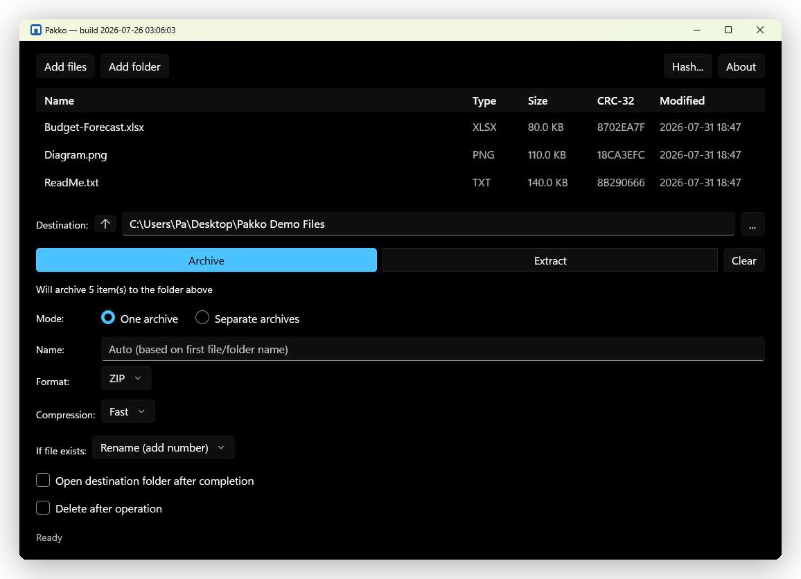

<p align="center">
  
</p>

<h1 align="center">Pakko — Windows ZIP Archiver</h1>

<p align="center">Minimal WinUI 3 GUI wrapper for Windows built-in ZIP support.</p>

<p align="center"><strong>No 7-Zip. No WinRAR. No third-party compression code.</strong></p>

<p align="center">
  <a href="https://sonarcloud.io/summary/new_code?id=pakkoapp-oss-1_pakko"></a>
  <a href="https://github.com/pakkoapp-oss/pakko/actions/workflows/build.yml"></a>
  <a href="https://github.com/pakkoapp-oss/pakko/releases/latest"></a>
  <a href="https://github.com/pakkoapp-oss/pakko/releases"></a>
  <a href="LICENSE"></a>
</p>

<p align="center">
  <a href="https://pakkoapp-oss.github.io/pakko/">🌐 Project website</a> ·
  <a href="https://apps.microsoft.com/detail/9p5mw010d8pr">🛒 Get it from Microsoft Store</a> ·
  <a href="https://ko-fi.com/pakko_app">☕ Support the project on Ko-fi</a> ·
  <a href="README.uk.md">🇺🇦 Українською</a>
</p>



---

## Why Not 7-Zip or WinRAR?

Pakko uses a different trust model — not a claim of absolute security superiority, but a different
set of supply chain dependencies with different auditability properties. Both tools have supply
chain characteristics (developer jurisdiction, no reproducible builds, CVE history) that some
security-conscious environments find unacceptable.

**For the full CVE tables and rationale, see [`SECURITY.md`](SECURITY.md)** (the canonical source).

---

## What Pakko Uses Instead

| Component | Source | Auditability |
|-----------|--------|-------------|
| ZIP compression | `System.IO.Compression` — .NET BCL | Open source, part of .NET runtime |
| UI framework | WinUI 3 / Windows App SDK | Open source on GitHub |

The entire compression stack is part of the .NET Base Class Library — maintained by Microsoft with a public CVE process, reproducible builds, and community audit via `dotnet/runtime`.

> **Trust dependency:** The .NET runtime and Windows App SDK are themselves trust dependencies. Pakko's security properties depend on the integrity of Microsoft's supply chain and build infrastructure. Organizations that trust the Microsoft/.NET ecosystem will find this architecture auditable; those that do not should evaluate accordingly.

---

## Security Properties

- **No third-party compression dependencies** — attack surface limited to .NET runtime
- **Open source** — full codebase auditable
- **Minimal permissions** — no network access, no background services
- **No telemetry** — no data leaves the machine
- **Mark of the Web (MOTW) propagation** — extracted files inherit `Zone.Identifier` from the archive by default; prevents macro execution in extracted Office docs (Explorer does not propagate MOTW)
- **No libarchive in-process** — tar/RAR/7z extraction via isolated `tar.exe` subprocess, sandboxed in an AppContainer with no network capability, not an in-process parser
- **Group Policy / ADMX support** — administrators can lock down risky features (e.g. tar-family extraction) fleet-wide; see [`docs/POLICIES.md`](docs/POLICIES.md)

---

## Tech Stack

| Layer | Technology |
|-------|-----------|
| UI | WinUI 3 + Windows App SDK |
| Language | C# 12 / .NET 8 LTS |
| Compression | `System.IO.Compression` (ZIP) |
| Distribution | MSIX (self-contained) |
| Min OS | Windows 10 1809 (build 17763) / Windows Server 2019 |
| License | Apache 2.0 |

---

## Supported Formats

| Format | Status | Method |
|--------|--------|--------|
| ZIP | ✅ read/write, v1.0 | `System.IO.Compression` |
| TAR/GZ/BZ2/XZ/ZST/LZMA | ✅ read (v1.3) + create (v1.4) | `tar.exe` (Windows built-in), AppContainer-sandboxed for extraction |
| RAR | ✅ read only, v1.3 | `tar.exe` (Windows built-in) — libarchive has no RAR writer |
| 7z | ✅ read only, v1.3 | `tar.exe` (Windows built-in) — libarchive has no 7z writer |
| Encrypted | ❌ out of scope | — |

---

## Windows 11 Integration

Pakko closes gaps in Windows Explorer:

- **Native context menu** — Extract Here, Extract to `<folder>`, Add to archive, Add to `X.tar`,
  Test archive (both the modern `IExplorerCommand` menu and the classic "Show more options" menu)
- **File type associations** — double-click any supported archive format opens directly into
  Pakko's Archive Browser, not just `.zip`
- **Archive Browser** — navigate an archive's folder structure without extracting everything
  first, extract a selection or the whole archive, then climb past the archive root into the real
  filesystem (drives, "This PC") the same way NanaZip's classic file manager does
- **Group Policy / ADMX** — administrators can disable tar-family extraction and other
  risk-relevant features fleet-wide via a real ADMX template; see [`docs/POLICIES.md`](docs/POLICIES.md)

Windows 11 23H2+ includes `tar.exe` (Microsoft-signed bsdtar), which Pakko uses — no third-party
compression tools — to read RAR/7z/tar/gz/bz2/xz/zst/lzma, and to create tar-family archives
(plain tar plus the five compression-filter variants).

---

## Command-Line Interface

`pakko.exe` (project name `Archiver.CLI`) is a standalone, self-contained command-line build with
7z-familiar commands (`x`/`t`/`i`/`a`/`l`) — it runs independently of the GUI/MSIX. See
[`docs/CLI.md`](docs/CLI.md) for the full command/switch specification. Download it as its own
per-architecture zip (with a `SHA256SUMS` file for verification) from the
[project's GitHub Releases page](https://github.com/pakkoapp-oss/pakko/releases) — every version
tag is built and published there automatically. It is not automatically added to `PATH` — see
`docs/CLI.md`'s "Distribution" section for how to make it available from any terminal.

---

## Project Status

**v1.1–v1.4 complete** — ZIP archive/extract, the native shell extension (context menu, file
associations, MOTW propagation), sandboxed RAR/7z/tar-family read + tar-family create via
`tar.exe`, the Archive Browser, and Group Policy/ADMX support are all implemented and on-device
verified.

- ✅ Archive (single / separate) with compression level selector, ZIP or any tar-family format
- ✅ Extract with smart folder logic, ZIP slip protection, and a per-conflict Ask/Overwrite/
  Rename/Skip resolution
- ✅ Password-protected ZIP detection
- ✅ System tray icon
- ✅ File log (`%LocalAppData%\Pakko\logs\pakko.log`)
- ✅ i18n — 37 locales, OS-language auto-match with English fallback
- ✅ MSIX packaging, signed with a dev cert via `Deploy.ps1`
- ✅ Mid-file cancellation (async streaming)
- ✅ Safe temp file/dir pattern — no partial files on cancel
- ✅ Compression-ratio bomb detection (1000:1 threshold), confirm-and-extract if the destination
  has room, for ZIP and every tar-family format
- ✅ UTF-8 filenames — Cyrillic and emoji round-trip verified
- ✅ Native right-click context menu — Extract here, Extract to folder, Add to archive/`X.tar`,
  Test archive
- ✅ File type association (every readable format) + `pakko://` protocol activation
- ✅ MOTW propagation on every extracted file, including Archive Browser previews
- ✅ Alternate Data Stream / reserved-filename / reparse-point protections during extraction
- ✅ Archive Browser — navigate, extract selected/all, preview an image or text file without a
  manual extract, climb past the archive root into the real filesystem
- ✅ RAR/7z/tar-family extraction runs inside an AppContainer sandbox — quarantine staging, ACL'd
  output directory, Job Object process limits, no network capability
- ✅ Group Policy / ADMX support — see [`docs/POLICIES.md`](docs/POLICIES.md)
- ✅ Full automated test suite, run on every push in CI (see the Build Status badge above)

**Now available on the Microsoft Store:** https://apps.microsoft.com/detail/9p5mw010d8pr
(also installable via `winget install 9P5MW010D8PR --source msstore`). GitHub Releases remain
available as an alternative for every version tag.

See `docs/SPEC.md`'s "Future Roadmap" section for the version-to-focus table, and `docs/TASKS.md`
for the detailed task list.

---

## Known Issues

- **Context menu flickers on the first right-click in a newly opened Explorer window** — this is
  a known Windows Explorer verb/icon-cache artifact (Explorer caches top-level shell-extension
  verbs across COM DLL registrations until it requeries them), not a Pakko bug.

---

## Building and Deploying

Prerequisites: Visual Studio 2022 (Windows App SDK / WinUI 3 + Desktop C++ workloads), .NET 8 SDK.

See [`scripts/README.md`](scripts/README.md) for the full build/sign/deploy steps and
[`CONTRIBUTING.md`](CONTRIBUTING.md) for the contributor workflow. Production code signing with a
trusted certificate is planned (T-F10) — see [`docs/SIGNING.md`](docs/SIGNING.md) for Pakko's Code
Signing Policy (team roles, build process, and artifacts covered).

---

## Running Tests

```bash
dotnet test --filter "Category!=Slow&Category!=VeryLarge"
```

Always run without a path argument — all projects must stay green after every change. See
[`docs/TESTING.md`](docs/TESTING.md) for the full test plan, fixture generation, and the
`Category=Slow`/`Category=VeryLarge` tiers.

---

## Documents

- [Developer / API Docs](https://pakkoapp-oss.github.io/pakko/dev/) — generated site: architecture,
  conventions, CLI reference, and an API reference built from `Archiver.Core`'s own XML doc comments
- [Changelog](CHANGELOG.md) — per-release history
- [Security Policy](SECURITY.md) — threat model, CVE tables, mitigations
- [Privacy Policy](docs/privacy.html)
- [Code Signing Policy](docs/SIGNING.md)
- [Group Policy / ADMX Reference](docs/POLICIES.md)
- [CLI Command Reference](docs/CLI.md)
- [Contributing Guide](CONTRIBUTING.md)
- [Code of Conduct](CODE_OF_CONDUCT.md)
- [License (Apache 2.0)](LICENSE)
