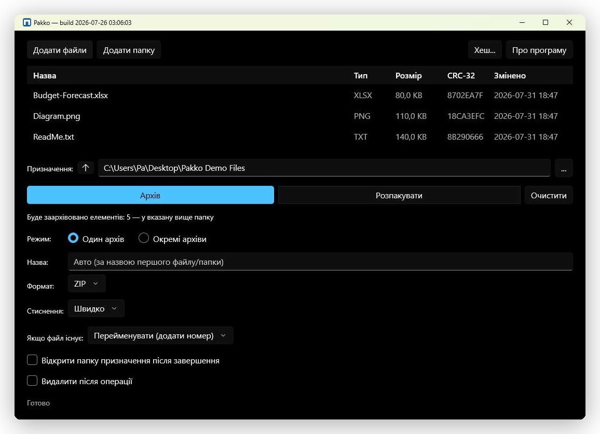

<p align="center">
  
</p>

<h1 align="center">Pakko — ZIP-архіватор для Windows</h1>

<p align="center">Мінімалістичний WinUI 3 GUI-обгортка над вбудованою підтримкою ZIP у Windows.</p>

<p align="center"><strong>Без 7-Zip. Без WinRAR. Без стороннього коду стиснення.</strong></p>

<p align="center">
  <a href="https://sonarcloud.io/summary/new_code?id=pakkoapp-oss-1_pakko"></a>
  <a href="https://github.com/pakkoapp-oss/pakko/actions/workflows/build.yml"></a>
  <a href="https://github.com/pakkoapp-oss/pakko/releases/latest"></a>
  <a href="https://github.com/pakkoapp-oss/pakko/releases"></a>
  <a href="LICENSE"></a>
</p>

<p align="center">
  <a href="https://pakkoapp-oss.github.io/pakko/uk/">🌐 Сайт проєкту</a> ·
  <a href="https://apps.microsoft.com/detail/9p5mw010d8pr">🛒 Отримати в Microsoft Store</a> ·
  <a href="https://ko-fi.com/pakko_app">☕ Підтримати проєкт на Ko-fi</a> ·
  <a href="README.md">🇬🇧 English</a>
</p>



---

## Чому не 7-Zip і не WinRAR?

Pakko використовує іншу модель довіри — це не твердження про абсолютну перевагу в безпеці, а інший
набір залежностей ланцюга постачання з іншими властивостями аудиту. Обидва інструменти мають
характеристики ланцюга постачання (юрисдикція розробника, відсутність відтворюваних збірок,
історія CVE), які деякі середовища, чутливі до безпеки, вважають неприйнятними.

**Повні таблиці CVE та обґрунтування — у [`SECURITY.md`](SECURITY.md)** (канонічне джерело;
документ англійською).

---

## Що Pakko використовує натомість

| Компонент | Джерело | Можливість аудиту |
|-----------|--------|-------------|
| Стиснення ZIP | `System.IO.Compression` — .NET BCL | Відкритий код, частина .NET runtime |
| UI-фреймворк | WinUI 3 / Windows App SDK | Відкритий код на GitHub |

Увесь стек стиснення — частина .NET Base Class Library, яку підтримує Microsoft із публічним
процесом CVE, відтворюваними збірками та аудитом спільноти через `dotnet/runtime`.

> **Залежність довіри:** .NET runtime і Windows App SDK самі є залежностями довіри. Властивості
> безпеки Pakko залежать від цілісності ланцюга постачання та збіркової інфраструктури Microsoft.
> Організації, що довіряють екосистемі Microsoft/.NET, знайдуть цю архітектуру придатною для
> аудиту; ті, що не довіряють — мають оцінювати відповідно.

---

## Властивості безпеки

- **Жодних сторонніх залежностей стиснення** — поверхня атаки обмежена .NET runtime
- **Відкритий код** — увесь код доступний для аудиту
- **Мінімум прав** — без мережевого доступу, без фонових служб
- **Без телеметрії** — жодні дані не залишають машину
- **Поширення Mark of the Web (MOTW)** — видобуті файли успадковують `Zone.Identifier` архіву за
  замовчуванням; запобігає виконанню макросів у видобутих документах Office (Explorer не
  поширює MOTW)
- **Без libarchive у процесі** — видобування tar/RAR/7z через ізольований підпроцес `tar.exe`,
  у пісочниці AppContainer без мережевих можливостей, а не через парсер у самому процесі
- **Підтримка групових політик / ADMX** — адміністратори можуть централізовано вимикати ризикові
  функції (наприклад, видобування tar-родини) на парку машин; див. [`docs/POLICIES.md`](docs/POLICIES.md)

---

## Технологічний стек

| Рівень | Технологія |
|-------|-----------|
| UI | WinUI 3 + Windows App SDK |
| Мова | C# 12 / .NET 8 LTS |
| Стиснення | `System.IO.Compression` (ZIP) |
| Дистрибуція | MSIX (self-contained) |
| Мін. ОС | Windows 10 1809 (build 17763) / Windows Server 2019 |
| Ліцензія | Apache 2.0 |

---

## Підтримувані формати

| Формат | Статус | Метод |
|--------|--------|--------|
| ZIP | ✅ читання/запис, v1.0 | `System.IO.Compression` |
| TAR/GZ/BZ2/XZ/ZST/LZMA | ✅ читання (v1.3) + створення (v1.4) | `tar.exe` (вбудований у Windows), пісочниця AppContainer для видобування |
| RAR | ✅ лише читання, v1.3 | `tar.exe` (вбудований у Windows) — libarchive не має райтера RAR |
| 7z | ✅ лише читання, v1.3 | `tar.exe` (вбудований у Windows) — libarchive не має райтера 7z |
| Зашифровані | ❌ поза межами проєкту | — |

---

## Інтеграція з Windows 11

Pakko закриває прогалини Провідника Windows:

- **Нативне контекстне меню** — Extract Here, Extract to `<folder>`, Add to archive, Add to
  `X.tar`, Test archive (як у сучасному меню `IExplorerCommand`, так і в класичному меню
  "Показати додаткові параметри")
- **Асоціації типів файлів** — подвійний клік по будь-якому підтримуваному формату архіву
  відкриває Archive Browser Pakko напряму, не лише для `.zip`
- **Archive Browser** — навігація структурою папок архіву без попереднього видобування всього
  вмісту, видобування вибраного або всього архіву, а потім підйом вище кореня архіву в реальну
  файлову систему (диски, "Цей ПК") — так само, як у класичному файловому менеджері NanaZip
- **Групові політики / ADMX** — адміністратори можуть вимкнути видобування tar-родини та інші
  ризикові функції на парку машин через справжній ADMX-шаблон; див. [`docs/POLICIES.md`](docs/POLICIES.md)

Windows 11 23H2+ включає `tar.exe` (bsdtar, підписаний Microsoft), який Pakko використовує — без
сторонніх інструментів стиснення — для читання RAR/7z/tar/gz/bz2/xz/zst/lzma та для створення
архівів tar-родини (звичайний tar плюс п'ять варіантів із фільтром стиснення).

---

## Інтерфейс командного рядка

`pakko.exe` (назва проєкту `Archiver.CLI`) — самодостатня автономна збірка командного рядка зі
знайомими для 7z командами (`x`/`t`/`i`/`a`/`l`) — працює незалежно від GUI/MSIX. Повну
специфікацію команд/ключів див. у [`docs/CLI.md`](docs/CLI.md) (документ англійською). Завантажте
його як окремий архів для своєї архітектури (з файлом `SHA256SUMS` для перевірки) на
[сторінці GitHub Releases проєкту](https://github.com/pakkoapp-oss/pakko/releases) — кожен
тег версії автоматично збирається й публікується там. Він не додається в `PATH` автоматично — див.
розділ "Distribution" у `docs/CLI.md`, як зробити його доступним з будь-якого термінала.

---

## Стан проєкту

**v1.1–v1.4 завершено** — архівування/видобування ZIP, нативне розширення оболонки (контекстне
меню, асоціації файлів, поширення MOTW), захищене читання RAR/7z/tar-родини та створення
tar-родини через `tar.exe`, Archive Browser і підтримка групових політик/ADMX — усе реалізовано
й перевірено на реальному пристрої.

- ✅ Архівування (одиночне / окремі архіви) з вибором рівня стиснення, ZIP або будь-який формат tar-родини
- ✅ Видобування з розумною логікою папок, захистом від ZIP slip і посконфліктним вирішенням
  Ask/Overwrite/Rename/Skip
- ✅ Виявлення захищених паролем ZIP
- ✅ Іконка в треї
- ✅ Файловий лог (`%LocalAppData%\Pakko\logs\pakko.log`)
- ✅ i18n — 37 локалей, автовизначення мови ОС з англійським фолбеком
- ✅ Пакування MSIX, підписане dev-сертифікатом через `Deploy.ps1`
- ✅ Скасування операції посеред файлу (асинхронне стрімінгове читання/запис)
- ✅ Безпечний шаблон тимчасових файлів/папок — без часткових файлів при скасуванні
- ✅ Виявлення ZIP-бомб за коефіцієнтом стиснення (поріг 1000:1), підтвердження перед видобуванням,
  якщо на диску достатньо місця — для ZIP і кожного формату tar-родини
- ✅ UTF-8 імена файлів — перевірено круговий обіг кирилиці та емодзі
- ✅ Нативне контекстне меню правою кнопкою — Extract here, Extract to folder, Add to archive/`X.tar`, Test archive
- ✅ Асоціація типів файлів (для кожного формату для читання) + активація через протокол `pakko://`
- ✅ Поширення MOTW на кожен видобутий файл, включно з попереднім переглядом в Archive Browser
- ✅ Захист Alternate Data Stream / зарезервованих імен файлів / reparse point під час видобування
- ✅ Archive Browser — навігація, видобування вибраного/усього, попередній перегляд зображення чи
  текстового файлу без ручного видобування, підйом вище кореня архіву в реальну файлову систему
- ✅ Видобування RAR/7z/tar-родини виконується в пісочниці AppContainer — карантинне
  стейджування, вихідна папка з ACL, обмеження процесів через Job Object, без мережевих можливостей
- ✅ Підтримка групових політик / ADMX — див. [`docs/POLICIES.md`](docs/POLICIES.md)
- ✅ Повний автоматизований набір тестів, що запускається в CI на кожен push (див. бейдж Build
  Status вище)

**Тепер доступний у Microsoft Store:** https://apps.microsoft.com/detail/9p5mw010d8pr
(також можна встановити через `winget install 9P5MW010D8PR --source msstore`). GitHub Releases
залишаються альтернативою для кожного тега версії.

Таблицю версій і фокусу дорожньої карти див. у розділі "Future Roadmap" `docs/SPEC.md`, а
детальний список завдань — у `docs/TASKS.md` (обидва документи англійською).

---

## Відомі проблеми

- **Контекстне меню блимає при першому правому кліку у щойно відкритому вікні Провідника** — це
  відомий артефакт кешу верб/іконок Провідника Windows (Explorer кешує верхньорівневі команди
  розширення оболонки між реєстраціями COM DLL, доки не запитає їх заново), а не помилка Pakko.

---

## Збірка та розгортання

Передумови: Visual Studio 2022 (навантаження Windows App SDK / WinUI 3 + Desktop C++), .NET 8 SDK.

Повні кроки збірки/підпису/розгортання — у [`scripts/README.md`](scripts/README.md) (англійською),
а робочий процес контриб'ютора — у [`CONTRIBUTING.md`](CONTRIBUTING.md). Підпис коду production-сертифікатом
у планах (T-F10) — див. [`docs/SIGNING.md`](docs/SIGNING.md) для політики підпису коду Pakko
(ролі команди, процес збірки, покриті артефакти).

---

## Запуск тестів

```bash
dotnet test --filter "Category!=Slow&Category!=VeryLarge"
```

Завжди запускайте без аргументу шляху — усі проєкти мають залишатися зеленими після кожної зміни.
Повний тест-план, генерацію фікстур і рівні `Category=Slow`/`Category=VeryLarge` див. у
[`docs/TESTING.md`](docs/TESTING.md) (англійською).

---

## Документи

- [Журнал змін](CHANGELOG.md) — історія релізів (англійською)
- [Політика безпеки](SECURITY.md) — модель загроз, таблиці CVE, заходи захисту (англійською)
- [Політика приватності](docs/privacy.html)
- [Політика підпису коду](docs/SIGNING.md)
- [Довідник групових політик / ADMX](docs/POLICIES.md)
- [Довідник команд CLI](docs/CLI.md)
- [Гід для контриб'юторів](CONTRIBUTING.md)
- [Кодекс поведінки](CODE_OF_CONDUCT.md)
- [Ліцензія (Apache 2.0)](LICENSE)
