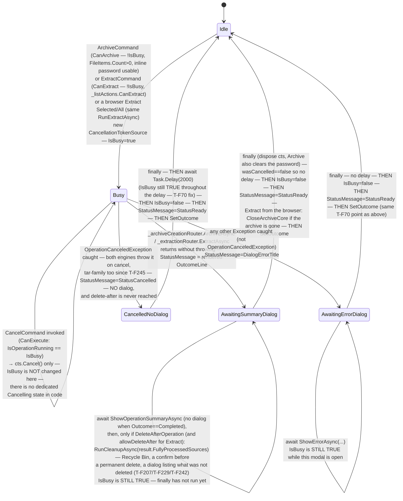
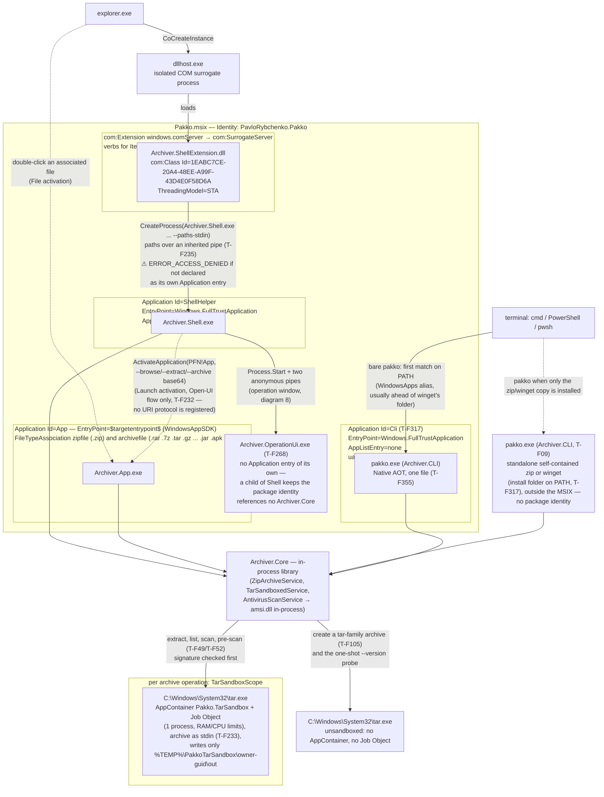
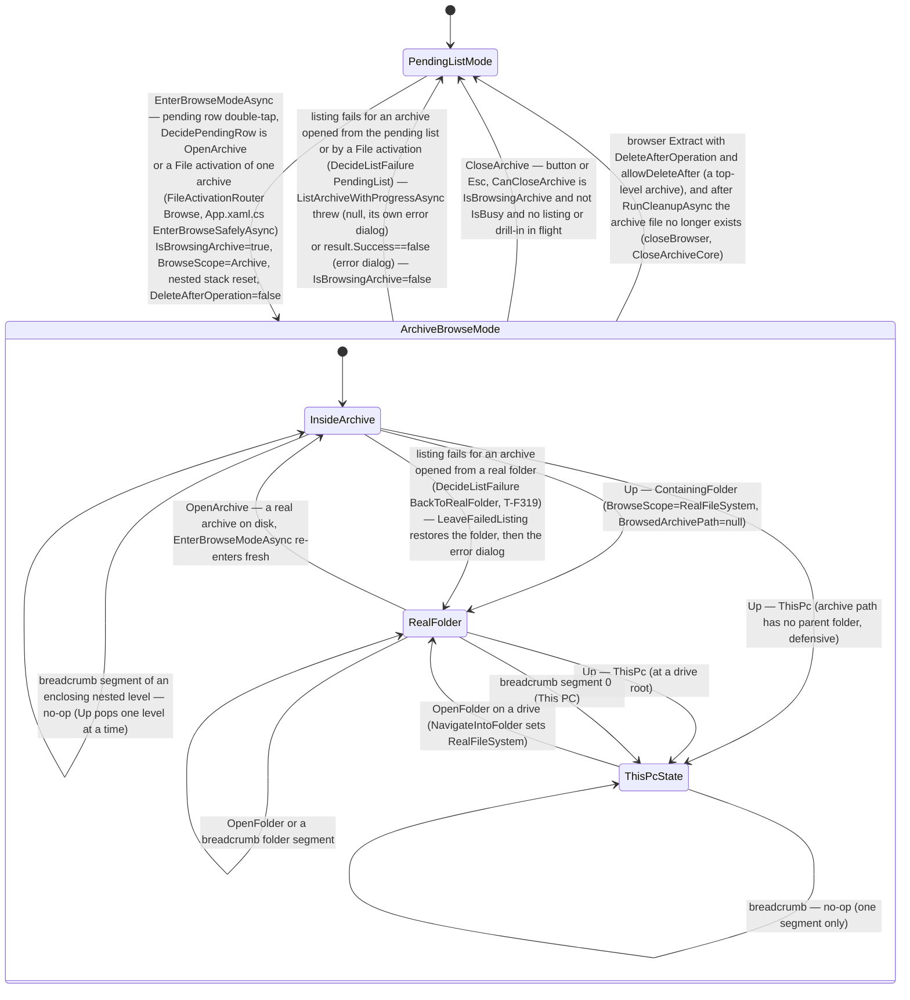
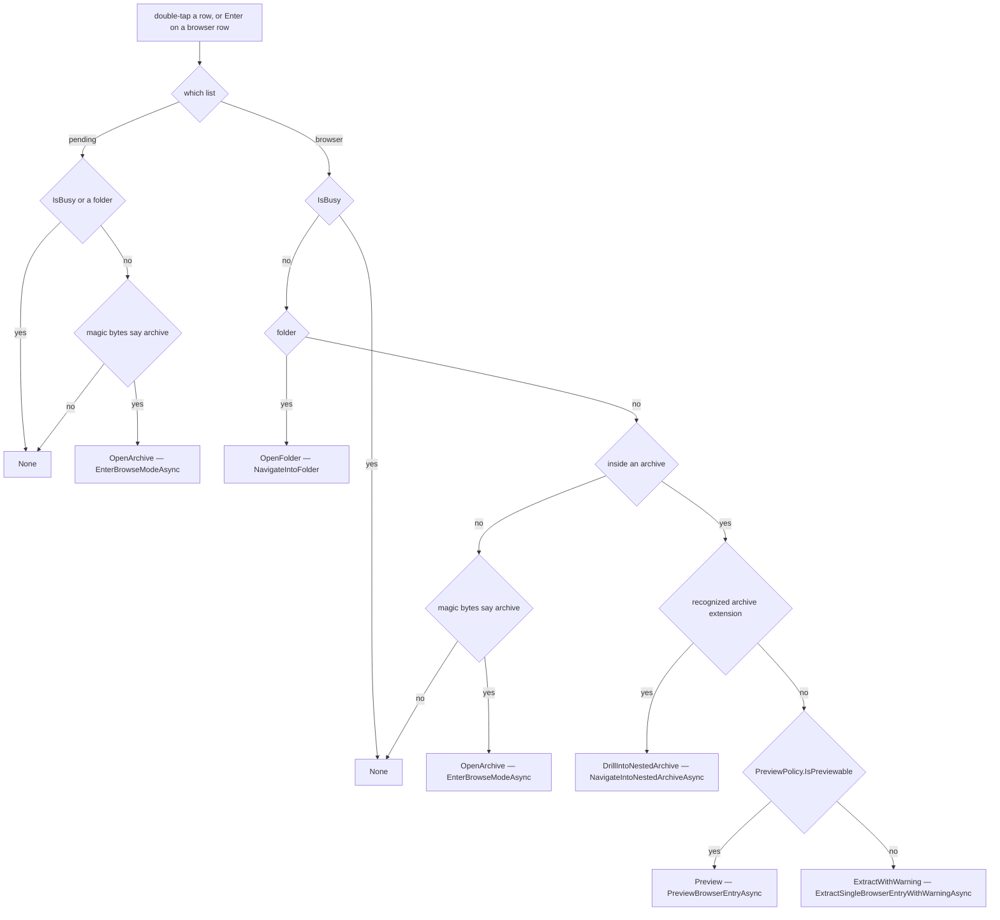
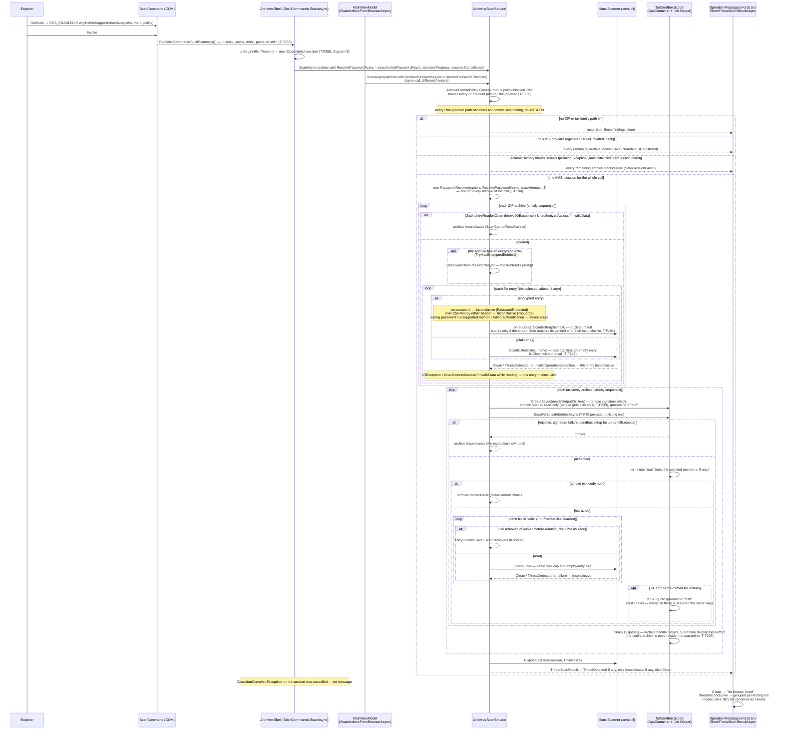
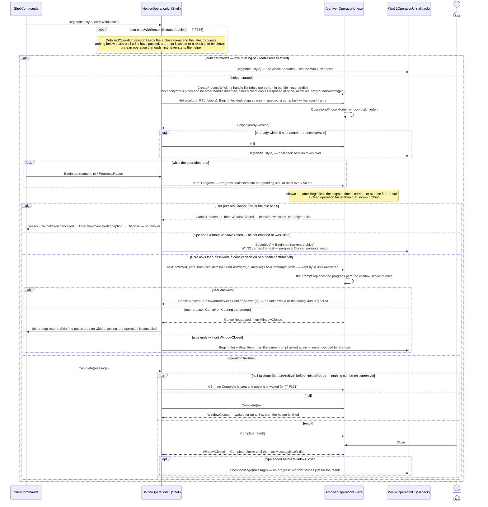

# DIAGRAMS.md — Required Diagrams for Dead-End & Problem-Area Detection

Diagrams here are a reasoning aid, not an executable test — they don't replace `dotnet test`,
they catch what unit tests structurally can't: illegal/missing state transitions, COM contract
mismatches across process boundaries, and unhandled branches in multi-step validation chains.

## Ground Truth Rule — read before drawing or updating any diagram

**A diagram must reproduce what the code actually does, verified by reading it — never what
seems plausible, symmetric, or "probably how it works."** Specifically:

- Every arrow, branch, and label must trace to a specific file:line you have actually read in
  the current session. If you have not opened the file, you do not know the branch — go read it.
- Do not smooth an asymmetric or ugly code structure into a tidy diagram. If the code has two
  `if`s with an implicit fallthrough (no `else`), draw exactly that — not three clean parallel
  branches. The ugliness is often the point (see the `OnConflict` gate in diagram 3: `Overwrite`
  has no explicit branch and that's a real, load-bearing fact about the code, not an omission
  to tidy up).
- Do not infer execution order from what would be "natural" — verify it. Two operations that
  look independent (e.g. "set `IsBusy=false`" vs. "await a modal dialog") may execute in either
  order depending on where in the method they actually appear; get this from the source, not from
  intuition (see diagram 2, where this was gotten backwards in an earlier draft — the dialog
  await happens *before* `finally`, not after).
- Where the code doesn't name something the diagram needs a label for (e.g. bucketing several
  `catch` blocks into "outcomes"), the label must be immediately followed by the literal
  condition from the code it stands for. Never let an invented label stand alone as if it were
  a real enum or state in the codebase.
- If, while drawing, you find the diagram doesn't match the code you just read, that's a signal
  either the diagram was wrong or the code has a real gap — report both, don't quietly pick
  whichever is more convenient to draw.
- When updating a diagram after a code change, re-derive the affected part from the new source —
  don't edit the old diagram by pattern-matching against its previous shape.

Violating this makes the diagram actively worse than having none: a wrong diagram is trusted
documentation that lies.

---

## When to update which diagram (Definition of Done)

| Change touches... | Update this diagram | Because |
|---|---|---|
| COM interop, `IExplorerCommand`, process launch (`CreateProcess`, `Process.Start`), `IProgressDialog` | **1. Sequence** | Every real bug so far here (`S_FALSE`, missing `[PreserveSig]`, undeclared `Application`) was a contract mismatch across a process/COM boundary — invisible in unit tests, visible in a sequence diagram. |
| `IsBusy`/cancellation/operation lifecycle in `MainViewModel`, or `NativeProgressDialog` cancel polling | **2. State** | Catches stuck states (a state with no outgoing transition) and commands gated on the wrong `CanExecute`. |
| New branch in `ZipArchiveService` validation/conflict/smart-folder logic | **3. Activity** | Catches silently-dropped entries: a new `continue`/skip path that isn't reflected in `ArchiveResult` (see Finding 2 below for why this matters). |
| MSIX manifest `<Application>` entries, `com:ComServer` registration, packaging of a new satellite EXE | **4. Component** | Catches "works in VS, `ERROR_ACCESS_DENIED` when packaged" — an EXE that isn't its own declared `Application` entry. |
| New branch in `TarSandboxedService`'s pre-scan/extraction/conflict pipeline | **5. Activity (tar.exe)** | Whole-archive-reject means a single scan gap silently lets an entire class of unsafe entries through — there's no per-entry fallback the way ZIP has, so a missed branch here is higher-severity, not lower. |
| `MainWindow.xaml` element added/removed, or any `Visibility` binding changed; new `IsBrowsingArchive`-gated (or should-be-gated) UI element; `BrowseLocationState`, `BrowserEntryRouting`, `BrowseNavigation`, or `MainViewModel`'s browse methods (enter, Up, breadcrumb, drill-in, close) | **6. State (UI mode)** — its three `check:` tables are verified by `DiagramSixTests` | Exactly the category that missed Row 0 never hiding in browse mode (found 2026-07-13 by manual comparison, not by this table) — a per-row visibility table is the only thing that would have caught it before shipping. |
| `HelperOperationUi`'s failover/close handling, `OperationWindowModel`'s states, or a new protocol message | **8. Sequence (operation window helper)** | Close, clean end and crash differ only by the last frame on the pipe — a missed case either loses the result or shows it twice. |
| New branch in `AntivirusScanService`'s ZIP-vs-tar-family dispatch, or either scan path's error handling | **7. Sequence (AMSI scan)** | A scan silently returning `Clean` for a path it never actually examined (unsupported format, no provider, oversized entry, a vanished tar quarantine file) is the exact failure class this feature exists to prevent — a missed branch here is a false negative, the highest-severity outcome this diagram category can catch. |
| `ArchiveCreationRouter`, either engine's `ArchiveAsync`/`CompressAsync` branching (mode, parallel threshold, encryption, conflict pre-pass, tar argument building) | **9. Activity (archive creation)** | The two engines differ on purpose (password, parallelism, command line) — a change that treats them as mirror images breaks the one it did not look at. |

Update the diagram in the same commit as the code change, alongside `dotnet test` — not as a
follow-up. Re-derive the affected part from the current source per the Ground Truth Rule above;
do not edit by pattern-matching the diagram's previous shape.

---

## 1. Sequence — Shell context-menu invocation

Sources read for this diagram: `src/Archiver.ShellExtension/dllmain.cpp`,
`src/Archiver.ShellExtension/ExplorerCommands.cpp`, `src/Archiver.ShellExtension/ShellExtUtils.cpp`,
`tests/Archiver.ShellExtension.Tests/ComLoadTests.cpp` (the enumeration order),
`src/Archiver.Shell/Program.cs`, `src/Archiver.Shell/ShellCommands.cs`,
`src/Archiver.Shell/Win32OperationUi.cs`, `src/Archiver.Shell/OperationMessages.cs` (T-F268),
`src/Archiver.Shell/ShellResultPresenter.cs`,
`src/Archiver.Shell/NativeProgressDialog.cs`, `src/Archiver.App/App.xaml.cs`,
`src/Archiver.App.Core/LaunchActivationRouter.cs` (T-F03, T-F232), `src/Archiver.Shell/AppLauncher.cs`,
`src/Archiver.Core/Services/LaunchArguments.cs` (T-F232).

**T-F99 (2026-07-13):** `Package.appxmanifest` now also registers `PakkoRootCommand`'s verb for
`desktop10:ItemType Type="Drive"`, alongside the existing `*`/`Directory` entries this diagram
already covers — `Explorer->>Root: CoCreateInstance(...)` is now also reachable for a drive-root
`IShellItemArray` selection. No new sequence step needed (`GetState`/`Invoke` already treat `paths`
generically, regardless of what kind of selection produced them), but see the new "What this
catches" bullet below for a real bug this reachability change exposed in `LaunchShellExe`'s
argument-building step (node `EH->>ShellExe`/`AC->>ShellExe` etc.).

```mermaid
sequenceDiagram
    actor User
    participant Explorer as explorer.exe
    participant Dllhost as dllhost.exe (COM surrogate)
    participant Factory as PakkoClassFactory<PakkoRootCommand>
    participant Root as PakkoRootCommand
    participant Enum as SubCommandEnum
    participant BC as BrowseCommand
    participant EDC as ExtractDialogCommand
    participant EHF as ExtractHereFlatCommand
    participant EH as ExtractHereCommand
    participant EF as ExtractFolderCommand
    participant CDC as CompressDialogCommand
    participant AC as ArchiveCommand
    participant TAC as TarArchiveCommand
    participant TC as TestCommand
    participant SC as ScanCommand
    participant HX as HashCrc32Command / HashSha256Command
    participant ShellExe as Archiver.Shell.exe
    participant Core as Archiver.Core (routers, FileHashService)
    participant Dlg as IOperationUi session (Win32OperationUi drawn — diagram 8 for the helper)
    participant App as Archiver.App.exe (Launch activation, T-F232)

    User->>Explorer: right-click selection
    Explorer->>Dllhost: CoCreateInstance(CLSID_PakkoRootCommand)<br/>(com:SurrogateServer registration)
    Dllhost->>Factory: DllGetClassObject(CLSID_PakkoRootCommand)<br/>only this CLSID is registered
    Explorer->>Factory: IClassFactory::CreateInstance
    Factory->>Root: Make<PakkoRootCommand>()
    Explorer->>Root: GetFlags() → ECF_HASSUBCOMMANDS
    Explorer->>Root: EnumSubCommands()
    Root->>Enum: Make each leaf, then SetCommands([BC, EDC, EHF, EH, EF, CDC, AC, TAC, TC, SC, HashCrc32, HashSha256])<br/>ALWAYS all twelve, unconditionally — selection does not filter EnumSubCommands.<br/>Order asserted by ComLoadTests' EnumSubCommands_ReturnsAllTwelveLeafCommandsInDocumentedOrder:<br/>BC first (T-F03, NanaZip's kOpen), then extract dialog/flat/intelligent/named-folder (T-F115),<br/>then compress dialog and the two one-click archive verbs (T-F105), then the diagnostic<br/>group last — Test, Scan (T-F146), CRC-32, SHA-256 (T-F128: two flat leaves, no submenu)
    Root-->>Explorer: Enum (IEnumExplorerCommand)
    loop Explorer drains the enumerator
        Explorer->>Enum: Next(celt, ...)
        Enum-->>Explorer: fetched items,<br/>S_OK if fetched==celt, else S_FALSE<br/>S_FALSE is a SUCCESS code here, not failure
    end
    Note over Explorer,HX: Visibility is decided per-command by GetState(), separately from enumeration.<br/>T-F262: the archive predicates take GetMenuPolicy() — an item DisableTarExtraction or<br/>BlockedFormats blocks is not an archive for them (HKLM policy, fail-safe, re-read at most every 5 s)
    Explorer->>BC: GetState → ECS_ENABLED iff paths.size()==1 AND AllPathsAreSupportedArchive(paths, policy)
    Explorer->>EDC: GetState → ECS_ENABLED iff AnyPathIsSupportedArchive(paths, policy)
    Explorer->>EHF: GetState → ECS_ENABLED iff AllPathsAreSupportedArchive(paths, policy) — same for EH and EF
    Explorer->>CDC: GetState → always ECS_ENABLED (T-F63)
    Explorer->>AC: GetState → ECS_HIDDEN iff AllPathsAreZip(paths) OR NOT IsCreationFormatAllowed("zip", policy)<br/>(INVERTED vs. EH/EF, deliberately still AllPathsAreZip — T-F86)
    Explorer->>TAC: GetState → ECS_HIDDEN iff AllPathsAreZip(paths) OR NOT IsCreationFormatAllowed("tar", policy)
    Explorer->>AC: GetTitle(psia) → BuildAddToArchiveTitle(paths)<br/>dynamic "Add to <name>.zip", truncated middle if >40 chars — TAC the same with .tar
    Explorer->>TC: GetState → ECS_ENABLED iff AnyPathIsZip(paths, policy)<br/>(T-F62/T-F86: ZIP only — tar-family has no test, the router would skip it)
    Explorer->>SC: GetState → ECS_ENABLED iff AnyPathIsSupportedArchive(paths, policy) (T-F146)
    Explorer->>HX: GetState → ECS_ENABLED iff paths non-empty (any file or folder, T-F128)
    User->>Explorer: click one visible leaf command
    alt command is BC (Open, T-F03)
        Explorer->>BC: Invoke(psia, pbc)
        BC->>ShellExe: LaunchShellExe(BuildOpenUiBrowseArgs(), paths)<br/>i.e. "--open-ui --browse --paths-stdin", the path on stdin (T-F235) — paths.size() is always 1 here, enforced by GetState
        BC-->>Explorer: S_OK, or HRESULT_FROM_WIN32(GetLastError())
        ShellExe->>App: AppLauncher.Launch → IApplicationActivationManager::ActivateApplication(<br/>"<own PFN>!App", "--browse <base64 JSON>") — T-F232, was a pakko:// URI —<br/>then ShellExe's Main returns/exits immediately — same LaunchOpenUi helper EDC/CDC use
        App->>App: Launch kind: LaunchActivationRouter.Decide(arguments) → Mode=Browse<br/>window.ActivationGate.RunOrDefer(...) → MainViewModel.EnterBrowseModeAsync(path)<br/>— skips the pending-list/extract-options view entirely, the same destination<br/>FileActivationRouter already routes a double-clicked single archive to (T-F100)
    else command is EDC or CDC (dialog form, T-F63)
        Explorer->>EDC: Invoke(psia, pbc) — or CDC, same shape
        EDC->>ShellExe: LaunchShellExe(BuildOpenUiExtractArgs(), paths)<br/>— or BuildOpenUiArchiveArgs for CDC —<br/>i.e. "--open-ui --extract/--archive --paths-stdin", paths on stdin (T-F235)<br/>Shell refuses a list over LaunchArguments' 32,000-char cap with a message
        EDC-->>Explorer: S_OK, or HRESULT_FROM_WIN32(GetLastError())
        ShellExe->>App: ActivateApplication("<own PFN>!App", "--extract <base64 JSON>")<br/>— or --archive — then ShellExe's Main returns/exits immediately —<br/>NO operation window, NO Core call in this branch at all
        Note over App: T-F83 (fixed 2026-07-06): cold start reads the activation via<br/>OnLaunched→AppInstance.GetCurrent().GetActivatedEventArgs(), not just<br/>the OnActivated event (which only fires for redirected/warm activation).<br/>Before the fix, a cold protocol launch silently opened an EMPTY window.
        App->>App: LaunchActivationRouter.Decide(arguments) → Mode=AddToList<br/>window.ActivationGate.RunOrDefer(...) → MainViewModel.AddPaths(paths)<br/>— files pre-loaded, user drives Archive/Extract from the full UI.<br/>T-F106: wrapped in ActivationGate/DeferredActionGate so this runs AFTER<br/>the first layout pass
    else command is EHF, EH, EF, AC, TAC, TC, SC or a hash leaf (silent form, RunShellCommand)
        Explorer->>EH: Invoke(psia, pbc) — every silent leaf has this shape
        alt GetSelectionPaths(psia) empty, or an item has no filesystem path
            EH->>User: MessageBoxW(MB_TOPMOST) — T-F235: a selection is refused whole, never processed partly
            EH-->>Explorer: E_INVALIDARG
        else paths present
            EH->>ShellExe: LaunchShellExe(args, paths) — BuildExtractHereArgs / BuildExtractHereFlatArgs /<br/>BuildExtractFolderArgs / BuildArchiveArgs() / BuildArchiveArgs("tar") / BuildTestArgs /<br/>BuildScanArgs / BuildHashArgs("crc32"|"sha256")<br/>CreateProcessW(command --paths-stdin) — T-F235: only the stdin read end is inherited, then<br/>the paths go to the child's stdin (UTF-16LE, NUL-separated, end marker) — does NOT wait
            ShellExe->>ShellExe: StdinPathList.Read — a list cut short is refused whole
            EH-->>Explorer: S_OK, or a MessageBoxW with the HRESULT on a launch or<br/>write failure — returned once the list is written, NOT when the operation finishes
            ShellExe->>Dlg: ui.Begin(title, Bytes, or Percent for Scan) — ONE session per Explorer command,<br/>even for a multi-archive selection (T-F268 step 3). The WinUI helper comes first<br/>(diagram 8) — Win32OperationUi, drawn here, is its fallback. Cancel is polled every 250 ms<br/>(IProgressDialog.HasUserCancelled, [PreserveSig] BOOL) and cancels the session's one token
            alt extract commands (EHF / EH / EF)
                loop each archive of the selection
                    ShellExe->>Dlg: session.BeginItem(name, i, n) — the title gains "name (i/n)" when n is greater than 1
                    ShellExe->>Core: IExtractionRouter.ExtractAsync(options with OnConflict=Ask, session.Progress, session.Cancellation)
                    opt Core raises a prompt (T-F155, T-F192, T-F217)
                        Core->>Dlg: conflict → session.AskConflictAsync / password → session.AskPasswordAsync,<br/>both through a StickyCallback — "apply to all/remaining" spans the whole selection —<br/>suspected bomb → session.ConfirmAsync, asked per archive, never "for all"
                        Dlg-->>Core: the user's answer
                    end
                    Core-->>ShellExe: IProgress<ProgressReport> per file/entry, then ArchiveResult
                end
            else AC / TAC
                ShellExe->>Core: IArchiveCreationRouter.ArchiveAsync(SingleArchive, OnConflict=Rename, Format=zip or tar)
            else TC
                ShellExe->>Core: IExtractionRouter.TestAsync(paths, progress, password via session.AskPasswordAsync)<br/>— the FULL selection, the router classifies each path, tar-family is skipped (T-F261)
            else SC
                ShellExe->>Core: IAntivirusScanService.ScanAsync — diagram 7
            else hash leaf
                ShellExe->>Core: FileHashService.ComputeAsync(paths, algorithm, session.Progress, session.Cancellation)<br/>single file / multi-file independently / single-folder recursive — an unreadable subfolder<br/>or a skipped junction is one error entry, never an exception (T-F251)
            end
            alt OperationCanceledException, or the session's token was cancelled
                ShellExe->>Dlg: session.Dispose() — no message at all<br/>T-F269: the one token stops the whole selection, later archives never start
            else completed
                Note over ShellExe: OperationMessages.ForArchiveResult / ForTestResult / ForScan / ForHash —<br/>by result.Outcome for archive results (T-F260): Failed lists errors, CompletedWithSkips and<br/>NothingDone list skips, Completed shows nothing. Test adds No errors detected only when an<br/>archive was really read (T-F274). Hash: Warning when any entry failed — for a single folder<br/>only the Files/Size/DataSum/NamesSum lines are shown, not which entry failed (T-F291)
                ShellExe->>Dlg: session.Complete(message) — closes the progress window first
                opt message is not null (Extract/Archive success has none)
                    ShellExe->>User: MessageBoxW(text, icon by severity, max 10 lines + and-N-more line)<br/>— shown even when no progress window could be created (T-F268)
                end
            end
        end
    end
```

**T-F258 (2026-09-29):** re-derived from `ExplorerCommands.cpp`, `ComLoadTests.cpp`,
`ShellCommands.cs`, `Win32OperationUi.cs` and `OperationMessages.cs`. The drawing had gone stale:
the `HashCommand` submenu parent it showed was flattened into two leaves long ago (T-F128
follow-up), and `TarArchiveCommand`/`ScanCommand` were missing. Added the extract commands'
conflict, password and compression-bomb prompts (T-F155, T-F192, T-F217) and the hash result's
error handling (T-F251). The Win32 dialog is drawn as one `IOperationUi` session; diagram 8 draws
the WinUI helper that comes before it. While drawing, found T-F291: when Explorer hashes a single
folder, a failed entry shows only as a warning icon.

**What this catches (verified against the real bugs already fixed here):**
- **`BC` (T-F03) is a third, distinct Open-UI destination — not a variant of `EDC`/`CDC`'s
  flow.** It reuses the identical `ShellCommands.OpenUi`/`ActivateApplication` mechanism, but
  `LaunchActivationRouter.Decide` returns `Browse` for `--browse` with one path, so it never
  touches the pending-list/extract-options view at all, unlike `--extract`/`--archive`.
- **T-F232 (2026-09-26): there is no `pakko://` URI scheme any more.** A registered scheme could
  be launched by any web page, e-mail or document link with an arbitrary (UNC) path, and the App
  could not tell such a URI from Archiver.Shell's. The hand-off is now a Launch activation that
  only a process already on the machine can start. `AppLauncher` refuses a selection whose
  arguments exceed `LaunchArguments.MaxLength` (32000) with a message box, because past the
  command-line limit `ActivateApplication` blocks forever instead of failing.
- `EH`/`EF`/`AC`/`EDC`/`CDC`/`TC` `Invoke()` never awaits the operation — Explorer's HRESULT comes
  back the instant `CreateProcess` returns. Anything that assumes Explorer "waits" for Pakko's
  result is wrong.
- **`EDC`/`CDC` (T-F63) take a structurally different path than the other four:** no
  `NativeProgressDialog`, no `ZipArchiveService` call from `Archiver.Shell.exe` at all — they only
  build `LaunchArguments` and hand off to `Archiver.App` via `ActivateApplication` (T-F232).
  A future change to the silent path's progress/result handling does not automatically apply here.
- **T-F83 (fixed 2026-07-06):** this dialog path is exactly what surfaced a pre-existing cold-start
  bug in `Archiver.App` — `AppInstance.Activated` only fires for *redirected* activation to an
  already-running instance, never for the process's own initial activation, so `OnLaunched` must
  pull `GetActivatedEventArgs()` itself. See `DECISIONS.md`'s "T-F83" entry.
- `HasUserCancelled()` is the one `IProgressDialog` method returning a plain `BOOL`; the
  `[PreserveSig]` boundary is exactly where "Cancel does nothing" lived (`NativeProgressDialog.cs:26`).
- `SubCommandEnum::Next()` returns `S_FALSE` on partial fetch — a *success* code, per
  `(fetched == celt) ? S_OK : S_FALSE` (`ExplorerCommands.cpp:29`). Any new
  `IEnumExplorerCommand`/`IExplorerCommand` method must not conflate `S_FALSE` with failure.
- Visibility filtering happens via `GetState()`, not `EnumSubCommands()` — a future change that
  tries to filter which commands appear by editing `EnumSubCommands` (e.g. "don't enumerate
  Archive for all-ZIP selections") would be editing the wrong method; `ArchiveCommand`'s
  `GetState` condition is the *inverse* of `ExtractHereCommand`/`ExtractFolderCommand`'s, which is
  easy to get backwards when copy-pasting.
- `TestCommand::GetState` (T-F62) uses `AnyPathIsZip` (`ExtractDialogCommand` shared it until T-F86
  moved it to `AnyPathIsSupportedArchive`), distinct from `AllPathsAreZip` (EH/EF) and its inverse (AC) — copy-pasting
  `AllPathsAreZip` here would hide Test/ExtractDialog on any mixed selection, unlike NanaZip's
  reference behavior (verified against real
  NanaZip source in `DECISIONS.md`).
- **T-F86:** `EH`/`EF`/`EDC` moved from `AllPathsAreZip`/`AnyPathIsZip` to new
  `AllPathsAreSupportedArchive`/`AnyPathIsSupportedArchive` (extension allowlist + `tar.exe`
  existence check — no magic-byte read at `GetState()` time, deliberately deviating from
  NanaZip's real exclusion-list shape; see `DECISIONS.md`). `TC` and `AC` were deliberately left
  on the old ZIP-only predicates: `TC` because `ITarService` has no Test capability (enabling it
  would produce a false "No errors detected" for an untested RAR/7z), `AC` because hiding "Add to
  archive…" for an all-RAR selection was never correct to begin with. A future change that makes
  these four commands' gates "consistent" by copy-pasting one predicate onto all of them would
  reintroduce either the false-Test-pass bug or hide a legitimate archive action.
  **Since T-F261/T-F274 (2026-09-28)** Test goes through `ExtractionRouter.TestAsync`, which skips a
  tar-family archive with its own reason and never says "No errors detected" for a run that read
  nothing — so enabling Test for tar would now show a skip, not a false pass. `TC` stays ZIP-only
  because there is still nothing to test there. (The comment at `ExplorerCommands.cpp`'s
  `TestCommand::GetState` still gives the pre-T-F261 reason.)
- **T-F99 (2026-07-13), obsolete since T-F235 (2026-09-28):** paths no longer go on the command
  line, so `QuotePath`'s drive-root trailing-backslash corruption cannot recur there; see
  `DECISIONS.md`'s T-F99 and fix phase 5 entries.

---

## 2. State — Operation lifecycle (`MainViewModel`)

Source read for this diagram (re-derived 2026-09-29, T-F258): `src/Archiver.App/ViewModels/MainViewModel.cs`
— `ArchiveAsync`, `ExtractAsync` → `RunExtractAsync`, `Cancel`, `CanArchive`/`CanExtract`,
`RunCleanupAsync`. Both methods have the same try/catch/finally shape; the diagram applies to either,
with the differences named in the labels. (Line numbers are no longer quoted — they went stale
with every change above them.) `Test`/`Scan` from the browser follow the same cancel path (T-F277)
but are not drawn here.

**T-F05 (Archive Browser):** `ExtractAsync()`'s body was extracted into a shared
`RunExtractAsync(archivePaths, selectedEntryPaths)`, now also called by
`ExtractSelectedFromBrowserCommand`/`ExtractAllFromBrowserCommand`/
`ExtractSingleBrowserEntryWithWarningAsync` (renamed from `ExtractSingleBrowserEntryAsync` by
T-F109/T-F110). The state machine below is unchanged — same
`Idle→Busy→{AwaitingSummaryDialog|AwaitingErrorDialog|CancelledNoDialog}→Idle` shape, same
`IsBusy` sequencing — only the transition's trigger label gains three more command names that
all lead to the identical `Busy` entry point via the same shared method body.

**Fixed 2026-07-18 (T-F123):** `PreviewBrowserEntryAsync` (T-F97, `MainViewModel.cs:1080-1121`)
and `NavigateIntoNestedArchiveAsync` (T-F98, `MainViewModel.cs:765-829`) both call
`_extractionRouter.ExtractAsync(...)` directly from a raw XAML `DoubleTapped` handler
(`ArchiveBrowserList_DoubleTapped`, `MainWindow.xaml.cs:192`) — **outside this state machine
entirely**, with no `IsBusy`/`CanExecute` gate of their own, so a user could previously trigger
either mid-`Busy` and start a second, concurrent extraction against the same
`TarSandboxedService`/quarantine machinery. Fixed at the input layer, not inside `MainViewModel`:
`ArchiveBrowserListView`'s `IsEnabled` is now bound to `ViewModel.IsNotBusy` (`MainWindow.xaml`),
the same pattern every other action-triggering control in this window already uses — a disabled
`ListView` never dispatches `DoubleTapped`/`SelectionChanged` at all, so
`ArchiveBrowserList_DoubleTapped` simply cannot fire while `Busy`. This diagram still does not draw
a transition for these two methods, but now because the input that reaches them is gated shut
during `Busy`, not because the gap is unaddressed.

**T-F199 step 5 (2026-09-28, replaces the T-F193 prompt path):** the new-archive password is typed
inline under the "Encrypt with password" checkbox and checked while typing; `ArchiveCommand`'s
CanExecute stays false until it is valid, so no prompt opens during `Busy`. `ArchiveAsync` reads
the password once before the Core call and clears it in `finally`, on every exit path.

**T-F199 step 7 / T-F211 (2026-09-28):** the status line during `Busy` shows the rendered
`OutcomeLine` (it replaced `StatusDone`/`StatusArchivedIn`); `ShowOperationSummaryAsync` is always
awaited but `DialogService` returns at once for `OperationOutcome.Completed`, so the summary opens
only on problems; "delete after" runs after it (T-F229). After `IsBusy=false` the status resets to
`StatusReady` and `SetOutcome` puts the result line in the footer, where it stays until the next
action (`FooterLine.Pick`). All three exit paths end in `SetOutcome` (result, error title or
"Cancelled"), and `ArchiveAsync` and `RunExtractAsync` end the same way.

**What this catches:**
- Every exit path sets `IsBusy=false` exactly once, after both the dialog-await (success/issues/
  error) and the cancel-only delay have finished — no path leaves `Busy` without eventually
  re-enabling controls, and (post-T-F70) no path re-enables them early either. A future edit that
  adds an early `return` before this point, or a new `catch` that doesn't fall through to it,
  would break this.
- **T-F70 fix (2026-07-06):** `IsBusy = false` used to live in `finally`, which ran *before* the
  cancel-only `Task.Delay(2000)` — so for those 2 seconds the UI was already not-busy (new
  operations invokable) while the status text still read "Cancelled", unlike the other three
  outcomes where `IsBusy` stays `true` for exactly as long as their dialog is open. Fixed by moving
  `IsBusy = false` to immediately before the final `StatusMessage = StatusReady` line, after the
  `if (wasCancelled) await Task.Delay(2000)` — see `DECISIONS.md`'s "T-F70" entry. All four exit
  paths now release `IsBusy` at the same conceptual point: once nothing transient is left on screen.
- `Cancel`'s `CanExecute` is gated on `IsOperationRunning` (=`IsBusy`) — a future state inserted
  between "user clicked" and `IsBusy=true` would make Cancel uninvokable during it. Note this also
  means Cancel now stays *clickable* (though a harmless no-op, since `_cts` is already null by
  `finally`) throughout the post-cancel 2-second delay too.
- Cancellation itself has no intermediate state: `cts.Cancel()` only sets the token; the running
  `Task.Run` loop notices it at whatever granularity it happens to check
  (`cancellationToken.IsCancellationRequested`, or inside `CopyToAsync`, which also observes the
  token). Confirm this still holds for any new async step added inside `ArchiveAsync`/`ExtractAsync`.

---

## 3. Activity — Extract validation/foldering chain

Source read for this diagram (redrawn 2026-09-25, fix phase 2; updated the same day for fix phase 3,
adding `Zip/ZipArchiveReader` and `ArchiveEntrySecurity.HasReservedName`): `ExtractWithSmartFolderingCoreAsync`,
`TryExtractSingleEntryAsync`, `TryCreateFolderEntry`, `WriteEntryAsync` and `CopyEntryToDestinationAsync` in
`src/Archiver.Core/Services/ZipArchiveService.cs`, plus `ExtractionStaging.CommitInto` and
`IO/VerifyingReadStream`. T-F223 (2026-09-29): nodes PW-PW2 and K's encrypted-entry failures from
`TryRejectUnsupportedOrEncryptedZipAsync`, `ResolveArchivePasswordAsync` and `OpenEntryContentStream`.

```mermaid
flowchart TD
    PM{"ExtractAsync outer loop, per archive:<br/>file missing? (T-F221)"} -- yes --> PM1["Errors += SourceNotFound<br/>(not 'not a recognized archive')"]
    PM -- no --> P0{"zip blocked by Group Policy?<br/>(T-F250 — also catches an Unknown-detected ZIP)"} -- yes --> P1["SkippedFiles += policy reason,<br/>archive not opened"]
    P0 -- no --> PW{"IsEncryptedZip? (any entry, whole central directory)"}
    PW -- yes --> PW1["ResolveArchivePasswordAsync, once per archive, before staging:<br/>options.ResolvePasswordAsync, up to 3 attempts, each checked against<br/>the smallest encrypted entry (T-F189/T-F243)"]
    PW1 -- "no password (none wired, cancelled, attempts used up)" --> PW2["Errors += PasswordProtectedExtract, archive not opened"]
    PW1 -- "resolved" --> A0
    PW -- no --> A0["ZipArchiveReader.Open: allEntries = every ZIP entry, files AND folder entries (T-F197),<br/>each with its name decoded by 7-Zip's rule, never ZipArchiveEntry.FullName (T-F234)"] --> A1{"T-F05: options.SelectedEntryPaths<br/>set and non-empty?"}
    A1 -- no --> A2["entries = allEntries.<br/>isSingleRootFolder/isSingleRootFile computed over files AND folders<br/>(a.txt + empty/ is MultiRoot), then<br/>ExtractionDestinationPlanner.Classify → RootShape (T-F157)"]
    A1 -- yes --> A3["entries = allEntries filtered to the selected paths<br/>+ anything nested under a selected folder path<br/>→ RootShape.SelectedSubset"]
    A2 --> A3B["ExtractionDestinationPlanner.Resolve(alreadyIsolated, shape, destDir,<br/>unisolatedDestDir, rootDuplicatesArchiveName)<br/>→ (actualDest, stripRootPrefix). T-F205: SingleFolder keeps the root<br/>unless EliminateDuplicateRootFolder is set and the root is named like the archive"]
    A3 --> A3B
    A3B --> A4["Compression-bomb check sums allFileEntries (whole archive),<br/>never the filtered subset — T-F05/T-F94"]
    A4 --> ST["using staging = ExtractionStaging.Create(DestinationFolder)<br/>sweeps .pakko-x-* of dead runs (T-F263), fresh hidden .pakko-x-owner-guid,<br/>never reused, disposed on every exit (T-F227)"]
    ST --> A["For each entry in entries"] --> CL{"CollidesAfterDecoding: other raw bytes,<br/>same decoded name as an earlier entry? (T-F234)"}
    CL -- yes --> E0["Errors += same name once decoded, entry not extracted"]
    CL -- no --> U{"HasUnsafePath: a .. segment (either separator)<br/>or a rooted / drive-relative name? (T-F228)"}
    U -- yes --> E1["Errors += unsafe path, entry not extracted"]
    U -- no --> C{"stripRootPrefix: strip leading segment"}
    C -- "stripped to empty" --> Z["the root itself: actualDest stands in for it<br/>(counts as extracted only for a folder entry)"]
    C -- "non-empty, or not applicable" --> D{"ADS marker, reserved device name (any segment,<br/>part before the first dot, T-F243) or control chars<br/>in the name without its trailing slash? T-F38/T-F39"}
    D -- yes --> S1["SkippedFiles += reason"]
    D -- no --> T["try (T-F230) — IOException, UnauthorizedAccessException and<br/>InvalidDataException fail only this entry, except a full disk"]
    T --> FD{"folder entry?"}
    FD -- yes --> FC{"inside staging, no reparse point?"}
    FC -- "reparse point" --> S4["SkippedFiles += reparse point"]
    FC -- ok --> FK["Directory.CreateDirectory in staging"]
    FD -- no --> G{"resolved path inside staging? then<br/>PathContainsReparsePoint? (T-F37)"}
    G -- "reparse point" --> S4
    G -- ok --> J{"file exists at finalFilePath, built from the path<br/>as resolved inside staging (T-F228), or already claimed?"}
    J -- no --> K
    J -- yes --> J0["T-F06: conflictResolver.ResolveAsync(finalFilePath)<br/>Ask → options.ResolveConflictAsync, else configured value"]
    J0 -- "Skip" --> S6["ConflictSkippedEntries += path, by the user or automatic (T-F260: archive Partial)<br/>the automatic ones become ArchiveResult.KeptExistingFiles (T-F313)"]
    J0 -- "Rename" --> K2["unique name via GetUniqueFilePath"]
    J0 -- "Overwrite" --> K
    K2 --> K
    K["open content: VerifyingReadStream(entry.Open, Length, Crc32),<br/>or the decrypting stream, capped the same way (T-F246/T-F231).<br/>Copy to staging, delete a half-written file on failure, then MOTW in<br/>EffectiveMotwMode, T-F360 (keeps the file time), then the entry time: NTFS 0x000A, else<br/>Unix 0x5455, else DOS (T-F298, best-effort)"]
    K -- "CRC mismatch / longer than declared / I/O error /<br/>encrypted entry: wrong password, unsupported method, authentication failed" --> E2["Errors += Cannot extract name: reason<br/>(destination path, never the staging path)"]
    T -. "ERROR_DISK_FULL" .-> X["rethrown: one archive-level error"]
    K --> L["extractedCount++"]
    FK --> L
    E0 & E1 & S1 & S4 & S6 & E2 & Z --> M{"More entries?"}
    L --> M
    M -- yes --> A
    M -- no --> N["staging.CommitInto(actualDest): if actualDest is new, clear Hidden<br/>then Directory.Move (T-F161). Otherwise, or on IOException, merge:<br/>folders first (T-F197), then files with File.Move overwrite —<br/>a locked target becomes a per-item ArchiveError (T-F170).<br/>Last, recorded folder-entry times on the folders the commit created (T-F298)"]
    N --> N2{"extractedCount == 0?"}
    N2 -- yes --> NU{"every skip in this archive was the user's own<br/>conflict answer, no other skip or error? (T-F216)"}
    NU -- yes --> N4["no warning — archive still not in CreatedFiles"]
    NU -- no --> N3["SkippedFiles += whole-archive entry (T-F87)<br/>archive not added to CreatedFiles"]
    N2 -- no --> O
    N3 --> O
    N4 --> O["T-F260: one SourceResult per archive — Completed only with no error,<br/>skip or conflict-skip and no selection. ExtractAsync removes a<br/>DestinationFolder it created when nothing was produced (T-F230)"]
    O --> W{"extractedCount > 0 and local headers<br/>disagree with the central directory? (T-F280)"}
    W -- yes --> W1["Warnings += one per archive: how many entries, the first one.<br/>Not an error, not a skip: Success and the SourceResult stay as they are"]
    W -- no --> W2["no warning"]
```

**T-F280 (2026-10-05).** Extraction reads by the central directory; when the local headers say
something else the result carries one `ArchiveWarning` per archive (W/W1). Test reports the same
finding as an error.

**Fix phase 5 (2026-09-28).** A blocked `zip` is refused per archive before the reader opens it
(P0/P1, T-F250; `TestAsync` and `ListEntriesAsync` refuse the same way; T-F221: all three report a missing file as `SourceNotFound` first, and listing a file that is not a ZIP gives `NotAnArchiveList`). When nothing was extracted
only because the user answered Skip, no whole-archive warning is added (NU/N4, T-F216); the source
still never counts as fully processed.

**Fix phase 3 (2026-09-25).** Names come from `ZipArchiveReader` (T-F234), so every gate below
sees the decoded, `/`-normalized name; a post-decoding collision is a per-entry `ArchiveError`,
checked before anything else; the reserved-name gate checks every segment (T-F243).

**Fix phase 2 (2026-09-25) — what changed in this chain.** Folder entries are extracted (T-F197);
an unsafe name is a per-entry `ArchiveError`, checked first (T-F228); any I/O, CRC-32 or
declared-size failure fails only its entry (T-F230/T-F246/T-F231) — the old "WHOLE ARCHIVE fails"
node for a path escape is gone; staging is a fresh owned folder, not `<dest>_tmp` (T-F227); the
old per-entry ratio node (removed by T-F94 long ago) is dropped from the drawing. The paragraphs
below are the history that led here; where they say a gate "routes to SkippedFiles, never
ArchiveError", that now holds only for the name, reparse-point and conflict gates.

**What this catches — a live finding, not a hypothetical:**
Every validation gate in this chain (ADS, reserved name, control chars, reparse, ZIP bomb,
`OnConflict=Skip`) routes to `SkippedFiles`, never `ArchiveError`. `ArchiveResult.Success` is
computed as `errors.Count == 0` (`ZipArchiveService.cs:449`) and does not look at `SkippedFiles`
at all. So an archive where *every* entry gets skipped reports `Success=true` with no real content
extracted besides an empty folder.

**Fixed downstream as T-F87 (node N2/N3 above):** this asymmetry became a real data-loss bug once
`DeleteAfterOperation` existed — `MainViewModel.ExtractAsync` deleted the source archive on
`Success=true` regardless of whether anything was actually extracted. Rather than redefine
`Success` (broad blast radius — every caller depends on its current meaning), the fix adds a
whole-archive `SkippedFiles` entry (`Path == archivePath`) when `extractedCount == 0`, and the
caller (`ZipArchiveService.ExtractAsync`) excludes that archive from `CreatedFiles`.
`MainViewModel.GetDeletableSources` then filtered `DeleteAfterOperation`'s cleanup list against
`SkippedFiles` by full path. See `DECISIONS.md`'s "T-F87" entry.

**Superseded by T-F260 (2026-09-25).** Matching paths let an archive with one per-entry skip
(S1-S6, e.g. `CON.txt`) be deleted (T-F229), and an Extract Selected run delete the whole archive
(T-F265). The outer loop now records a `SourceResult` per archive (node O), and the App deletes
only `ArchiveResult.FullyProcessedSources`; `GetDeletableSources` is gone.

**T-F161 (2026-08-11) / T-F170 (2026-08-12): node N's commit step is resilient to a locked file,
not a bare `Directory.Move`.** The original diagram (and the original code) described the commit
as a single unconditional `Directory.Move`/per-file-merge choice with no failure handling at all.
Two real bugs were found and fixed here, both from a locked-file scenario a cloud-sync client,
real-time antivirus, or Search Indexer can trigger transiently: T-F161 found that the fast-path
`Directory.Move` fails the *whole* tree with `IOException` the instant any single file inside it
is locked — even a file Pakko itself had already finished writing — so it now falls back to a
per-file merge instead of failing the extraction outright. T-F170 then found the per-file merge
loop had the identical gap one level deeper: a single locked *destination* file's `File.Move`
threw uncaught (confirmed empirically as `UnauthorizedAccessException`, not `IOException`),
aborting every remaining file in that same loop. Both are now caught per-file, recording a
per-item `ArchiveError` for the locked file while every other entry still lands — see
`DECISIONS.md`'s T-F161 and T-F170 entries.

**Not updated for `TestAsync` (T-F62), by decision:** `TestAsync` is a separate, structurally
simpler method — a flat per-archive loop with no foldering, no conflict handling, no path-escape
check, and no writes to disk at all — not a new branch inside
`ExtractWithSmartFolderingAsync`, so it isn't this diagram's subject. It does have its own
"silently dropped" shape worth naming: a path that is neither a ZIP nor a recognized foreign
archive format (`GetKnownArchiveReason` returns `null`) is skipped with no `SkippedFiles` entry
and no `ArchiveError` — mirroring `ExtractAsync`'s identical existing gap for the same input
shape (same `if (!IsZipFile(...)) { ...; if (reason is not null) ...; continue; }` pattern).
Not a new gap `TestAsync` introduces; not fixed here as it's `ExtractAsync`'s pre-existing
behavior, out of scope for T-F62.

The GUI path surfaces this correctly — `ShowOperationSummaryAsync` receives the full
`ArchiveResult` including `SkippedFiles`. **The shell path was fixed to match (T-F68, 2026-07-06):**
`Archiver.Shell` (now `OperationMessages.ForArchiveResult`, T-F268) calls `ShellResultPresenter.Classify(result)` and
shows a dedicated `MB_ICONWARNING` dialog ("N entries skipped: ...") whenever
`SkippedFiles.Count > 0` and there are no errors, instead of only checking `!result.Success ||
result.Errors.Count > 0`. `ArchiveResult.Success` itself is unchanged (still `errors.Count == 0`,
per node O above) — only the shell's dialog *trigger* was widened; see `DECISIONS.md`'s "T-F68"
entry for the two options considered and why widening the trigger (not `Success`) was chosen.
**Update (fix phase 7, T-F260):** Shell now chooses the message by `ArchiveResult.Outcome`;
`ShellResultPresenter.Classify` is gone and `Success` is derived from `Errors`.

**Corrected in this redraw:** the `OnConflict` gate is not three parallel branches for three enum
values. The code is two sequential `if`s with no `else` — `Skip` and `Rename` are handled
explicitly; `Overwrite` has no branch at all and simply falls through to extraction with the
original path, with the actual overwrite deferred to the final merge step's
`File.Move(overwrite: true)`. Drawing this as three clean branches in the previous version hid
that a new `ConflictBehavior` value added later would silently get "extract unchanged" behavior
unless a branch is added for it explicitly.

**T-F06 (2026-07-14): a 4th `ConflictBehavior` value, `Ask`, was in fact added — and does NOT hit
the silent-fallthrough gap the paragraph above warned about,** because it's resolved into a
concrete `Skip`/`Overwrite`/`Rename` by a new `ConflictResolver.ResolveAsync` call (node J0 above)
*before* reaching this gate, not by adding a third case to the two `if`s themselves — the gate's
own two-`if`-no-`else` shape is untouched. `Ask`'s resolution flows through a new Core→UI callback
(`ExtractOptions.ResolveConflictAsync`), mirroring the existing `ConfirmCompressionBombExtraction`
callback's shape (same nullable-delegate/DispatcherQueue-marshaling pattern, different call site).
`ConflictResolver` also remembers an "apply to all" decision across every entry and every archive
in the current `ExtractAsync` call (constructed once before the outer archive loop) — so this
gate can now be reached with a resolved value chosen once, dozens of entries earlier, not just a
value read fresh from `options.OnConflict` each time. See `DECISIONS.md`'s T-F06 entry.

**Not diagrammed here — `ZipArchiveService.ArchiveAsync`'s own two `OnConflict` gates** (the
single-decision `SingleArchive` case, and the sequential `SeparateArchives` pre-pass loop) also
gained the identical `ConflictResolver`-resolves-`Ask` treatment as part of T-F06, but this
diagram's declared source is `ExtractWithSmartFolderingAsync` only — `ArchiveAsync` was never in
scope here even before T-F06. Both gates are structurally simpler than this one (a single
decision per call, or one decision per source in a plain pre-pass loop — no per-entry loop, no
smart-foldering), so a full flowchart wasn't judged to add signal beyond this note. See
`DECISIONS.md`'s T-F06 entry for the full detail on both. **Update (T-F158, 2026-08-11):** the
Skip/Overwrite/Rename decision itself inside both gates now routes through the shared
`DestinationConflictResolver` (`Archiver.Core/Services/DestinationConflictResolver.cs`) —
previously "identical treatment" by convention/copy, now literally the same function, also shared
with `TarSandboxedService`'s equivalent gates. Still no flowchart here — same reasoning as above,
now with less duplication risk behind it, not more. See `DECISIONS.md`'s T-F158 entry.

---

## 4. Component/Deployment — MSIX package & process boundaries

Sources read for this diagram (re-derived 2026-09-29, T-F258): `src/Archiver.App/Package.appxmanifest`
(Identity, the three `<Application>` entries — T-F317 added `Cli` with the `pakko.exe` alias,
re-read 2026-10-03 — the two `uap:FileTypeAssociation`s, `com:SurrogateServer`,
the `desktop4/5/10` verbs), the `ProjectReference`s of `Archiver.App`, `Archiver.Shell`,
`Archiver.CLI` (`AssemblyName` `pakko`) and `Archiver.OperationUi`,
`src/Archiver.Core/Services/Sandbox/TarSandboxScope.cs` (`CreateAsync`, `RunAsync`), and
`src/Archiver.Core/Services/TarSandboxedService.cs` (`RunUnsandboxedTarAsync`, `DetectCapabilitiesAsync`).

**T-F258 (2026-09-29):** re-derived. Added the biggest process boundary since T-F52 — tar.exe as a
child of whichever process hosts `Archiver.Core` (App, Shell or `pakko.exe`), sandboxed for every
run that reads an untrusted archive and unsandboxed for creation and the version probe (see
`SECURITY.md`); `pakko.exe` outside the package; the file associations and File activation; the
stdin path hand-off. `pakko://` is not drawn: T-F232 removed it.

**T-F317 (2026-10-03):** the package now also carries `pakko.exe` as `Application Id=Cli` with the
`pakko.exe` execution alias (shape from NanaZip's real manifest), so a terminal reaches the CLI
inside the package identity; the zip/winget copy stays outside it. Like every new `<Application>`,
it exists because an exe in the package must be declared to be launchable from outside.

**What this catches:** any satellite EXE added later that is *not* given its own `<Application>`
entry with `EntryPoint="Windows.FullTrustApplication"` will build and run fine from Visual Studio
but fail with `ERROR_ACCESS_DENIED` the moment it's launched via `CreateProcess` from inside the
installed MSIX package — invisible until on-device testing. This is exactly the bug the
`ShellHelper` entry above was added to fix.

**Finding 1 (doc drift) — fixed 2026-07-06 as T-F69:** `ARCHITECTURE.md:259` had stated
*"Registered via `com:InProcessServer` in `Package.appxmanifest`"*, but the actual manifest
(`Package.appxmanifest:70-78`) uses `com:SurrogateServer`, matching `CLAUDE.md`'s own
"Correction — SurrogateServer" note in `DECISIONS.md`. `ARCHITECTURE.md` now says
`com:SurrogateServer` and its sub-command list was updated to include T-F63's new dialog commands.

---

## 5. Activity — tar.exe whole-archive pre-scan and extraction (T-F49, sandboxed since T-F52)

Source read for this diagram: `ExtractSingleArchiveAsync`, `ScanForUnsafeEntriesAsync`,
`IsDangerousEntryName`, `EnumerateFilesGuarded`, `TryMoveSingleEntryAsync` in
`src/Archiver.Core/Services/TarSandboxedService.cs`, `TarSandboxScope.CreateAsync`/`ListAsync`/
`ExtractAsync` in `src/Archiver.Core/Services/Sandbox/TarSandboxScope.cs`, and
`ExtractionStaging.CommitInto` in `src/Archiver.Core/Services/ExtractionStaging.cs` (re-read for
fix phase 4, 2026-09-25).

```mermaid
flowchart TD
    A0["ExtractSingleArchiveAsync per archivePath:<br/>scope = TarSandboxScope.CreateAsync(archivePath, needsOutputDir:true)<br/>— verifies tar.exe's Authenticode signature once,<br/>opens archivePath read-only, sharing read only, for the whole scope (T-F233),<br/>ensures the AppContainer profile, sweeps quarantines of dead runs (T-F263), creates %TEMP%\PakkoTarSandbox\&lt;owner-guid&gt;\out<br/>with ACEs — no ACE, link or copy of the user's archive"]
    A0 -- "signature check fails, or the archive is open for writing elsewhere ('in use')" --> RejSig["throw TarSignatureVerificationException / IOException<br/>caught in ExtractAsync as ArchiveError — fail-closed,<br/>never a silent unsandboxed fallback"]
    A0 -- "signature OK" --> A[ExtractSingleArchiveAsync continues] --> B["scope.ListAsync(verbose:false) = tar -t -f - (archive as inherited stdin)<br/>first with --options tar:hdrcharset=UTF-8, again without it if tar.exe<br/>reports non-UTF-8 names (T-F204) — INSIDE the AppContainer + a fresh Job Object"]
    B -- "exit != 0" --> RejIO1["throw IOException(DescribeFailure(stdErr))<br/>→ finally still runs: scope disposed —<br/>caught in ExtractAsync as ArchiveError"]
    B -- "exit 0" --> D{"for each listed name:<br/>IsDangerousEntryName?<br/>('..' segment with either separator, rooted path,<br/>ADS ':', reserved name, control char)"}
    D -- yes --> RejTar1["throw TarArchiveRejectedException<br/>WHOLE ARCHIVE rejected — finally still runs: scope disposed"]
    D -- "no, all names clean" --> E["scope.ListAsync(verbose:true) = tar -tv -f -<br/>— same scope and header charset, a fresh Job Object"]
    E -- "exit != 0" --> RejIO1
    E -- "exit 0" --> F{"-t line count ==<br/>-tv line count?"}
    F -- no --> RejTar2["throw TarArchiveRejectedException<br/>('listing is inconsistent')"]
    F -- yes --> G{"for each -tv line:<br/>char[0] == '-' or 'd'?"}
    G -- "no (l/h/b/c/p/s)" --> RejTar3["throw TarArchiveRejectedException<br/>('symlink, hardlink, device...')<br/>⚠ THIS is the gate that blocks the confirmed<br/>symlink-escape exploit — see DECISIONS.md's T-F49 entry"]
    G -- "yes, every entry '-' or 'd'" --> Bomb{"T-F94: ArchiveEntrySecurity.EvaluateCompressionBombAsync<br/>(declaredUncompressedSize from the scan above,<br/>compressedFileSize = archivePath's FileInfo.Length,<br/>free space at destDir, confirmCompressionBombExtraction callback)"}
    Bomb -- "InsufficientDiskSpace" --> BombSkip1["SkippedFiles += 'destination has N bytes free,<br/>archive declares M uncompressed'; return (destDir, false)<br/>— scope disposed, no extraction ever runs"]
    Bomb -- "UserDeclined<br/>(callback null → defaults to declined, e.g. Archiver.Shell/CLI)" --> BombSkip2["SkippedFiles += 'suspicious ratio N:1'; return (destDir, false)<br/>— scope disposed, no extraction ever runs"]
    Bomb -- "NotABomb, or UserConfirmed" --> PreDir["Pre-create the directories an entry needs before<br/>its own directory entry (archive order), via Directory.CreateDirectory<br/>at Pakko's OWN (unsandboxed) identity under scope.OutputDirectory —<br/>libarchive's implicit parent-dir creation fails under the AppContainer<br/>(T-F52); a directory with its own entry first is left to tar.exe,<br/>which sets its time (T-F298)"]
    PreDir --> G2{"T-F05: options.SelectedEntryPaths<br/>set and non-empty?<br/>(gates D-G above already ran<br/>UNCONDITIONALLY — the pre-scan<br/>never branches on this)"}
    G2 -- no --> H["scope.ExtractAsync(null)<br/>= tar -x -f - -C out (current directory = quarantine root)"]
    G2 -- yes --> G3["ExpandSelection(allNames, SelectedEntryPaths):<br/>each selected path → its exact -t name<br/>(file or dir form) + every -t name it's<br/>a '/'-prefix of (descendants) — built from<br/>the SAME name list gate D already validated,<br/>never a second listing"]
    G3 --> H2["scope.ExtractAsync(&lt;expanded members&gt;)<br/>each name escaped so tar.exe reads it as that name,<br/>not as a wildcard pattern (T-F284)"]
    H2 -- "exit != 0 (e.g. a stale/unmatched<br/>member name — 'Not found in archive')" --> RejIO2
    H2 -- "exit 0" --> FC
    H -- "exit != 0 (T-F239: a Job limit hit is named in front of stderr)" --> RejIO2["throw IOException(stdErr)<br/>→ finally still runs: scope disposed<br/>→ caught in ExtractAsync as ArchiveError"]
    H -- "exit 0" --> FC{"T-F171: FindDuplicateGroups - file names several<br/>extracted entries share (case-insensitive, not a folder name)?"}
    FC -- "none" --> I
    FC -- "yes" --> FC2["scope.ExtractFirstOccurrencesAsync(first names)<br/>= tar -x -q -C first -- names (same AppContainer, fresh Job Object)<br/>keep a file only at the exact expected path with the first entry's -tv size.<br/>SkippedFiles += copies not extracted (3rd+ copy, or an unrecovered first copy)"]
    FC2 --> I["T-F263: staging = ExtractionStaging.Create(unisolatedDestDir),<br/>T-F298: record folder-entry times from the quarantine before any move<br/>walk the kept first copies, then EnumerateFilesGuarded(scope.OutputDirectory)<br/>- the first copy claims the name, the last meets the conflict rule"]
    I --> J{"subdirectory hit during walk:<br/>IsReparsePoint?"}
    J -- yes --> K["⚠ silently NOT descended into —<br/>no SkippedFiles entry, no ArchiveError<br/>(see Finding below)"]
    J -- no --> L[yield each file in this directory]
    K --> Mloop{More entries?}
    L --> N{"File.Exists at actualDest + relativePath,<br/>or already claimed in this run?"}
    N -- no --> O
    N -- yes --> N0["T-F06: resolvedConflict = await conflictResolver.ResolveAsync(finalFilePath)<br/>same resolver/callback shape as diagram 3's node J0 —<br/>independent ConflictResolver instance, own 'apply to all'<br/>memory scoped to this ExtractAsync call only<br/>(does not cross a mixed zip+tar-family selection)"]
    N0 -- "resolvedConflict==Skip" --> P["SkippedFiles += 'already exists at destination'; continue"]
    N0 -- "resolvedConflict==Rename" --> O2["finalFilePath = GetUniqueFilePath(finalFilePath, claimed)"]
    N0 -- "resolvedConflict==Overwrite" --> O3["NO explicit branch — falls through to O<br/>with the ORIGINAL finalFilePath;<br/>the commit's File.Move(overwrite:true) does the actual overwrite<br/>(same asymmetry as diagram 3's ZIP OnConflict gate)"]
    O2 --> O
    O3 --> O
    O["claim finalFilePath; File.Move(file, staging\relative path of finalFilePath)<br/>ArchiveEntrySecurity.TryPropagateMotw(archivePath, stagedFile)<br/>in EffectiveMotwMode (T-F360)<br/>— from the archive the user chose; the stream moves with the file;<br/>the file keeps the time tar.exe set (T-F298)"] --> Mloop
    P --> Mloop
    Mloop -- yes --> I
    Mloop -- no --> CF["T-F197: CreateFolderEntries — every folder entry from the pre-scanned<br/>names (or the expanded selection), same root strip, created under<br/>staging, so empty folders arrive too"] --> CM["staging.CommitInto(actualDest) — the same commit as ZIP (diagram 3):<br/>rename when actualDest is new, else a per-file merge;<br/>each locked destination file = one ArchiveError, then the recorded<br/>folder times (T-F298). A cancel before this point leaves nothing at the destination"]
    CM --> Q2{"totalFiles &gt; 0 &&<br/>extractedCount == 0?<br/>(T-F87 - every file hit P, nothing moved)"}
    Q2 -- yes --> Q3["SkippedFiles += whole-archive entry<br/>(Path == archivePath); caller does NOT<br/>add this archive to CreatedFiles"]
    Q2 -- no --> Q
    Q3 --> Q["return destDir<br/>(finally: staging disposed; scope.Dispose() — archive closed,<br/>quarantine root deleted, AppContainer SID handle released;<br/>the AppContainer PROFILE itself is never deleted)"]
    Q --> R{{"ArchiveResult.Success is derived (no errors) and Outcome classifies the call (fix phase 7). T-F260: the outer loop records one SourceResult per archive (same rule as diagram 3's node O); DeleteAfterOperation reads only FullyProcessedSources. ExtractAsync removes a DestinationFolder it created when nothing was produced, as ZIP does (T-F309)"}}
```

**What this catches — the confirmed exploit, and one new finding:**
- **Added 2026-07-18 (doc-only, found during a documentation audit — no code gap):** the
  whole-archive compression-bomb decision (`Bomb` node, `TarSandboxedService.cs:225-256`, T-F94)
  had never been drawn here despite sitting directly inside this diagram's own declared source
  function, between gate G and `PreDir`. It runs unconditionally after the pre-scan passes,
  independent of `SelectedEntryPaths` (node G2) — the same "validate the whole archive regardless
  of what subset gets extracted" principle gates D–G already follow.
- **Not drawn here, by the same precedent diagram 3 already established:** T-F113's proactive
  RAR-encryption rejection (`TarSandboxedService.ExtractAsync`'s outer per-archive loop, not
  `ExtractSingleArchiveAsync`) and its reactive `IsLikelyEncryptionFailure` reclassification sit
  outside this diagram's declared scope, the same way diagram 3 excludes `ZipArchiveService.
  ExtractAsync`'s own outer-loop `IsEncryptedZip`/`IsZipFile` gates. Flagged here per the Ground
  Truth Rule rather than silently added or silently ignored — if a future maintainer decides the
  outer-loop exclusion should end, both diagrams need the same call, not just this one.
- **Gate G is the load-bearing check.** It is the only thing standing between this pipeline and
  the reproduced symlink-escape exploit in `DECISIONS.md`'s T-F49 entry (a `link -> ..` symlink
  entry followed by `link/escaped.txt`, which made raw tar.exe write one directory level above
  the extraction root). Any future change that weakens gate G (e.g. widening the character
  whitelist, or trusting `-tvf`'s columns beyond character 0) reopens that exploit. Gates D and F
  run first but do not by themselves block a symlink entry — an entry named `link` with no `..`
  or rooted path in its name passes D cleanly; only G's type check catches it.
- **Whole-archive-reject, no per-entry fallback.** Unlike diagram 3's ZIP chain (where a bad
  entry is skipped and the rest of the archive still extracts), any rejection here
  (`RejTar1`/`RejTar2`/`RejTar3`) throws before `-xf` ever runs — the entire archive produces one
  `ArchiveError` and nothing is written to the final destination. Since T-F52, the quarantine
  scope (staged archive + ACL'd `in\`/`out\`) *does* already exist by this point — the pre-scan
  itself now runs sandboxed, which needs a staged copy — but that's an ephemeral, Pakko-owned
  `%TEMP%` directory the `finally` always cleans up regardless of which branch threw; nothing
  reaches the user's chosen destination either way. This is deliberate (see `DECISIONS.md`), but
  means a single overly-broad future name/type check would silently reject entire legitimate
  archives rather than just skipping one entry.
- **New finding (node K): a reparse-point subdirectory hit during the post-extraction walk is
  silently dropped** — `EnumerateFilesGuarded` simply doesn't push it onto its traversal stack,
  recording neither a `SkippedFiles` entry nor an `ArchiveError`. Currently unreachable in normal
  operation, since gate G already rejects any archive containing a symlink entry before `-xf`
  ever runs — this path only matters if gate G is ever weakened, or in the already-documented
  TOCTOU gap between the scan pass and `-xf` (archive modified between the two). Flagged per this
  file's Ground Truth Rule rather than silently patched; not fixed as part of T-F49 since it's
  currently dead code, not a live gap — worth a one-line `SkippedFiles` addition if gate G's
  guarantees are ever loosened.
- **Same `OnConflict` asymmetry as diagram 3:** `Overwrite` has no explicit branch and falls
  through to the unconditional `File.Move(overwrite: true)` — identical shape to
  `ZipArchiveService`'s gate, confirmed by reading `TarSandboxedService.cs` directly rather than
  assuming parity with diagram 3.
- **T-F06 (2026-07-14): `Ask` resolved the same way as diagram 3's node J0** (node N0 above) — a
  separate `ConflictResolver` instance from `ZipArchiveService`'s, since `TarSandboxedService` is a
  distinct `ExtractAsync` call routed independently by `ExtractionRouter`. An "apply to all"
  decision made while extracting a batch of tar-family archives does not carry over to a ZIP in
  the same user selection, and vice versa — an accepted, documented scope cut, not a bug. See
  `DECISIONS.md`'s T-F06 entry.
- **New (T-F05, node G2/G3): the archive browser's "Extract selected" narrows what `-xf` extracts,
  but never what the pre-scan validates.** Gates D through G run unconditionally, exactly as
  before `SelectedEntryPaths` existed — the branch at G2 only changes the member-argument list
  passed to `-xf`, never whether the whole-archive scan runs. `ExpandSelection` builds that list
  from `allNames` (the same list gate D already validated), so a stale/mismatched selected path
  fails the entire `-xf` call with a real tar.exe error rather than silently extracting nothing —
  see `DECISIONS.md`'s T-F05 entry for the empirical spike confirming tar.exe's exact
  member-matching and directory-auto-recursion behavior this relies on.
- **Same `Success`/`SkippedFiles` asymmetry as diagram 3, fixed downstream the same way (T-F87,
  nodes Q2/Q3):** an extraction where every file was skipped (e.g. `OnConflict=Skip` and every
  entry already exists at the destination) still reports `Success=true` — `Success` itself was
  deliberately left as `errors.Count==0` (see `DECISIONS.md`'s "T-F87" entry for why). What Q2/Q3
  add: a whole-archive `SkippedFiles` entry (`Path == archivePath`) when nothing was actually
  moved, and exclusion of that archive from `CreatedFiles`. Since T-F260 the per-archive
  `SourceResult` (node R) is what `DeleteAfterOperation` reads, for both engines; a cancel
  anywhere in this chain now throws out of `ExtractAsync` instead of being reported as success
  (T-F245).

---

## 6. State — MainWindow UI Mode, Element Visibility and Row Dispatch (T-F05, T-F199, T-F111, T-F112)

Redrawn 2026-10-03 (T-F292) from the current source, read in full this session:
`src/Archiver.App/MainWindow.xaml` (`AppTitleBar` + the four `ContentGrid` rows),
`src/Archiver.App/MainWindow.xaml.cs` (row double-tap and key handlers), `src/Archiver.App/App.xaml.cs`
(file activation), `src/Archiver.App/ViewModels/MainViewModel.cs` (every `*Visibility` property,
`EnterBrowseModeAsync`, `ListArchiveWithProgressAsync`, `NavigateIntoNestedArchiveAsync`,
`OpenPendingRowAsync`/`OpenBrowserRowAsync`, `NavigateIntoFolder`, `NavigateToBreadcrumbSegment`,
`NavigateUp`, `CloseArchive`, `RunExtractAsync`'s `closeBrowser`) and App.Core's
`BrowseLocationState`, `BrowserEntryRouting`, `BrowseNavigation`, `NestedArchivePolicy`.

History, in short (detail in `docs/DECISIONS.md`'s T-F05 follow-ups, T-F106, T-F107, T-F98 and wave 4
entries): the browser started as an inline mode swap of sibling rows (T-F05, 2026-07-13, after Row 0
never hid in browse mode); Up climbs out of the archive into real folders and "This PC" instead of
leaving the browser (T-F107); nested archives drill in up to `NestedArchivePolicy.MaxDepth` (T-F98);
the T-F199 redesign replaced the 8-row grid with a title bar, option cards and a footer, and Close
archive (button and Esc, T-F210) came back as the way out; the row decisions moved from code-behind
into App.Core (T-F242, T-F112).

**Three tables below are a contract checked by a test.** `DiagramSixTests`
(`tests/Archiver.App.Core.Tests`) reads every row between a `check:` marker pair and compares it with
`BrowseLocationState.For`, `BrowserEntryRouting` and `BrowseNavigation.DecideUp`; it also requires
the full domain of `For`, every `RowOpenAction` and every `BrowseUpStep`, and a matching
`From --> To` arrow in the state diagram for each Up row. Edit a table and the code together, or the
test goes red. The rest of this section (entry, exit, breadcrumb, drill-in) lives in the WinUI view
model and is checked by reading, not by the test.

**T-F319 (fixed 2026-10-06):** `EnterBrowseModeAsync` reads where the user was before it changes
anything; `BrowseNavigation.DecideListFailure` (`BrowseNavigationTests`) picks the exit when the listing
fails. The destination folder is set only after the archive lists.

### Where the user is — what the browser offers (`BrowseLocationState.For`)

`insideArchive` is `IsBrowsingArchive && BrowseScope == Archive`; `nested` is `_browseStack.Count > 0`;
`isZip` is the magic-byte check of the level being browsed. Outside an archive `isZip` is always
false (`SetBrowseLevel(null, false)`) and the stack is always empty, so those rows are unreachable but
still pinned.

<!-- check:browse-location -->
| insideArchive | nested | isZip | Extract selected/all | Options cards | Test | Delete-after | Outside-archive info | Where |
|---|---|---|---|---|---|---|---|---|
| yes | no | yes | yes | yes | yes | yes | no | top-level ZIP |
| yes | no | no | yes | yes | no | yes | no | top-level tar family |
| yes | yes | yes | yes | yes | yes | no | no | nested ZIP (a temp copy) |
| yes | yes | no | yes | yes | no | no | no | nested tar family |
| no | no | no | no | no | no | no | yes | real folder or This PC |
| no | no | yes | no | no | no | no | yes | unreachable |
| no | yes | no | no | no | no | no | yes | unreachable |
| no | yes | yes | no | no | no | no | yes | unreachable |
<!-- /check -->

### What a double-click on a row does (`BrowserEntryRouting`, T-F111)

The pending list calls `DecidePendingRow` (double-tap only; its keys are Delete and the menu key),
the browser `DecideBrowserRow`; Enter on a browser row
(`ArchiveBrowserList_PreviewKeyDown`) is the same `OpenBrowserRowAsync`. "Archive on disk" is the
magic-byte probe, run off the UI thread; `-` means the probe must not run. A row name ending in `/`
is a folder.

<!-- check:row-open -->
| List | isBusy | insideArchive | Row | Archive on disk | Action |
|---|---|---|---|---|---|
| pending | yes | - | report.zip | - | None |
| pending | no | - | docs/ | - | None |
| pending | no | - | report.dat | no | None |
| pending | no | - | report.zip | yes | OpenArchive |
| browser | yes | yes | inner.zip | - | None |
| browser | no | yes | docs/ | - | OpenFolder |
| browser | no | no | docs/ | - | OpenFolder |
| browser | no | no | report.dat | yes | OpenArchive |
| browser | no | no | report.dat | no | None |
| browser | no | yes | inner.zip | - | DrillIntoNestedArchive |
| browser | no | yes | photo.jpg | - | Preview |
| browser | no | yes | setup.exe | - | ExtractWithWarning |
<!-- /check -->

### Where Up goes (`BrowseNavigation.DecideUp`, T-F112)

The button, Backspace and Alt+Up all run `NavigateUpCommand`. `-` in the archive column means no
archive path (null).

<!-- check:browse-up -->
| Scope | Folder path | Nested depth | Archive path | Step | From | To |
|---|---|---|---|---|---|---|
| Archive | docs/2026 | 0 | C:\a\b.zip | ArchiveParentFolder | InsideArchive | InsideArchive |
| Archive | docs | 2 | C:\Temp\inner.zip | ArchiveParentFolder | InsideArchive | InsideArchive |
| Archive |  | 1 | C:\Temp\inner.zip | PopNestedLevel | InsideArchive | InsideArchive |
| Archive |  | 0 | C:\a\b.zip | ContainingFolder | InsideArchive | RealFolder |
| Archive |  | 0 | C:\b.zip | ContainingFolder | InsideArchive | RealFolder |
| Archive |  | 0 | - | ThisPc | InsideArchive | ThisPcState |
| RealFileSystem | C:\a\b | 0 | - | RealParentFolder | RealFolder | RealFolder |
| RealFileSystem | C:\ | 0 | - | ThisPc | RealFolder | ThisPcState |
| ThisPc |  | 0 | - | None | ThisPcState | ThisPcState |
<!-- /check -->

### Element visibility (keyed by element, not by grid row)

| Element (`MainWindow.xaml`) | Shown when (`MainViewModel`) |
|---|---|
| `AppTitleBar` | always |
| Row 0, create toolbar: Add files, Add folder, Hash, About | `IsPendingListVisibility` = not `IsBrowsingArchive` |
| Row 0, browse toolbar: Scan, Close archive (Esc), About | `IsBrowsingArchiveVisibility`; Scan enabled when not busy and `BrowsedArchivePath` set (inside an archive) |
| Row 0, browse toolbar: Test | `TestArchiveVisibility` = browsing and `ShowsTest` (table above) |
| Row 1, `FileListView` with sortable header | `IsPendingListVisibility` |
| Row 1, empty drop zone (own Add buttons) | inside the pending grid, `IsFileListEmptyVisibility` = `FileItems.Count == 0` |
| Row 1, `BrowseBreadcrumbRow` (Up, `BreadcrumbBar`), `BrowseHeader`, `ArchiveBrowserListView` | `IsBrowsingArchiveVisibility`; the list is disabled while busy |
| Encryption badge in `BrowseBreadcrumbRow` | `EncryptionBadgeVisibility` = browsing, scope Archive, `_browseEncryption.IsEncrypted` |
| `BrowseInfoBar` | `IsBrowseInfoOpen` = browsing and (outside-archive info or the encryption badge) |
| Row 2, `OptionsScroll` | `OptionsVisibility` = not browsing, or `ShowsOptions`; `OptionsOpacity` 0.55 on an empty create list |
| `NewArchiveCard` | `NewArchiveCardVisibility` = not browsing; collapsed (summary shown) when the list turns archives-only, reopened when it stops |
| Tar format items in Format | `TarFormatVisibility` = not `DisableTarExtraction` (policy, fixed per run) |
| Encrypt checkbox / "ZIP only" note | `EncryptCheckVisibility` = Zip, `EncryptZipOnlyVisibility` = not Zip |
| Inline password panel | `EncryptionPanelVisibility` = `InlinePasswordState.Applies` (ticked and Zip) |
| `DestinationCard` (destination, conflict, open folder) | whenever `OptionsScroll` is |
| Delete-after checkbox and Recycle Bin note | `DeleteAfterVisibility` = not browsing, or `OffersDeleteAfter` |
| Footer progress bar and Cancel | `IsOperationRunningVisibility` = `IsBusy` (diagram 2's concern) |
| Footer result/selection/preview line | `FooterTextVisibility` = `FooterLine.Pick` is not None; Show in folder and Details only on an outcome |
| Footer status line | `StatusLineVisibility` = not an outcome line |
| Footer Clear, Extract, Compress | `IsPendingListVisibility`; Extract and Compress swap columns 3 and 4 so the accent action is rightmost |
| Footer Extract selected, Extract all | `BrowseExtractActionsVisibility` = browsing and `ShowsExtractActions` |

Checked against the code with no finding: every element named in the old diagram's 8-row table has a
place above; nothing visible in browse mode calls a create-only command; the browse-mode `ListView`'s
explicit `VirtualizingStackPanel` is the deliberate exception recorded in `docs/DECISIONS.md`'s T-F05
entry (its rows have no late async properties).

---

## 7. Sequence — AMSI threat scan (T-F146)

Sources read for this diagram (re-derived 2026-09-29, T-F258): `src/Archiver.ShellExtension/ExplorerCommands.cpp`
(`ScanCommand::GetState`/`Invoke`), `ShellExtUtils.cpp` (`BuildScanArgs`), `src/Archiver.Shell/ShellCommands.cs`
(`ScanAsync`), `src/Archiver.Core/Services/AntivirusScanService.cs` (`ScanAsync`, `ScanZipArchiveAsync`,
`ScanEncryptedEntryAsync`, `ScanOneEntryAsync`, `ScanTarArchiveAsync`, `ScanExtractedFilesAsync`),
`src/Archiver.Core/Services/Sandbox/TarSandboxScope.cs` (`CreateAsync`, `Dispose`),
`src/Archiver.App/ViewModels/MainViewModel.cs` (`ScanArchiveFromBrowserAsync`). Two entry points
converge on the same `AntivirusScanService.ScanAsync`; `Archiver.CLI` has no scan command.

**T-F258 (2026-09-29):** re-derived from the code. Added since the last drawing: Explorer's paths
arrive over stdin and Shell's scan runs in one `IOperationUi` session; the password branch for
encrypted ZIP entries (T-F194); the AMSI session and per-entry failure branches (T-F247); tar
extraction's non-zero exit; the quarantine no longer holds a link to the user's archive (T-F233,
which also removed T-F248's read-only leftover), and its deletion is best-effort.

**Why this is a real defense, not decoration:** every branch that doesn't reach `Amsi.ScanBuffer`
(unsupported format, blocked by policy, no provider, rejected tar archive, oversized entry,
vanished quarantine file) produces an explicit `Inconclusive` finding with a stated reason —
there is no path through `AntivirusScanService.ScanAsync` that silently returns `Clean` for an
archive or entry it never actually examined. The one `Clean` without a `ScanBuffer` call is an
empty entry (T-F247): there are no bytes to examine, and AMSI rejects a zero-length buffer. This was the exact concern `advisor` raised before
implementation started (docs/DECISIONS.md's T-F146 entry) and is what the Phase A test suite
(`AntivirusScanServiceTests.cs`, `AntivirusScanServiceTarTests.cs`) exercises directly, one branch
at a time.

---

## 8. Sequence — Explorer operation window helper (T-F268 steps 4-5)

Sources read for this diagram: `src/Archiver.Shell/Program.cs`, `src/Archiver.Shell/HelperOperationUi.cs`,
`src/Archiver.Shell/HelperProcessLauncher.cs`, `src/Archiver.Shell/OperationWindowText.cs`,
`src/Archiver.Shell/DeferredOperationSession.cs`, `src/Archiver.Shell/HandleListProcess.cs` (T-F356),
`src/Archiver.OperationUi/HelperApp.cs`, `src/Archiver.OperationUi/ShellPipe.cs`,
`src/Archiver.OperationUi/OperationWindow.cs`, `src/Archiver.OperationUi.Core/OperationWindowModel.cs`,
`src/Archiver.OperationUi.Protocol/Messages.cs`.

`Program.cs` gives `ShellCommands` a `HelperOperationUi` with `Win32OperationUi` (diagram 1's
windows) as its fallback. Conflict and password prompts are asked inside the helper window
(step 5); step 4's hand-over of the whole operation to Win32 at the first prompt is gone.

**What this catches:** the three ways the helper can end — the user closing it (a cancel), a
clean end (`WindowClosed` after `Complete`), and a crash (EOF with no `WindowClosed`) — are told
apart only by that last frame. A helper that exits without writing it turns every normal close
into a spurious Win32 failover, so `ShellPipe.Send` writes synchronously before the window closes.
A prompt is completed by exactly one of: the helper's answer, the fallback re-asking it after a
crash, or the safe answer after a cancel — whoever removes it from the pending map under the lock.

---

## 9. Activity — Archive creation routing (T-F223)

Sources read for this diagram (2026-09-29): `src/Archiver.Core/Services/ArchiveCreationRouter.cs`;
`ZipArchiveService.cs` — `ArchiveAsync`, `ResolveEncryptionPasswordAsync`, `ArchiveSingleArchiveModeAsync`,
`ArchiveSeparateArchivesModeAsync`, `ResolveSeparateArchivePlansAsync`, `ArchiveSingleSeparatePathAsync`;
`TarSandboxedService.cs` — `CompressAsync`, `ProcessSeparateArchivesAsync`, `CompressToArchiveAsync`,
`AppendSourcesToTarArgs`, `CountRecursiveEntriesAndBytes`, `RunUnsandboxedTarAsync`; the callers
`MainViewModel.ArchiveAsync`, `ShellCommands.ArchiveAsync` and `Archiver.CLI`'s `BuildArchiveOptions`/
`CliArgumentParser` (`-t{type}`). Updated 2026-10-10 for T-F275 step 2 from `ArchiveCreationRouter.cs`,
`Recovery/RecoveryDataWriter.cs` and `Recovery/RecoveryProgressSplit.cs`.

```mermaid
flowchart TD
    F1["App: Format combobox, SelectedArchiveMode,<br/>inline password when Encrypt applies (ZIP only),<br/>recovery data 5/10/20 % unless DisableRecoveryData"] --> R
    F2["Shell: Add to X.zip or Add to X.tar<br/>SingleArchive, OnConflict=Rename, no password, no recovery data"] --> R
    F3["CLI a: -t zip / tar / tar.gz ... (default zip), SingleArchive,<br/>-y → Overwrite else Skip, -p refused by the parser for tar-family,<br/>-rr N → RecoveryPercent, -rr with -so refused by the parser"] --> R
    R{"ArchiveCreationRouter: format allowed by<br/>AllowedFormats/BlockedFormats?"} -- no --> RE1["Errors += CreationFormatBlocked"]
    R -- yes --> R2{"DisableTarExtraction and format is not Zip?"}
    R2 -- yes --> RE2["Errors += TarCreationDisabled — tar.exe never starts"]
    R2 -- no --> RR1{"RecoveryPercent outside 0 to 100?"}
    RR1 -- yes --> RRE1["Errors += RecoveryPercentInvalid"]
    RR1 -- no --> RR2{"RecoveryPercent over 0 and DisableRecoveryData?"}
    RR2 -- yes --> RRE2["Errors += RecoveryDataDisabled — nothing written"]
    RR2 -- no --> R3{"Format == Zip?"}

    R3 -- yes --> Z0["ZipArchiveService.ArchiveAsync: trim trailing separators (T-F153)"]
    Z0 --> Z1{"ResolvePasswordAsync set?"}
    Z1 -- yes --> Z2["ResolveEncryptionPasswordAsync — one prompt, maxAttempts 1,<br/>BEFORE any conflict step (T-F193)"]
    Z2 --> Z3{"null, empty, non-printable-ASCII or over 99 chars?<br/>(EncryptionPasswordRule)"}
    Z3 -- yes --> ZE["return: one error, nothing written"]
    Z3 -- no --> ZM
    Z1 -- no --> ZM{"Mode"}

    ZM -- SingleArchive --> S1["DestinationConflictResolver on name.zip<br/>(Ask → the frontend's conflict prompt, T-F158)"]
    S1 -- Skip --> S1S["return: every source SkippedFiles (ArchiveAlreadyExists)"]
    S1 -- "Overwrite / Rename" --> S2["temp = ArchiveTempFile.Create: sweep .pakko-a-* of dead runs,<br/>new .pakko-a-owner-guid.tmp — not hidden, the old archive stays (T-F312)<br/>one walk: total bytes, file count, largest file (T-F35, T-F352)"]
    S2 --> S3{"password set, OR level Fastest, OR file count over 64,<br/>OR a few large files: level not NoCompression, at least 8 MiB beside the<br/>largest file and at least a quarter of it, free space for twice the sources,<br/>source and destination disks known to have no seek penalty?<br/>(UsesParallelWriter, T-F299/T-F352)"}
    S3 -- yes --> S4["ParallelSingleArchiveWriter — hand-rolled writer,<br/>the only one that encrypts (AES-256 AE-2), T-F35/T-F193,<br/>and stores an entry Deflate did not shrink (T-F299)"]
    S3 -- no --> S5["sequential ZipArchive writer"]
    S4 --> S6
    S5 --> S6{"cancelled? then: any entry in the .tmp?"}
    S6 -- "cancelled" --> SX["delete .tmp, rethrow OperationCanceledException"]
    S6 -- "entries" --> S7["ArchiveTempFile.CommitAsync .tmp → name.zip — retries ~1.5 s<br/>while either file is held (T-F312). Replaces only an archive that existed<br/>at the start (Overwrite); one that appeared during the run is kept and<br/>this one takes name (N).zip (T-F321). CreatedFiles += the path it landed at"]
    S6 -- "none" --> S8["delete .tmp — no empty archive (T-F60)"]
    S4 & S5 -. "IOException / UnauthorizedAccessException / any other exception" .-> S9["delete .tmp, Errors += CannotCreateArchive /<br/>AccessDeniedCreatingArchive / UnexpectedError — never thrown"]

    ZM -- SeparateArchives --> P1["sequential plan pass, sorted: a reparse point is skipped (T-F23),<br/>DestinationConflictResolver per source incl. same-run name clashes (T-F12)"]
    P1 --> P2["Parallel.ForEachAsync over the plans — degree = cores,<br/>or cores / writer window for the hand-rolled writer"]
    P2 --> P3{"per source: password set, OR level Fastest?"}
    P3 -- yes --> P4["ParallelSingleArchiveWriter with that one source"]
    P3 -- "no, folder" --> P5["ZipArchive + AddDirectoryToArchiveAsync"]
    P3 -- "no, file" --> P6["ZipArchive + AddEntryFromFileAsync"]
    P3 -- "neither exists" --> P7["Errors += SourceNotFound"]

    R3 -- no --> T0["TarSandboxedService.CompressAsync — UNSANDBOXED (T-F105)"]
    T0 --> T1{"ResolvePasswordAsync set?"}
    T1 -- yes --> TE1["Errors += PasswordOnlyForZip — before any prompt"]
    T1 -- no --> T2{"tar.exe Authenticode signature valid?"}
    T2 -- no --> TE2["Errors += TarSignatureInvalid"]
    T2 -- yes --> TM{"Mode"}
    TM -- SingleArchive --> T3["DestinationConflictResolver on name.ext, Skip returns every source skipped"]
    TM -- SeparateArchives --> T4["SEQUENTIAL loop, sorted: missing → SourceNotFound,<br/>conflict per source, then one tar.exe per source"]
    T3 --> T3T["temp = ArchiveTempFile.Create (T-F312)"]
    T3T --> T5
    T4 --> T5["temp = ArchiveTempFile.Create per source (T-F312).<br/>T-F286: first sweep the staging folders a killed creation left (owner process gone, links removed first).<br/>AppendSourcesToNameList, per source: reparse point skipped, missing → error,<br/>a name the ANSI code page cannot hold anywhere in the tree → error (T-F266/T-F204),<br/>a clashing name: file staged as a renamed copy, folder as a junction (T-F168, T-F171),<br/>a clashing folder on a network share → error, then lines -C, parent, name (exact -C → ./-C, T-F283)"]
    T5 --> T6{"no source left?"}
    T6 -- yes --> T7["no tar.exe run"]
    T6 -- no --> T8["tar.exe -v -cf name.tmp -T - — the name list on stdin (T-F273/T-F283), SandboxedProcessLauncher with no AppContainer and<br/>no Job Object, stderr a-lines drive progress"]
    T8 --> T9{"exit code 0 and .tmp exists?"}
    T9 -- no --> TE3["delete .tmp, Errors += TarCreationFailed"]
    T9 -- yes --> T10["ArchiveTempFile.CommitAsync .tmp → name.ext — same rule as S7 (T-F321),<br/>CreatedFiles += the path it landed at"]

    S7 & P2 & T10 -.-> PR{"router, after the engine returns: RecoveryPercent over 0?<br/>(unless DisableRecoveryData, the engine ran with OpenDestinationFolder off;<br/>with a percent, its progress scaled below 100)"}
    PR -- "no, DisableRecoveryData" --> PR0["the engine's result, unchanged"]
    PR -- "no" --> PRS["on the thread pool, for each of CreatedFiles: the set the test would find,<br/>naming the archive, length or first-16-KiB MD5 no longer matching →<br/>delete each of its files that holds only that Set ID,<br/>a failed delete → Warnings += RecoveryOldVolumeNotDeleted; then open the folder if asked and no error"]
    PR -- yes --> PR1["on the thread pool, for each of CreatedFiles, even with errors (T-F275):<br/>Par2Creator writes name.par2 and name.vol0+R.par2 via temp files → RecoveryFiles"]
    PR1 -. "empty or beyond the reader limits / any exception but cancel" .-> PR2["Errors += RecoveryDataFileTooLarge / RecoveryDataNotCreated on that archive,<br/>the archive stays, every Completed source → Partial"]
    PR1 --> PR3["delete name.volN+M.par2 the reader parses as another Set ID,<br/>a failed delete → Warnings += RecoveryOldVolumeNotDeleted"]
    PR3 --> PR4["report 100 %, then open the folder if asked and no error"]
```

**What this catches:** the two engines are not symmetric, and a change that assumes they are will
be wrong. ZIP resolves the password before any destination is touched; tar refuses a password
outright. ZIP's separate archives run in parallel after a sequential planning pass; tar's run one
after another. ZIP writes entries itself; tar hands every source path to tar.exe as a name list on
its stdin (never as arguments, T-F283/T-F273), which is why the ANSI-name gate exists only on this side.
Encryption forces the hand-rolled writer at any file count — `ZipArchive` has no encrypting API.
Recovery data (T-F275) is the router's step, not an engine's: it runs over each finished archive's
bytes (ciphertext for an encrypted ZIP), and the folder opens only after it, so nobody moves an
archive whose set is still being written.

---

## Findings summary (surfaced while drafting/redrawing 2026-07-05, all three since resolved)

1. **`ARCHITECTURE.md:259` stale** — said `com:InProcessServer`, actual manifest and
   `DECISIONS.md` say `com:SurrogateServer`. Tracked as **T-F69** — fixed 2026-07-06.
2. **Possible silent-empty-extract bug** — `ArchiveResult.Success` ignores `SkippedFiles`; the
   shell path (`Program.cs:235`) only checks `Errors`, so an all-skipped shell extraction shows
   no dialog at all. Tracked as **T-F68** — fixed 2026-07-06 (see diagram 3's note below and
   `DECISIONS.md`).
3. **`IsBusy` vs. status-text asymmetry** — after a cancelled operation, `IsBusy` was already
   `false` throughout the fixed 2-second `StatusCancelled` display, while after a completed/errored
   operation `IsBusy` stayed `true` for as long as the summary/error dialog was open. Tracked as
   **T-F70** — decided (align, not document) and fixed 2026-07-06; see diagram 2 above and
   `DECISIONS.md`.

## Findings summary (surfaced while drafting diagram 5, 2026-07-07)

4. **Reparse-point subdirectory silently dropped during `TarSandboxedService`'s post-extraction
   walk** — no `SkippedFiles` entry, no `ArchiveError`; see diagram 5's node K and its note above.
   Not tracked as a `T-Fxx` and not fixed — currently dead code (gate G already rejects any
   archive containing a symlink entry before this walk can run), so there is nothing live to fix
   yet. Revisit if gate G's guarantees are ever loosened.

## Findings summary (surfaced updating diagrams 3/5 for T-F06, 2026-07-14)

5. **Diagrams 1, 2, and (pre-fix) 3 had never actually been rendered by a real mermaid
   implementation — all three failed to parse.** This file's own header says diagrams here are
   "a reasoning aid, not an executable test," which was true in a more literal sense than
   intended: nothing in this repo's workflow ever fed these `mermaid` code blocks through an
   actual renderer, so syntax errors survived multiple redraws undetected. Found only because a
   direct question ("are the diagrams updated and run as a test?") prompted actually running them
   through `npx @mermaid-js/mermaid-cli` for the first time. Root cause in all three: a bare `;`
   or an unescaped `"..."` inside unquoted node/message/transition label text — mermaid's
   sequence/state/flowchart grammars all treat these as statement-structure tokens, not literal
   text, unless the whole label is quoted. Fixed by replacing every offending `;`/`"..."` with
   `—`/plain text (diagrams 1 and 2) and quoting a node label containing literal parentheses
   (diagram 3, pre-dating T-F06 — unrelated to this round's actual content change). All six
   diagrams now render cleanly; verified via real `.svg` output, not just visual inspection of
   the source. Not tracked as a `T-Fxx` — punctuation-only fixes, no code or behavior changed.
   **Worth remembering for future diagram edits:** avoid bare `;` and `"quoted phrases"` inside
   any mermaid label text going forward, even though nothing catches this automatically today.
